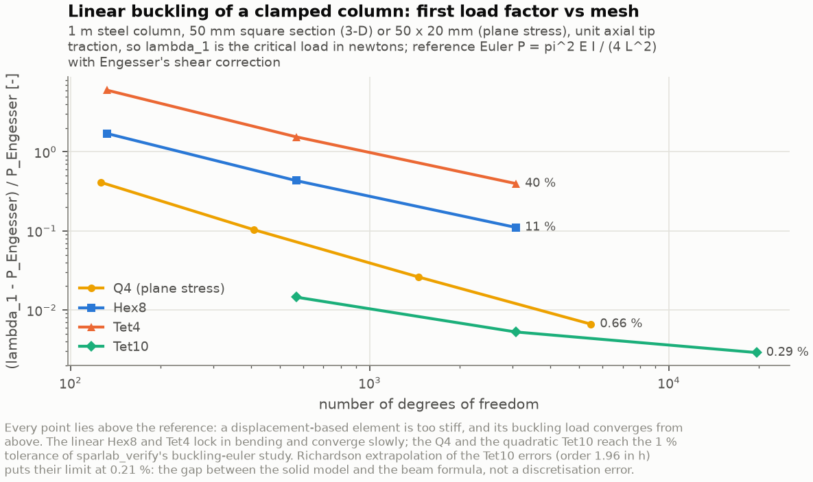
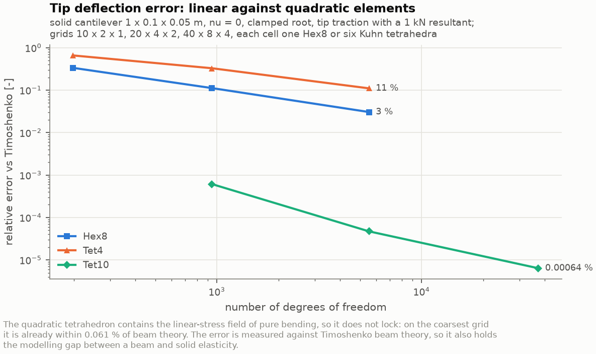

# SparLab

**A 2-D and 3-D finite-element structural solver with density-based topology
optimisation, built for lightweight aerospace structures.**

Modern C++17 numerical core (Eigen sparse), Python visualisation, JSON input
decks, and a verification suite that compares every claim against an exact
answer, an independent theory, or an independent finite-element code.

<p align="center">
  
</p>

<p align="center">
  <em>A two-bolt mounting bracket with a pin lug, optimised for minimum weighted
  compliance under three load cases at a 35&nbsp;% volume constraint. 38&nbsp;400
  elements, 375 iterations, 1&nbsp;128 linear solves, 444&nbsp;s. Black is
  material, the page colour is void.</em>
</p>

The result: **6.5 % stiffer and 41 % higher in fundamental frequency than a
uniform plate of the same mass**, with the volume constraint met to 7×10⁻¹¹
relative.

---

## What it does

| Capability | Detail |
|------------|--------|
| **Finite elements** | Plane stress, plane strain and 3-D solids; bilinear quadrilaterals (Q4), linear triangles (Tri3), trilinear hexahedra (Hex8), linear tetrahedra (Tet4) and **isoparametric quadratic tetrahedra (Tet10)** with curved edges; Gauss-Legendre and collapsed-Gauss quadrature, sparse assembly into a cached pattern, exact Dirichlet partitioning |
| **Meshes** | Structured Q4 / Tri3 / Hex8 / Tet4 / Tet10 generators, `mesh.order: 2` elevation of any tetrahedral mesh, and **Gmsh (MSH 2.2, 4.1) and Abaqus / CalculiX `.inp` readers** (C3D10 and Gmsh second-order tetrahedra included): named groups as supports, loads and passive regions, orientation repair, unit scaling, duplicate-node and quality checks |
| **Linear solvers** | Sparse Cholesky (LDL^T), **smoothed-aggregation algebraic multigrid** preconditioned CG (bitwise identical on any number of threads), Jacobi CG, and an automatic choice by problem size |
| **Loads** | Point loads and consistently integrated edge / face tractions, multiple load cases with weights |
| **Recovery** | Displacements, exact support reactions, element and nodal strain/stress, von Mises, principal stresses, element strain energy, compliance |
| **Modal analysis** | Consistent or lumped mass, generalised eigenproblem by shift-invert subspace iteration, validity screening for negative and rigid-body eigenvalues |
| **Linear buckling** | `(K + lambda K_G) phi = 0` of each load case by subspace iteration, with the buckling spectral transformation and an inertia-placed shift when reversed-load modes crowd the spectrum; a check of the analysed model, the full design domain and the **exported part** |
| **Topology optimisation** | SIMP with penalty continuation, density and sensitivity filters, a **Heaviside projection** with `beta` continuation, the **robust (eroded / blueprint / dilated) formulation** for a minimum length scale, an **additive-manufacturing overhang filter**, analytical sensitivities, optimality criteria *or* the method of moving asymptotes, aggregated **stress** and **buckling** constraints with adjoint sensitivities, passive solid/void regions, multi-load-case objective, length-scale, erosion and overhang checks of the result |
| **Geometry** | The structure before and after optimisation as VTK and watertight binary STL, with closure, manifoldness and volume checks |
| **Verification** | Patch tests on all five elements (the Tet10's quadratic one included), rigid-body modes, positive definiteness, reaction equilibrium, agreement of seven linear solvers, multigrid iteration counts under refinement, finite-difference gradient checks (compliance, stress, buckling and the overhang filter, 2-D and 3-D, through the projection), mass conservation, beam, rod and Euler-Engesser column theory, mesh convergence - and **cross-validation against CalculiX and scikit-fem**, node by node for displacements and mode by mode for buckling load factors, including the parts meshed in Gmsh |
| **Diagnostics** | Pre-solve detection of rigid-body under-constraint and floating regions, singular-matrix reporting with the likely modelling cause, explicit non-convergence and infeasibility reporting |
| **Output** | `summary.json`, CSV tables, legacy VTK for ParaView, CalculiX decks, STL, publication-quality figures and animations |

## Quick start

```bash
# 1. Dependencies (Debian/Ubuntu; see scripts/setup_deps.sh for other platforms)
./scripts/setup_deps.sh

# 2. Build and test          (~2 min build, ~40 s tests)
make build
make test

# 3. Solve one case          (~0.1 s plane, ~1 s solid)
make benchmark CASE=cantilever_analysis
make benchmark CASE=block_3d_analysis

# 4. Verification studies    (~2 min, exits non-zero if any tolerance is missed)
make verify

# 5. Cross-validation         (needs scikit-fem; CalculiX's ccx if installed)
make cross-validation

# 6. Everything: all benchmarks, the design study, scaling, figures, tables
make all
```

Only Eigen 3.3+ and a C++17 compiler are required to build; OpenMP is used
by the multigrid solver, and by Eigen inside the Jacobi CG solver, when the
compiler has it. Catch2 is used for the tests
and is fetched automatically if the system package is absent. The Python
layer needs `numpy`, `pandas`, `matplotlib` and `pillow`; the cross-validation
additionally needs `scikit-fem` and, for the CalculiX half, `ccx` on the path.
The mesh files the real-geometry decks read are committed; regenerating
them, and the Tet4 / Tet10 study that meshes the engine mount afresh, needs
the `gmsh` Python package.

Every target is a thin wrapper over a script or a binary, so anything can also
be typed by hand:

```bash
cmake -S . -B build -G Ninja -DCMAKE_BUILD_TYPE=Release && cmake --build build -j
./build/bin/sparlab_solve  --config configs/verification/block_3d_analysis.json --output results/x --export-calculix
./build/bin/sparlab_topopt --config configs/benchmarks/bracket_3d.json          --output results/y
./build/bin/sparlab_topopt --config configs/benchmarks/l_bracket_stress.json    --output results/z --stress-limit 9.4e6
./build/bin/sparlab_topopt --config configs/benchmarks/engine_mount_3d.json     --output results/w
./build/bin/sparlab_topopt --config configs/benchmarks/mbb_beam_projected.json  --output results/v
./build/bin/sparlab_topopt --config configs/benchmarks/column_buckling.json     --output results/u
./build/bin/sparlab_topopt --config configs/benchmarks/mbb_beam_overhang.json   --output results/t --overhang -y
./build/bin/sparlab_solve  --config configs/verification/engine_mount_tet10_analysis.json --output results/s --buckling 4
./build/bin/sparlab_verify --study all --output results/verification
./build/bin/sparlab_bench  --dim 3 --sizes 8,16,32,64 --solver amg_cg --output results/benchmark
python3 python/scripts/cross_validate.py --case results/x --output results/cross_validation
```

Run any executable with `--help` for its full flag list.

## Commands

| Task | Command |
|------|---------|
| Configure and build | `make build` |
| Run all tests | `make test` |
| Run the verification / validation studies | `make verify` |
| Cross-validate against CalculiX and scikit-fem | `make cross-validation` |
| Tet4 against Tet10 on the engine mount (needs `gmsh`) | `make tet10-study` |
| Solve one benchmark | `make benchmark CASE=aerospace_bracket` |
| Run all benchmarks (2-D and 3-D) | `make benchmarks` |
| Run the aerospace design study | `make study` |
| Runtime scaling benchmarks (direct vs multigrid vs Jacobi; Q4, Hex8, Tet4) | `make scaling` |
| Regenerate the Gmsh meshes (needs the `gmsh` package) | `make meshes` |
| Regenerate all figures and animations | `make figures` |
| Refresh the committed result tables | `make results` |
| Everything, in order | `make all` |
| Clean | `make clean`, `make distclean` |

## Results

All numbers below are read from the `summary.json` of the run named beside them.
`docs/results/README.md` is the machine-generated version and is refreshed by
`make results`, so the documentation cannot drift from the solver output.

### Verification and validation

| Study | Kind | Metric | Value | Tolerance |
|-------|------|--------|------:|----------:|
| Patch test, distorted mesh | verification | max relative error in `u`, strain, stress | `4.07e-15` | `1e-10` |
| Solver agreement (7 solvers, multigrid included) | verification | max relative difference vs dense LU | `8.97e-12` | `1e-8` |
| **Topology sensitivity vs central differences** | verification | max relative gradient error, best step | `2.18e-08` | `1e-5` |
| Mass conservation, `sum(M)/dim = rho V` | verification | relative error, Q4 and Hex8 | `4.84e-14`, `4.89e-14` | - |
| Mesh convergence | verification | observed order, tip deflection | `2.31` | - |
| Cantilever tip deflection vs Timoshenko | validation | relative difference, finest mesh | `4.78e-04` | `0.02` |
| Cantilever `f1` vs Euler-Bernoulli | validation | relative difference | `5.52e-03` | `0.02` |
| **Axial mode vs fixed-free rod theory** | validation | relative difference | `4.02e-06` | - |
| Patch test 3-D, distorted Hex8 mesh | verification | max relative error in `u`, strain, stress | `1.63e-15` | `1e-10` |
| Topology sensitivity 3-D vs central differences | verification | max relative gradient error, best step | `1.56e-08` | `1e-5` |
| Solid cantilever deflection vs Timoshenko | validation | relative difference, finest mesh | `5.42e-03` | `0.03` |
| Solid cantilever `f1` vs Euler-Bernoulli | validation | relative difference, weak axis | `1.06e-02` | `0.03` |
| Patch test, distorted Tri3 and Tet4 meshes | verification | max relative error in `u`, strain, stress | `9.17e-15` | `1e-10` |
| Tri3 / Tet4 cantilever deflection vs Timoshenko | validation | relative difference, finest mesh (the worse of the two) | `1.66e-02` | `0.03` |
| **Multigrid CG vs Cholesky**, Hex8 and Tet4 to 47 775 DOFs | verification | max relative displacement difference; iterations `14 -> 16` and `16 -> 20` under refinement | `4.37e-12` | `1e-8` |
| **Sensitivity through the Heaviside projection**, `beta` = 2, 8, 32 | verification | worst scaled-entry or directional gradient error, best step | `9.65e-08` | `1e-5` |
| **Quadratic patch test** (pure bending), distorted Tet10 meshes | verification | max relative error in `u` and stress; Hex8 and Tet4 cannot pass | `1.22e-14` | `1e-9` |
| Tet10 cantilever deflection vs Timoshenko | validation | relative difference, finest mesh (Hex8 3.0 %, Tet4 11 %) | `6.36e-06` | `0.01` |
| **Column buckling vs Euler-Engesser**, Q4 and Tet10 | validation | relative difference of `lambda_1`, finest mesh | `6.64e-03` | `0.01` |
| Buckling-constraint sensitivity vs central differences | verification | max scaled gradient error, best step | `1.72e-06` | `1e-5` |
| Sensitivity through the overhang filter | verification | worst scaled-entry or directional gradient error, best step | `2.81e-06` | `1e-5` |

`make verify` exits non-zero if any tolerance is missed, so it is a usable
numerical regression gate. Full detail, including what is *not* covered, in
[`docs/verification.md`](docs/verification.md).

### Cross-validation against independent codes

The same discrete problems - nodes, connectivity, supports, consistent nodal
loads - solved by CalculiX and scikit-fem, nodal displacements compared node
by node (`make cross-validation`):

| Problem | Reference | Max relative difference | Tolerance |
|---------|-----------|------------------------:|----------:|
| Plane cantilever, 1 440 Q4 | scikit-fem 12.0.2 `ElementQuad1` | `1.47e-10` | `1e-7` |
| Plane cantilever, 1 440 Q4 | CalculiX 2.21 `CPS4` | `8.75e-07` | `1e-5` |
| Solid block, tip load, 1 280 Hex8 | scikit-fem `ElementHex1` | `5.59e-12` | `1e-7` |
| Solid block, tip load, 1 280 Hex8 | CalculiX `C3D8` | `3.39e-06` | `1e-5` |
| Solid block, face pressure | scikit-fem `ElementHex1` | `1.42e-11` | `1e-7` |
| Solid block, face pressure | CalculiX `C3D8` | `2.43e-06` | `1e-5` |
| Plane cantilever, 2 880 Tri3 | scikit-fem `ElementTriP1` / CalculiX `CPS3` | `1.66e-11` / `8.86e-07` | `1e-7` / `1e-5` |
| Solid block, 7 680 Tet4, two load cases | scikit-fem `ElementTetP1` / CalculiX `C3D4` | `<= 9.46e-12` / `<= 3.64e-06` | `1e-7` / `1e-5` |
| **Gmsh lug bracket**, 20 336 Tri3, `nu = 0` | scikit-fem / CalculiX `CPS3` | `<= 6.09e-13` / `<= 4.29e-06` | `1e-7` / `1e-5` |
| **Gmsh engine mount**, 39 936 Tet4, solved by multigrid CG | scikit-fem / CalculiX `C3D4` | `<= 1.48e-12` / `<= 1.98e-06` | `1e-7` / `1e-5` |
| **Gmsh engine mount**, 13 918 curved Tet10 | scikit-fem `ElementTetP2` / CalculiX `C3D10` | `<= 1.54e-12` / `<= 1.65e-06` | `1e-7` / `1e-5` |
| Axial columns, Hex8 / Tet4 / Tet10: **buckling load factors**, 4 modes | scikit-fem (own `K_G`) / CalculiX `*BUCKLE` | `<= 8.41e-10` / `<= 8.26e-05` | `1e-7` / `1e-4` |

scikit-fem implements the same element formulations independently, so its
differences are linear-solver round-off. CalculiX's `C3D8`, `C3D4` and
`C3D10` are the same elements as the Hex8, Tet4 and Tet10, and the `1e-06` to
`4e-06` displacement differences are within the six significant digits of
its `.frd` result file - as close as that format lets one see. For buckling,
scikit-fem assembles its own geometric stiffness and agrees to `1e-9`;
CalculiX's `*BUCKLE` agrees to `6e-6` on `C3D4` and sits `4e-5` to `8e-5`
high on `C3D8` and `C3D10`, for a reason not identified, which is recorded
rather than explained away. Its plane elements are a layer of solid elements
internally, which matches plane stress only at `nu = 0`: the lug bracket at
its real `nu = 0.33` differs from CalculiX by `1.1e-03`, and is therefore
recorded as a comparison between idealisations rather than judged
([details](docs/verification.md)).

### Benchmarks

| Case | Elements | Method | Solver | `nu` | Iterations | Compliance [J] | Equal-mass plate [J] | Stiffness gain | Grey | Optimisation [s] |
|------|---------:|--------|--------|-----:|-----------:|---------------:|---------------------:|---------------:|-----:|-----------------:|
| Cantilever beam | 12 800 Q4 | OC | Cholesky | 0.40 | 362 | 1.11252 | 1.37813 | **1.239** | 0.0947 | 48.9 |
| MBB beam | 10 800 Q4 | OC | Cholesky | 0.50 | 434 | 221.551 | 259.521 | **1.171** | 0.279 | 56.6 |
| MBB beam, projected | 10 800 Q4 | OC + projection | Cholesky | 0.50 | 218 | 189.654 | 259.521 | **1.368** | 0.0207 | 31.6 |
| Aerospace bracket | 38 400 Q4 | OC | Cholesky | 0.35 | 375 | 3.00015 | 3.19665 | **1.065** | 0.116 | 443.9 |
| Wing rib | 12 500 Q4 | OC | Cholesky | 0.40 | 530 | 1.35608 | 1.21194 | **0.894** | 0.221 | 64.9 |
| L-bracket, stress-constrained | 4 096 Q4 | MMA + stress | Cholesky | 0.35 | 494 | 0.0895584 | - | - | 0.118 | 22.1 |
| Solid bracket | 4 096 Hex8 | OC | Cholesky | 0.30 | 157 | 0.289513 | - | - | 0.336 | 450.5 |
| Solid bracket, projected | 4 096 Hex8 | OC + projection | multigrid CG | 0.30 | 190 | 0.181884 | - | - | 0.0125 | 99.6 |
| Solid bracket, 356k DOFs | 110 592 Hex8 | OC + projection | multigrid CG | 0.30 | 171 | 0.170987 | - | - | 0.000862 | 1339.9 |
| Lug bracket, Gmsh mesh | 20 336 Tri3 | OC + projection | Cholesky | 0.35 | 211 | 0.828909 | 0.950635 | **1.147** | 0.00387 | 37.7 |
| Engine mount, Abaqus mesh | 39 936 Tet4 | OC + projection | multigrid CG | 0.25 | 265 | 0.443669 | - | - | 0.0484 | 278.5 |
| Column, buckling-constrained (`lambda >= 6`) | 3 200 Q4 | MMA + robust projection | Cholesky | 0.25 | 375 | 186.636 | 155.286 | 0.832 | 0.0426 | 156.7 |
| MBB beam, robust | 10 800 Q4 | OC + robust projection | Cholesky | 0.50 | 236 | 195.485 | 260.601 | **1.333** | 0.0253 | 35.2 |
| MBB beam, overhang filter | 10 800 Q4 | MMA + projection + AM filter | Cholesky | 0.50 | 211 | 193.255 | 259.526 | **1.343** | 0.0166 | 26.4 |
| Solid bracket, overhang filter | 4 096 Hex8 | MMA + projection + AM filter | multigrid CG | 0.30 | 177 | 0.188922 | - | - | 0.00967 | 100.3 |

Every OC run but the robust one meets the volume constraint at its returned
design to between `1.1e-11` and `9.6e-11` relative. Without the projection it
holds at every recorded iteration too; with it, the starting design and the
first design after each `beta` step are analysed before an update puts them
back on the target. The robust OC run holds the *dilated* design to a
rescaled target (met to `9.6e-11`); its blueprint follows only through the
ratio of the two volumes, and ends 0.41 % under the volume fraction. MMA
treats the volume as an explicit constraint and meets it between `-2.0e-4`
and `-2.8e-6`, on the feasible side. The optimisation times come from one
4-core machine: the direct solver runs on one core and the multigrid solver
on four.

"Stiffness gain" compares against a *uniform plate of the same mass*, not
against the solid domain. In this 2-D idealisation `K` and `M` both scale
linearly with thickness, so such a plate has compliance `C_solid / nu` and
exactly the full-solid frequencies - the runs verify that frequency invariance
numerically (to `2.5e-12`) rather than assuming it.

The wing rib's gain below 1 is a real result, not a solver failure: diagnostic
runs show the optimiser beats uniform thinning by 4.6 % with full design
freedom, and that the *mandated attachment features* - spar pads and skin
flanges, forced solid and charged against the same volume budget - cost 16 %
between them. Measured on its **interpreted** structure instead of on the
objective, the rib comes out level with the plate rather than 10.6 % short of
it (1.006 after correcting for the 1.3 % mass thresholding adds) - the reported
objective is the pessimistic one, for the reason the design study takes apart.
See [`docs/benchmarks.md`](docs/benchmarks.md).

The column's gain below 1 is real too, and it is the plane model talking.
The equal-mass plate is 2.5 mm thick instead of 10 mm; in plane it buckles at
`lambda_1 = 37.4` (a quarter of the solid's 149.65, since `K` scales with the
thickness and `K_G` does not), so in this idealisation it beats the
constrained design on both counts. Out of its plane - which a plane model
cannot see - a 2.5 mm plate 1 m tall buckles at about 130 N by Euler's
formula, and the optimised column's 10 mm members are not safe out of plane
either: the benchmark is an in-plane stability problem, a web braced out of
its plane ([section 12](docs/benchmarks.md#12-a-column-with-a-buckling-constraint)).

### Stress constraint: what it buys

The L-bracket is the canonical stress-constrained case: a square with its
upper-right quadrant removed, clamped at the top of one arm and loaded at the
tip of the other, whose compliance-optimal design fills the re-entrant corner
and concentrates stress there. The same deck run with and without a 9.4 MPa
aggregated von Mises limit (`P = 8`, `q = 0.5`, MMA):

| | Constraint off | Constraint on |
|---|---:|---:|
| Compliance | 0.08528 J | 0.08956 J (+5.0 %) |
| Relaxed stress peak of the design / limit | 1.66 | **0.994** (feasible) |
| Re-solved thresholded structure: peak von Mises / limit | **1.078** | **0.810** |

A 25 % lower peak stress in the re-solved structure for 5.0 % more
compliance, with the corner visibly rounded
([figure](docs/figures/l_bracket_stress_stress_comparison.png)). The
constraint bounds the *relaxed* stress of the density model; the re-solve of
the thresholded structure is the number that says whether the part meets the
limit, and both are reported.

### Heaviside projection: what it buys


The MBB beam and the solid bracket, each run with and without the
projection:

| | MBB beam | MBB beam, projected | Solid bracket | Solid bracket, projected |
|---|---:|---:|---:|---:|
| Grey level | 0.279 | **0.021** | 0.336 | **0.013** |
| Thresholded structure / optimised compliance | 0.851 | **0.995** | 0.609 | **0.983** |
| Thresholded structure [J] | 188.60 | 188.63 | 0.1763 | 0.1787 |
| Thresholded volume fraction | 0.510 | 0.501 | 0.312 | 0.302 |

Without a projection the reported compliance describes a grey field: the
thresholded part is 15 % (MBB) and 39 % (bracket) stiffer than the
optimiser said. With it, the reported compliance and the part agree to
0.5 % and 1.7 %. The part itself changes little, so what the projection
buys is a number that means what it says. At a sharp projection the design
change never settles, so the projected decks stop on the compliance
instead: a spread below 0.1 % over 10 iterations
([details](docs/benchmarks.md)).

### Buckling constraint: what it buys


A 0.5 m x 1 m aluminium plate, 10 mm thick, clamped at its base and loaded
by 100 kN of axial compression on a pad at the top, with a quarter of its
material. The same deck three ways:

| | Compliance only | `lambda >= 6`, plain projection | `lambda >= 6`, robust projection |
|---|---:|---:|---:|
| Compliance | 112.182 J | 159.209 J | 186.636 J |
| Lowest load factor, SIMP model | - | 6.0005 | 6.0020 (eroded design) |
| Lowest load factor, **exported part** | **2.86** | **3.65** | **5.81** |

The compliance optimum is a single strut that buckles at 2.86 times its
load. With the constraint, the SIMP model the optimiser sees meets
`lambda >= 6` - but with a plain projection its bracing is grey, and the
exported part, thresholded and re-analysed as solid aluminium, buckles at
3.65. Acting on the eroded design, the robust formulation denies the
optimiser members that erosion removes, and the part reaches 5.81, 3 %
short of the requirement. The part's value is the one to judge; both are
reported ([details](docs/benchmarks.md)).

### Robust formulation and overhang filter: what they buy

| | MBB beam, plain projection | MBB beam, robust |
|---|---:|---:|
| Compliance as drawn | 189.654 J | 195.485 J |
| Compliance if the part comes out thinner (eroded, `eta = 0.6`) | 231.398 J (**+22.0 %**) | 204.051 J (**+4.4 %**) |
| Smallest member / narrowest gap | 3 / 5 cells | 4 / 6 cells |

The robust design pays 3 % as drawn and loses a fifth as much stiffness to
the erosion, because none of its members is thin enough to vanish
([figure](docs/figures/mbb_beam_robust_comparison.png)).


| | Unsupported solid elements | Compliance |
|---|---:|---:|
| MBB beam, no filter (built +y) | 132 of 5 420 (2.4 %) | 186.441 J |
| MBB beam, overhang filter, built +y / -y | **0** / **0** | 193.255 J (+3.7 %) / 206.731 J (+10.9 %) |
| Solid bracket, no filter (built +y) | 78 of 1 234 (6.3 %) | 0.180861 J |
| Solid bracket, overhang filter | **0** | 0.188922 J (+4.5 %) |

With the filter no solid element lacks support directly or diagonally below
it - a 45-degree overhang limit - so the designs are printable under that
rule, and only under that rule ([details](docs/benchmarks.md)).

### Quadratic tetrahedra: what they buy


The engine mount meshed from CAD by Gmsh at 8 to 1.5 mm, solved on linear
tetrahedra, on the same meshes elevated to Tet10, and on curved Tet10 cells:

| Mesh | DOFs | Compliance, vertical load | vs finest Tet10 |
|------|-----:|--------------------------:|----------------:|
| Tet4, 4 mm (the benchmark's mesh) | 25 920 | 0.332694 J | **-18.9 %** |
| Tet4, 1.5 mm | 357 087 | 0.391839 J | -4.4 % |
| Tet10 curved, 6 mm | 61 812 | 0.400594 J | -2.3 % |
| Tet10 curved, 3 mm | 388 488 | 0.410003 J | reference |

A part meshed with linear tetrahedra reads a fifth too stiff on the mesh the
benchmark uses, and still 4.4 % at 14 times the unknowns; the curved Tet10 is
closer at 6 mm than the Tet4 at 1.5 mm with 5.8 times fewer unknowns. The
finest run is itself a lower bound, so no extrapolated exact value is
claimed ([details](docs/benchmarks.md)).

### Real geometry

Two parts drawn and meshed in Gmsh by `python/scripts/make_meshes.py`, read
through the mesh-file readers, with their physical groups as the supports,
the loads and the solid rings around the holes:

| | Lug bracket | Engine mount |
|---|---:|---:|
| Mesh file | Gmsh MSH 4.1 | Abaqus / CalculiX `.inp` |
| Elements, DOFs | 20 336 Tri3, 20 834 | 39 936 Tet4, 25 920 |
| Solver chosen by `auto` | Cholesky | multigrid CG |
| Iterations, stop | 211, objective stall at `beta` 32 | 265, objective stall at `beta` 16 |
| Thresholded / optimised compliance | 0.996 | 0.955 |
| Against the baseline | **1.147** times as stiff as the equal-mass plate | 1.95 times the full part's compliance at 25 % of its mass |
| `f1`, full part to optimised | 2202 to **2902 Hz** | 1278 to **1795 Hz** |
| Optimisation time | 37.7 s | 278.5 s |

The engine mount's rings take almost half of its 25 % material budget. Its
first run, started from a uniform 0.25, stopped before the first update:
the move limit could not bring the part down to its budget in one step,
and the optimiser said so instead of returning an infeasible design. The
deck now starts at 0.15 ([details](docs/benchmarks.md)).

### Three dimensions


A 0.24 x 0.12 x 0.06 m aluminium block, clamped on one face and loaded at the
far end in two load cases (3 kN down, 1.2 kN sideways), with 30 % of its
volume to place:

| | `bracket_3d` | `bracket_3d_large` |
|---|---:|---:|
| Mesh | 4 096 Hex8, 15 147 DOFs | 110 592 Hex8, **356 475 DOFs** |
| Linear solver | sparse Cholesky | **multigrid CG**, 23.5 iterations per solve |
| Projection | none | Heaviside, `beta` 1 to 16 |
| Iterations, optimisation time | 157, 450 s | 171, 1 340 s |
| Grey level | 0.34 | **0.00086** |
| Thresholded structure / optimised compliance | 0.61 | **0.9997** |
| Thresholded structure / full solid block, compliance | 2.35 | 2.18 |
| `f1`, thresholded structure vs solid block | +9.8 % at 31 % of the mass | **+25.7 %** at 30 % of the mass |

The coarse run shows why a solid density design needs a projection: its
grey level is 0.34, and the structure it thresholds to is 39 % stiffer than
the compliance the optimiser reported. The fine run shows what the
multigrid solver makes possible. It optimises 23.5 times the unknowns with
the projection on, in three times the time, and the part it exports is the
design it optimised. Both parts are exported as closed STL surfaces, and
the fine one is also 2-manifold. The compliance ratios are against the full
solid on each run's own mesh ([details](docs/benchmarks.md)).

### Modal: what optimisation does to the spectrum

| Case | Structure | Mass [kg] | `f1` [Hz] | `f2` [Hz] |
|------|-----------|----------:|----------:|----------:|
| Cantilever | full solid / equal-mass plate | 0.899 / 0.360 | 872.1 | 3173.0 |
| Cantilever | optimised topology | 0.360 | **1016.4** | 1685.7 |
| Bracket | full solid / equal-mass plate | 1.349 / 0.472 | 1437.2 | 4252.3 |
| Bracket | optimised topology | 0.473 | **2027.4** | 3917.9 |
| Wing rib | full solid / equal-mass plate | 0.278 / 0.111 | 1488.7 | 2623.1 |
| Wing rib | optimised topology | 0.113 | **386.6** | 487.1 |
| Solid bracket | full solid block | 4.856 | 835.0 | 1471.0 |
| Solid bracket | optimised topology | 1.515 | **917.1** | 1664.9 |

Compliance optimisation raises the fundamental frequency of the cantilever
(+16 %) and the bracket (+41 %) at equal mass, and **lowers** it sharply for the
wing rib (-74 %). In every plane case the *higher* modes fall, because a
truss has local member modes a continuous plate does not; the solid designs
keep `f2` and `f3` above the solid block's but lose `f4`. A compliance objective sees only
the static load path; a design with a vibration requirement needs that
requirement in the optimisation, which this single-constraint optimiser cannot
carry. Discussion in [`docs/benchmarks.md`](docs/benchmarks.md) and
[`docs/aerospace_study.md`](docs/aerospace_study.md).

### Design study: 41 runs, 7 arms

The bracket is swept over volume fraction, load-case weighting, mesh resolution
(twice), SIMP penalty, filter radius and Young's modulus. All 41 points
converge on the stated criteria and meet the volume constraint. The findings
that changed how the rest of this project is set up:

| Finding | Measurement |
|---------|-------------|
| **The reported objective ranks the numerical settings backwards** | Reported stiffness gain spans **0.72-1.22** and crosses parity with a uniform plate eight times; the *interpreted* structures of the 38 sound points span **1.01-1.27** and never cross it. The three best points on the reported objective are the three worst structures in the study |
| A mandated feature can dominate the answer | The passive attachment collars are 3.9 % of the domain but **25.8 %** of the volume budget at `nu` = 0.15, which is most of why the payoff falls from 26.6 % to 1.0 % as the budget shrinks |
| Quote the filter radius in metres, never in cells | Radius fixed in metres, five meshes agree to **1.2 %**; radius fixed at 1.5 cells, the same meshes spread **28 %** and the topology chases the mesh |
| Check the filter is resolved and the penalty high enough | Three points produced designs that fall apart when thresholded - two from an identity filter (average support **1.000** element, up to **494** disconnected groups) and one from `p` = 1.5, whose interpretation is **6.75x** softer than the field it came from |
| A minimum length scale is not free | **36.9 %** more reported compliance between a 3.75 mm and a 15 mm filter radius |
| The local optimum costs something real | Two runs of the same problem reached designs **1.3 %** apart on the same objective |
| One load case was doing nothing | `up_reversal` is exactly `-0.5` times `down_limit`, so its compliance is `0.25 C_down` to ten digits and the compliance objective cannot see it |
| The runs are reproducible to the last bit | The study was run on three separately compiled binaries, the last one after the cached-pattern assembly and the new stall criterion went in; all 41 points reproduced with a relative difference of **exactly zero** every time |

Full tables, figures and reasoning in
[`docs/aerospace_study.md`](docs/aerospace_study.md).

### Runtime scaling

One linear solve from scratch, the factorisation plus a back-substitution or
the multigrid setup plus CG to a relative residual of `1e-10`
(`make scaling`):

| | Q4 plate | Hex8 block | Tet4 block |
|---|---:|---:|---:|
| Largest mesh both solvers ran | 194 922 DOFs | 47 775 DOFs | 15 147 DOFs |
| Sparse Cholesky | 3.98 s | 43.5 s | 1.90 s |
| Multigrid CG | 0.571 s | 0.637 s | 0.325 s |
| **Cholesky / multigrid** | **7.0** | **68** | **5.9** |
| Largest multigrid run | 1 003 002 DOFs in 3.06 s | 830 115 DOFs in 13.0 s | 109 395 DOFs in 1.56 s |
| CG iterations over the range | 14 to 17 | 14 to 17 | 16 to 21 |
| Growth slope of the time, Cholesky / multigrid | 1.56 / 1.03 | 2.35 / 0.95 | 2.32 / 0.78 |

With the direct solver one optimiser iteration costs essentially one
factorisation. That follows from two design decisions: compliance is
self-adjoint, so no adjoint solve is needed (the stress constraint adds one
back-substitution per load case, not a second factorisation), and one
factorisation of `K_ff` is shared across every load case. In 2-D that is
cheap. In 3-D the factorisation grows like `n^2.35`, which is why solid
problems above 10 000 unknowns go to multigrid CG by default. Its iteration
count barely moves with the mesh, and inside an optimisation it reuses its
aggregates and starts every solve from the previous design's answer
([details](docs/benchmarks.md)).

## Figures

| | |
|---|---|
|  |  |
| Design domain, rigid bolt attachments, three load cases, and the passive solid/void regions | The SIMP density field and its explicit interpretation as solid material |
|  |  |
| Analytical gradients against central differences over eight step sizes, with every element tested | Tip deflection against Euler-Bernoulli and Timoshenko theory, plus self-convergence order |
|  |  |
| Compliance, volume constraint, design change and grey level against iteration | Wall-clock cost of each solver phase against problem size |
|  |  |
| Natural frequencies before and after optimisation, at equal mass | Mass-stiffness trade and the vibration metric across the volume sweep |
|  |  |
| The same L-bracket with and without the stress constraint, on one colour scale with the limit marked | Von Mises, principal and normal stress on the surface of the optimised solid bracket |
|  |  |
| Nodal displacements against CalculiX and scikit-fem on eleven problems, with each tolerance and the `.frd` rounding floor | Mode shapes of the interpreted solid structure |
|  |  |
| A lug bracket meshed in Gmsh (20 336 triangles), optimised with the Heaviside projection | An engine mount read from an Abaqus / CalculiX file (39 936 tetrahedra), solved with multigrid CG |
|  |  |
| The MBB beam with and without the projection, and the distribution of its densities | Cholesky, multigrid CG and Jacobi CG: time and storage against problem size on Q4, Hex8 and Tet4 |
|  |  |
| The solid bracket at 356 475 DOFs, optimised with multigrid CG | Multigrid iterations under refinement against Jacobi CG, and agreement with Cholesky |
|  |  |
| Compliance, the SIMP model's lowest load factor and `beta` through the buckling-constrained run | The first buckling load of a clamped column against Euler-Engesser on Q4, Hex8, Tet4 and Tet10 |
|  |  |
| The solid bracket built standing up, without and with the overhang filter, unsupported faces in red | Cantilever tip error of Hex8, Tet4 and Tet10 on the same grids |

Further figures in [`docs/figures/`](docs/figures/): deformed shapes,
displacement and stress fields, reaction and equilibrium checks, mode shapes,
density evolution montages, the 3-D and simplex verification studies, the
projection's gradient check, solver iteration counts, mesh-dependence and
settings studies, and an animation for most benchmarks (including the solid
bracket's surface as it evolves).

## Formulation

The full derivation is in [`docs/formulation.md`](docs/formulation.md); the
essentials:

**Elements.** Bilinear Q4 shape functions on `(xi, eta) in [-1,1]^2`,

```
  N_1 = 1/4 (1-xi)(1-eta)   N_2 = 1/4 (1+xi)(1-eta)
  N_3 = 1/4 (1+xi)(1+eta)   N_4 = 1/4 (1-xi)(1+eta)
```

and their trilinear Hex8 counterparts `N_a = 1/8 (1 + xi_a xi)(1 + eta_a eta)(1 + zeta_a zeta)`;
isoparametric mapping `x = sum_a N_a x_a`, Jacobian `J_ij = dx_i/dxi_j`, and

```
  K_e = sum_g w_g t detJ B^T D B        (2 x 2 Gauss, exact for the Q4; 2 x 2 x 2 for the Hex8)
  M_e = sum_g w_g rho t detJ N^T N      (3 x 3 Gauss; 3 x 3 x 3)
  f_e = sum_g w_g t |x_s (x x_t)| N^T t_bar   (2-point per direction, along an edge or over a face)
```

with `D` the plane-stress, plane-strain or full 3-D isotropic matrix and `B`
`3 x 8` or `6 x 24`. The Tet10 uses `N_i = L_i (2 L_i - 1)` at the corners
and `4 L_a L_b` on the edges in barycentric coordinates, isoparametric (so
its edges may curve with the CAD surface), a 4-point stiffness rule, and
Hinton-Rock-Zienkiewicz lumping where a row-sum lump would be indefinite.

**Linear buckling.** For a load case with displacement `u`,

```
  (K_ff + lambda K_G,ff(u)) phi = 0 ,     phi^T K_G phi = int sigma_ij(u) phi_k,i phi_k,j
```

solved for the smallest positive `lambda` by subspace iteration on
`K^-1 (-K_G)`, switching to the spectral transformation
`(K + sigma K_G)^-1 K` with `sigma` placed by the inertia of an `LDL^T`
factorisation when reversed-load modes crowd the spectrum.

**Boundary conditions by partitioning, not penalty.** The reduced system is
`K_ff u_f = f_f - K_fp u_p` and the reactions come from the full residual
`r = K u - f`. This keeps `K_ff` symmetric positive definite, gives exact
reactions with no second assembly, and leaves the eigenvalue spectrum
undistorted.

**SIMP.** The modified law, so a design variable may reach exactly 0 or 1 while
`K` stays invertible:

```
  E(rho)/E_0     = eps + (1 - eps) rho^p ,        eps = E_min/E_0 = 1e-9
  d(E/E_0)/drho  = p (1 - eps) rho^(p-1)
```

Mass is interpolated separately, `m(rho) = eps_m + (1-eps_m) rho^p`, matching
the stiffness exponent so `E/m` stays bounded in void regions and no spurious
low-frequency mode appears.

**Filtering.** `rho_tilde = Hhat x` with row-normalised linear-hat weights
`H_ei = max(0, r_min - |x_e - x_i|)`. Because the map is linear the chain rule is
exact, which is what makes the finite-difference verification meaningful.

**Sensitivities.** Compliance is self-adjoint, so no adjoint solve is needed:

```
  dc/drho_e = -sum_l w_l  d(E(rho_e)/E_0)/drho_e  u_{l,e}^T K_e^0 u_{l,e}  <= 0
  grad_x c  = Hhat^T grad_rho c ,      grad_x g = Hhat^T v
```

**Optimality criteria.** The separable KKT condition
`B_e = (-dc/dx_e)/(lambda dg/dx_e) = 1` gives

```
  x_e^{k+1} = clip( x_e^k B_e^eta , max(x_lo, x_e^k - m) , min(x_hi, x_e^k + m) )
```

with `eta = 1/2`, move limit `m = 0.2`, and `lambda` found by geometric bisection
on the monotone volume map.

**Method of moving asymptotes.** For more than one constraint, each function
is replaced at `x^k` by Svanberg's separable convex approximation
`r_i + sum_j [ p_ij/(U_j - x_j) + q_ij/(x_j - L_j) ]` between moving asymptotes
`L_j < x_j^k < U_j`, and the subproblem is solved by a primal-dual
interior-point method. Convergence requires feasibility
(`max_i g_i <= 1e-4`), and the iterate that was judged is the design returned.

**Stress constraint.** One aggregated constraint per load case,

```
  sigma_e = rho_e^q sigma_vm(D_0 B_e u_e)                  (qp relaxation, q = 0.5)
  g_l     = c_l ( sum_e sigma_e^P )^(1/P) / sigma_lim - 1 <= 0   (P = 8)
```

with the scale `c_l` re-fitted every iteration so the p-norm tracks the true
maximum, and the gradient from one adjoint solve per load case,
`K lambda = d sigma_PN / d u`, on the cached factorisation - verified against
central differences in 2-D and 3-D.

**Buckling constraint.** `KS_P(lambda_req / lambda_i) - 1 <= 0` over the
lowest positive load factors, with the stress in `K_G` interpolated as
`rho^p` without the `E_min` floor (against pseudo modes in void) and each
`d lambda_i / d rho` from one adjoint solve that carries the stress's
dependence on the design.

**Robust formulation and overhang filter.** The filtered field projected at
`eta + delta`, `eta` and `eta - delta`: the objective and constraints on the
eroded design, the volume on the dilated one, the blueprint exported. The
overhang filter `xi_e = smin(rho_tilde_e, smax_{s below e} xi_s)`, layer by
layer from the plate, sits between the density filter and the projection,
with its gradient from an adjoint recursion from the top layer down.

See [`docs/topology_optimization.md`](docs/topology_optimization.md) for the
filters, the projection and its robust form, the overhang filter,
continuation, convergence criteria, MMA, the stress and buckling constraints
and the diagnostics.

## Conventions

Strict SI everywhere: metres, newtons, pascals, kilograms, hertz, joules. No
unit-conversion helpers and no implicit scaling, so a value in a result file is
already in the unit its column header states.

Right-handed axes, with a plane model in the x-y plane. Structured node
numbering `node(i,j,k) = k(nx+1)(ny+1) + j(nx+1) + i` and element numbering
`elem(i,j,k) = k·nx·ny + j·nx + i`, x fastest. Q4 nodes counter-clockwise
from the lower-left corner; Hex8 nodes in the VTK order (bottom face, then
top); Tet10 corners then the edge nodes of `(0 1) (1 2) (2 0) (0 3) (1 3)
(2 3)`, as VTK and C3D10. A buckling load factor multiplies its load case;
modes are `phi^T K phi = 1`. A build direction `+y` grows the part along
`+y` from a plate at low `y`. `dim` translational DOFs per node, `dof(n,c) = dim·n + c`. Forces and
displacements positive along `+x`/`+y`/`+z`; tensile stress positive;
tractions given as a global stress vector, not a normal pressure. Voigt
ordering `{sxx, syy, sxy}` in the plane and `{sxx, syy, szz, sxy, syz, szx}`
in a solid, paired with *engineering* shear strain.

Full table, including every tolerance and its default, in
[`docs/conventions.md`](docs/conventions.md).

## Architecture

```
  apps/            sparlab_solve  sparlab_topopt  sparlab_verify  sparlab_bench
                            |
     +----------------------+----------------------+
     |                      |                      |
  io/                   topopt/                  fem/
  Json  Config          DesignDomain             StaticAnalysis  ModalAnalysis
  MeshReader            SimpInterpolation        StressRecovery  ModelDiagnostics
  CsvWriter VtkWriter   DensityFilter Projection LinearSolver    Multigrid
  StlWriter             Sensitivity  StressConstraint   Assembler  FemModel
  CalculixWriter        BucklingConstraint       Buckling
  ResultWriter          OverhangFilter LengthScale  DofManager  Selector
                        OptimalityCriteria  Mma  BoundaryConditions
                        TopologyOptimizer
                                                         |
                                     +-------------------+-------------------+
                                     |                   |                   |
                                 elements/          material/             mesh/
                                 Element (abc)      IsotropicMaterial     Mesh
                                 Quad4 Tri3                               Structured
                                 Hex8  Tet4  Tet10                        SubMesh
                                 Quadrature              |
                                     +---------+---------+-------------------+
                                               |
                                            core/  Types Exceptions Logging Timer

  python/sparlab_viz/   loaders -> style -> fields / solid -> plots / plots3d / studies
                        (reads only what io/ writes; never recomputes physics)
  python/scripts/cross_validate.py   drives CalculiX and scikit-fem on the exported decks
  python/scripts/make_meshes.py      generates the Gmsh meshes (committed)
  python/scripts/tet10_part_study.py meshes, solves and compares Tet4 and Tet10
```

No cycles, no upward dependencies, and one dimension-generic core: the mesh
carries its dimension at run time, the element kernels are written for their
own dimension, and everything above them is written against `dim` - so the
plane path is byte-for-byte what it was before the solid path existed. Each
component's responsibilities, the design decisions behind them, and what it
takes to add a new element type, a new material model, another mesh format,
a linear solver, a new constraint or another external code are in
[`docs/architecture.md`](docs/architecture.md).

## Input decks

A run is fully determined by one JSON file. Comments and trailing commas are
accepted; syntax errors report their line and column; **unknown keys are
reported**, and `--strict-config` makes them an error - a misspelled key that
silently takes its default is one of the easiest ways to publish a wrong number.

```json
{
  "name": "cantilever_beam",
  "mesh":     { "type": "structured_quad", "nx": 160, "ny": 80,
                "lx": 0.40, "ly": 0.20 },
  "material": { "name": "Al 7075-T6", "youngs_modulus": 71.7e9,
                "poisson_ratio": 0.33, "density": 2810.0 },
  "model":    { "thickness": 0.004, "stress_state": "plane_stress" },
  "boundary_conditions": [
    { "name": "clamped_root", "fix": ["x", "y"],
      "region": { "box": { "xmax": 0.0 } } }
  ],
  "load_cases": [
    { "name": "tip_down", "weight": 1.0,
      "point_loads": [
        { "force": [0.0, -2000.0], "distribution": "total",
          "region": { "box": { "xmin": 0.40, "ymin": 0.0975, "ymax": 0.1025 } } }
      ] }
  ],
  "modal":    { "enabled": true, "num_modes": 6 },
  "topology": { "enabled": true, "volume_fraction": 0.4,
                "filter": { "type": "density", "radius_elements": 2.0 } }
}
```

A solid deck differs only where the dimension shows: `"type": "structured_hex"`
(or `structured_tet`) with `nz` and `lz`, `"fix": ["x", "y", "z"]`,
three-component forces and tractions, `zmin`/`zmax` boxes, cylinders about any
axis and spheres as regions, no thickness. Regions are geometric - box,
circle / cylinder, annulus / tube, sphere, nearest node, explicit ids, unions
and complements - so the same deck applies unchanged at any mesh resolution.

A part drawn in a CAD tool comes in through a mesh file, and its physical
groups become regions:

```json
"mesh":  { "type": "file", "path": "../meshes/engine_mount_3d.inp", "scale": 0.001 },
"boundary_conditions": [ { "fix": ["x", "y", "z"], "region": { "group": "bolt_holes" } } ],
"solver": { "linear": { "type": "auto" } },
"topology": { "projection": { "enabled": true, "beta_max": 16 } }
```

Every field, including the mesh-file, solver, multigrid, projection, MMA and
stress-constraint blocks, is documented in
[`docs/configuration.md`](docs/configuration.md).

Shipped decks: [`configs/benchmarks/`](configs/benchmarks/) (the four plane
compliance cases and the MBB beam's projected, robust and overhang-filtered
variants, the stress-constrained L-bracket, the buckling-constrained column,
the solid bracket with its projected, overhang-filtered and 356 475-DOF
variants, and the Gmsh lug bracket and engine mount),
[`configs/meshes/`](configs/meshes/) (the lug bracket, and the engine mount
in linear and in curved quadratic tetrahedra, with how they were generated),
[`configs/studies/`](configs/studies/) (the design-study baseline),
[`configs/verification/`](configs/verification/) (the static, modal and
buckling decks the cross-validation uses, on all five element types).

## Output

Each run writes a self-describing directory:

```
results/<case>/
  summary.json              every scalar, tolerance, timing and provenance field
  config.json               verbatim echo of the input deck
  mesh.json                 nodes, connectivity, prescribed DOFs, applied loads
  displacement_<lc>.csv     nodal displacements per load case
  stress_<lc>.csv           element strains, stresses, von Mises, energy
  reactions_<lc>.csv        support reactions
  fields_<lc>.vtk           ParaView fields (point and cell data)
  modes*.csv, mode_*.vtk    eigenvalues, frequencies, residuals, mode shapes
  history.csv               optimisation iteration history (with the stress
                            ratio and constraint values under MMA)
  density_final.csv         final design, physical density, passive tags
  density_history.csv       density snapshots for the animation
  structure_before.{vtk,stl}  the design domain (a plane one extruded by its thickness)
  structure_after.{vtk,stl}   the thresholded structure, closed and outward, with its
                            closure, manifoldness and volume checks in the summary
  calculix_<lc>.inp         (sparlab_solve --export-calculix) one CalculiX deck per load case
```

`summary.json` is the single source of truth for every number quoted in the
documentation.

## Engineering integrity

Things this project deliberately does, because the opposite is easy and wrong:

* **a density field is never presented as geometry without saying how it was
  converted.** Every topology summary records the threshold, the elements
  retained, the number of disconnected groups and the material discarded as
  islands. Every run then re-solves that *extracted* structure with real
  material and reports its own compliance, mass and peak stress, because the
  objective the optimiser minimised is not the compliance of the part a
  threshold would produce - on the bracket the extracted structure comes out
  9-29 % stiffer. With the Heaviside projection the two agree to within 2 %,
  and 4.5 % on the engine mount. The modal analysis of an "optimised
  structure" runs on the same sub-mesh;
* **no manufacturability is claimed beyond what is modelled.** The overhang
  filter models one additive-manufacturing rule and the robust formulation
  one uniform manufacturing error; "0 unsupported elements" means printable
  under that rule, nothing more. No draw direction, tool access, support
  removal, residual stress or fillet is modelled, and the exported STL is
  the voxel boundary of the thresholded cells - closed and outward, checked
  and reported as such, but a staircase, not a part;
* **a buckling constraint is judged on the part.** The constraint holds the
  load factors of the SIMP model; every run with a `buckling` section
  re-analyses the exported part and reports its load factor beside them - on
  the column 3.65 and 5.81 against a SIMP 6.00, printed as such;
* **a stress constraint is not a stress substantiation.** It bounds the
  relaxed, aggregated stress of the density model. Every constrained run
  therefore re-solves its thresholded structure with full material and
  reports that peak against the limit alongside the relaxed one - on the
  L-bracket 0.81 and 0.99 of the limit respectively - and the unconstrained
  run of the same deck sits beside them as the reference;
* **agreement with other codes is measured, not asserted.** The
  cross-validation reports every difference with its tolerance, and says
  where a difference is the reference's own output precision rather than a
  disagreement;
* **no comparison value is invented.** The MBB compliance is reported as
  computed, with the density-, sensitivity- and no-filter variants side by side,
  and without claiming agreement with a literature number that was not
  re-derived under identical settings;
* **failures are reported, not hidden.** Singular matrices, non-positive
  Cholesky pivots, residuals above tolerance, non-convergence, an infeasible
  stress-constrained design, a non-manifold exported surface, disconnected
  topologies and unknown configuration keys all produce a specific, actionable
  message - and the optimiser records *which* convergence criterion fired,
  the final value of every indicator, and under MMA returns the iterate it
  actually judged rather than an unevaluated update;
* **every tolerance is recorded** in the run summary;
* **runs are deterministic.** The only randomness is a seeded filler in the
  subspace-iteration starting basis and the node-perturbation generator, both
  with explicit default seeds. The threaded solvers give the same bits on any
  number of threads, and the aerospace study reproduced all 41 points exactly
  on three separately compiled binaries.

## Assumptions and limitations

The short version: plane or solid continuum only (no plates, shells or
beams), linear and small-strain, static, undamped free vibration and linear
(bifurcation) buckling - no imperfections or post-buckling - no body forces,
linear elements plus the quadratic tetrahedron (no Q8, Tri6 or Hex20) and one
cell type per mesh, attachment features are *representations* and not joint
models, load cases are illustrative and not flight loads, the objective is
weighted compliance and not a load envelope, the constraints are the volume,
an aggregated relaxed stress and an aggregated SIMP buckling load (no
frequency or displacement constraints), the robust formulation's length
scale is measured rather than stated, the overhang rule needs a structured
grid, one machine and no distributed memory, cross-validation of
displacements on eleven problems and of buckling load factors on three, no
comparison against experiment.

The long version, with what it would take to lift each item, is in
[`docs/limitations.md`](docs/limitations.md). It is worth reading before
treating any number here as a design answer.

## Documentation

| Document | Contents |
|----------|----------|
| [`docs/formulation.md`](docs/formulation.md) | continuum problem in 2-D and 3-D, Q4, Tri3, Hex8, Tet4 and Tet10 elements, quadrature, assembly, the linear solvers and the multigrid construction, stress recovery, modal algorithm, linear buckling, what the cross-validation exports |
| [`docs/topology_optimization.md`](docs/topology_optimization.md) | SIMP, filters, the Heaviside projection, the robust formulation and length-scale check, the overhang filter, sensitivity derivation, optimality criteria, MMA, the aggregated stress and buckling constraints and their adjoints, passive regions, continuation, convergence, diagnostics |
| [`docs/conventions.md`](docs/conventions.md) | units, coordinates and numbering in both dimensions, element face tables, mesh-file numbering, signs, Voigt ordering, energy definitions, tolerances, determinism |
| [`docs/architecture.md`](docs/architecture.md) | layering, the dimension-generic core, component responsibilities, design decisions, extension points |
| [`docs/configuration.md`](docs/configuration.md) | complete input-deck reference (structured and file meshes, mesh order, solvers and multigrid, buckling, projection and the robust formulation, overhang, MMA, stress and buckling constraints) and the command-line overrides |
| [`docs/verification.md`](docs/verification.md) | every verification and validation check in 2-D and 3-D, the simplices and the quadratic tetrahedron, the mesh readers, the multigrid solver, the projection, buckling, the robust and overhang options, the MMA and constraint tests, the cross-validation against CalculiX and scikit-fem, with measured values and what is not covered |
| [`docs/benchmarks.md`](docs/benchmarks.md) | the benchmark cases in detail, the projection comparison, the two parts read from mesh files, the 356 475-DOF solid, Tet4 against Tet10, the buckling-constrained column, the robust and overhang comparisons, convergence behaviour, runtime and solver scaling |
| [`docs/aerospace_study.md`](docs/aerospace_study.md) | the parametric design study: mass-stiffness trade, load weighting, mesh dependence, penalty, filter radius, material stiffness |
| [`docs/limitations.md`](docs/limitations.md) | assumptions and scope boundaries |
| [`docs/results/README.md`](docs/results/README.md) | machine-generated result tables |

## Continuous integration

[`.github/workflows/ci.yml`](.github/workflows/ci.yml) runs three jobs:

* **build and test** on GCC and Clang, in Release and Debug, with
  `-DSPARLAB_WARNINGS_AS_ERRORS=ON`. The Debug build enables Eigen's own
  assertions, which is the configuration most likely to catch an indexing
  mistake;
* **verification** runs all the studies, plane and solid, and fails the build
  if any documented tolerance is missed, uploading the summary either way;
* **benchmark** runs the static, modal and buckling analyses on all five
  element types and both Gmsh parts, the scikit-fem half of the
  cross-validation on all eleven problems - displacements, and the buckling
  load factors of the three columns - (which fails the build on a
  disagreement), reduced topology optimisations covering OC, MMA with the
  stress constraint, the Hex8 path, the projection with and without, the
  multigrid solver, the two parts read from mesh files, the buckling
  constraint, the robust formulation and the overhang filter with their
  comparison runs, small direct / multigrid / Jacobi scaling runs, and
  regenerates the figures and tables - so a break in the whole pipeline, not
  just the library, is caught.

## Licence

MIT. See [`LICENSE`](LICENSE).
