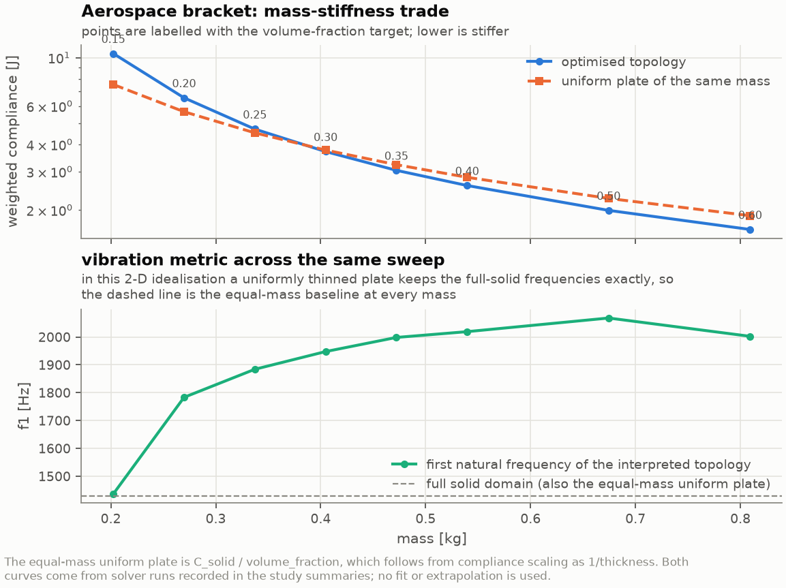
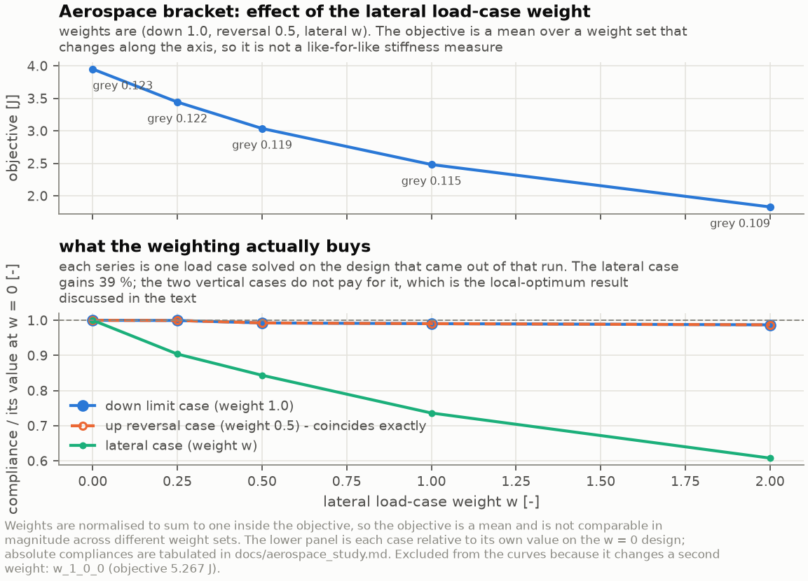
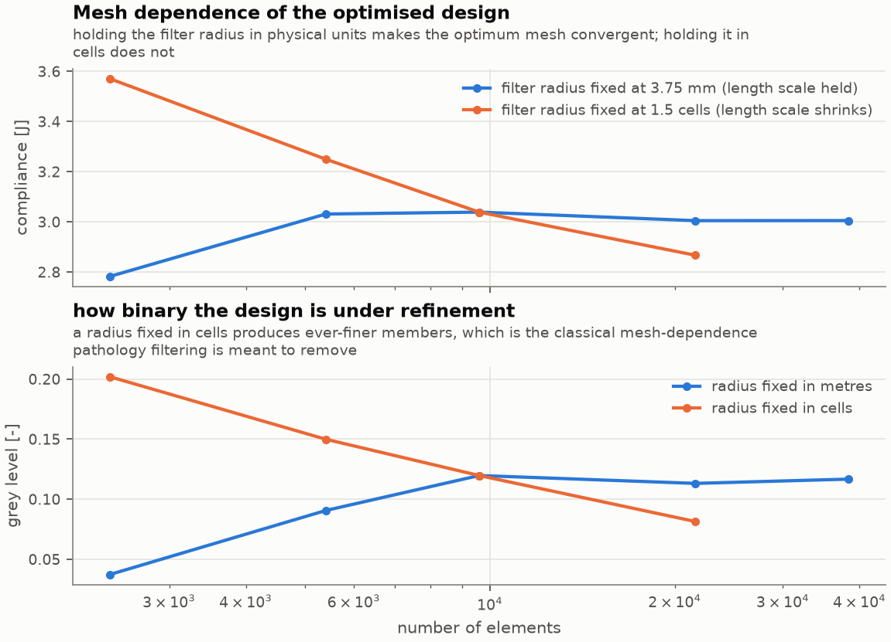
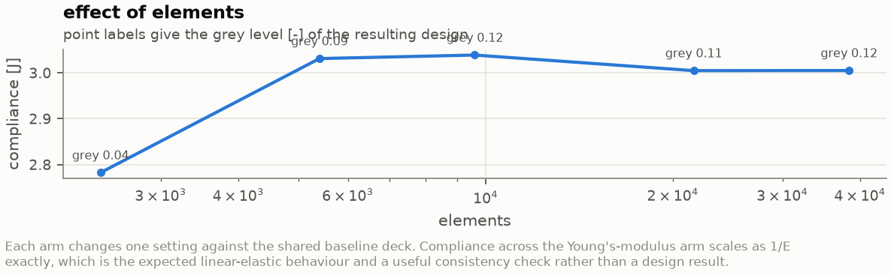
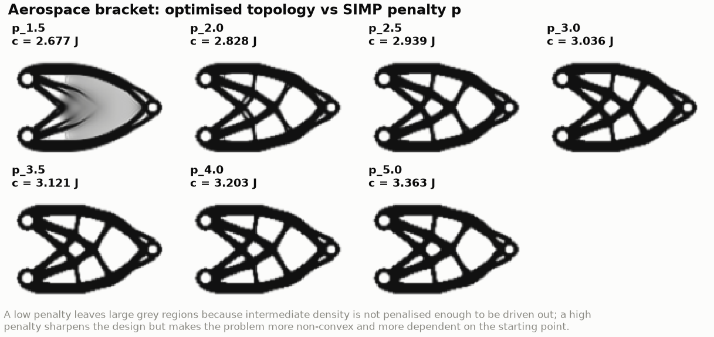
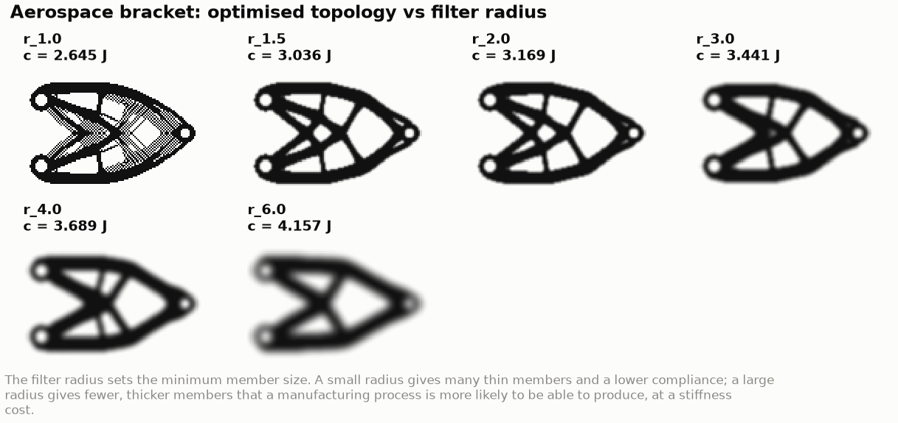

# Aerospace design study

A parametric study of the two-bolt aerospace bracket: what the volume fraction
buys, how the load-case weighting moves the load path, and how much of a
"topology" is really a consequence of numerical settings rather than of the
structural problem.

Every number here is read from the `summary.json` of a study point.
`docs/results/aerospace_study.csv` is the complete machine-generated table -
one row per point, every column straight from a solver run - and this document
adds the interpretation.

Reproduce all of it with:

```bash
make study      # 41 points
make figures    # the study figures below
make results    # refresh docs/results/*.csv
```

## The baseline and what each arm changes

The shared baseline is [`configs/studies/aerospace_bracket_study.json`](../configs/studies/aerospace_bracket_study.json):
the same bracket as the `aerospace_bracket` benchmark, on a coarser mesh so that
a 41-point sweep is affordable.

| | Baseline |
|---|---|
| Domain | 0.30 m x 0.20 m plate, 8 mm thick, plane stress |
| Mesh | 120 x 80 Q4 elements (9 600 elements, 19 602 DOFs) |
| Material | Al 7075-T6: `E` = 71.7 GPa, `nu` = 0.33, `rho` = 2810 kg/m^3 |
| Supports | two bolt holes at (0.03, 0.045) and (0.03, 0.155) m, radius 10.5 mm, every node inside fixed in `x` and `y` |
| Load case `down_limit` | 9 kN downward, spread over the upper half of the lug bearing annulus at (0.27, 0.10) m, weight 1.0 |
| Load case `up_reversal` | 4.5 kN upward on the same annulus, weight 0.5 |
| Load case `lateral` | 4.5 kN in `+x` on the same annulus, weight 0.5 |
| Passive void | the two bolt holes and the lug hole |
| Passive solid | annular collars around all three holes (9 mm and 9.5 mm wide) |
| Volume fraction | 0.35 |
| SIMP | `p` = 3 with continuation from 1.5 in 3 stages of 30 iterations, `emin_ratio` = 1e-9, mass law `penalty_matched` |
| Filter | density filter, radius 1.5 cells = 3.75 mm |
| Optimiser | OC, move limit 0.2, damping 0.5 |
| Convergence | `max |dx| < 1e-2` **or** relative objective change `< 5e-5` over 20 iterations, cap 600 iterations |

The convergence rule is deliberately identical to the four plane benchmark decks, so
compliance is comparable between a study point and a benchmark, and every point
stops for a recorded reason rather than at an iteration budget.

Each arm changes **exactly one** thing through a `sparlab_topopt` command-line
override; the deck itself is never edited, which is what makes the study
reproducible from one file plus one script:

| Arm | Varied | Values | Points |
|-----|--------|--------|-------:|
| `volume_fraction` | volume-fraction target | 0.15, 0.20, 0.25, 0.30, 0.35, 0.40, 0.50, 0.60 | 8 |
| `load_weighting` | lateral case weight (and one single-case design) | (1, 0.5, w) for w = 0, 0.25, 0.5, 1, 2; plus (1, 0, 0) | 6 |
| `mesh_fixed_r` | mesh, filter radius fixed at 3.75 mm | 60x40 ... 240x160 | 5 |
| `mesh_fixed_cells` | mesh, filter radius fixed at 1.5 cells | 60x40 ... 240x160 | 5 |
| `penalty` | SIMP penalty `p` | 1.5, 2.0, 2.5, 3.0, 3.5, 4.0, 5.0 | 7 |
| `filter_radius` | filter radius in cells | 1.0, 1.5, 2.0, 3.0, 4.0, 6.0 | 6 |
| `youngs_modulus` | Young's modulus | 45, 71.7, 110, 200 GPa | 4 |

The `volume_fraction` and `youngs_modulus` arms additionally run a modal
analysis (4 modes) on the interpreted topology, which is where the
vibration metric in this study comes from.

## How each quantity is measured

These definitions matter more than usual here, because several of them are easy
to read as something stronger than they are.

**Objective.** The weighted compliance is a *weight-normalised mean*,

```
  C = sum_l w_l C_l / sum_l w_l ,      C_l = f_l . u_l
```

so it is a mean over the weight set in force for that run. Comparing the
objective across the load-weighting arm therefore compares means taken with
different weights; the per-case compliances `C_l` are the like-for-like
quantities, and every summary records them alongside the normalised weights it
used (`compliance_J` reconstructs exactly from the two).

**Stiffness gain.** `C_plate / C_optimised`, where `C_plate = C_solid / nu` is
the compliance of a *uniform plate of the same mass* - not of the solid domain.
Above 1 means the optimisation beat uniform thinning. The 2-D scaling behind
that baseline (`K` and `M` both linear in thickness) is derived in
[`benchmarks.md`](benchmarks.md) and verified numerically in each run.

**Vibration metric.** `f1` of the **interpreted** topology: the density field
thresholded at 0.5, reduced to its largest edge-connected group, and re-solved
as an ordinary FE model with real material. It is not a SIMP-penalised
pseudo-structure. In this idealisation a uniformly thinned plate keeps the
full-solid frequencies exactly, so the full-solid `f1` is simultaneously the
equal-mass baseline at every volume fraction.

**Grey level.** `M_nd = (4/n) sum_e rho_e (1 - rho_e)`, which is 0 for a fully
black-and-white design and 1 if every element sat at 0.5. It measures how far
the relaxed solution is from a real 0/1 structure.

**Connected groups and islands.** Counted on the thresholded field by edge
adjacency. A design with more than one group has material that carries no load
to the supports; the volume in the discarded groups is recorded per point.

**Density is not geometry.** Every topology shown here is a density field.
Where a figure or a frequency treats it as a solid, the threshold and the
connectivity reduction that produced that solid are stated, and the discarded
volume is reported. Nothing in this study models a manufacturing process, so
none of it is a manufacturability claim - the filter radius sets a minimum
*length scale*, which is not the same thing.

## One load case turned out to be redundant

Before any trend: the deck's three load cases are not three independent pieces
of information, and the study is what exposed it.

`up_reversal` is 4.5 kN upward on exactly the annulus where `down_limit`
applies 9 kN downward. In linear elasticity that makes it `-0.5` times the same
load, so its displacement field is `-0.5 u_down` and its compliance is
`0.25 C_down` exactly. The measured ratio is `0.2500000000` at **every** point
of the volume-fraction arm, to ten digits.

A weighted-compliance objective therefore cannot tell `(1, 0.5, 0)` apart from
`(1, 0, 0)`: the two differ by the constant factor 0.75, which the optimality
criteria absorbs into its Lagrange multiplier, so both runs descend the same
path. The study confirms it to round-off - the reported objectives differ by
exactly that factor (ratio 0.750000000016), both runs take 286 iterations and
retain 3374 elements, and the two density fields differ nowhere by more than
`4.5e-09`.

So the load reversal earns its place in a *stress*, buckling or fatigue
assessment, and in this compliance formulation it earns nothing. That is a
property of the objective, not a bug, and the only honest thing to do is say
so: the bracket study has **two** independent load directions, vertical and
lateral, not three.

## Mass-stiffness trade: the volume-fraction arm



| Target `nu` | Compliance [J] | Mass [kg] | Equal-mass plate [J] | Stiffness gain | Grey | Groups | Iterations | `f1` of topology [Hz] |
|------------:|---------------:|----------:|---------------------:|---------------:|-----:|-------:|-----------:|----------------------:|
| 0.15 | 10.4152 | 0.2023 | 7.52834 | **0.723** | 0.120 | 1 | 219 | 1470.5 |
| 0.20 | 6.52829 | 0.2698 | 5.64626 | **0.865** | 0.127 | 1 | 269 | 1764.3 |
| 0.25 | 4.65910 | 0.3372 | 4.51701 | **0.970** | 0.122 | 1 | 359 | 1896.4 |
| 0.30 | 3.69712 | 0.4046 | 3.76417 | **1.018** | 0.121 | 1 | 260 | 1953.9 |
| 0.35 | 3.03599 | 0.4721 | 3.22643 | **1.063** | 0.119 | 1 | 203 | 2006.6 |
| 0.40 | 2.58498 | 0.5395 | 2.82313 | **1.092** | 0.111 | 1 | 237 | 2011.4 |
| 0.50 | 1.98924 | 0.6744 | 2.25850 | **1.135** | 0.098 | 1 | 217 | 2064.8 |
| 0.60 | 1.62593 | 0.8093 | 1.88209 | **1.158** | 0.076 | 1 | 214 | 1999.9 |

Compliance falls by 6.4x across the sweep, monotonically, as it must. The
interesting number is the stiffness gain, and it is **not** flat: measured on
the objective, the optimiser loses to a uniformly thinned plate at and below
`nu` = 0.25 and beats it from `nu` = 0.30 up. Interpolating between those two
points puts the break-even near `nu` = 0.28, and interpolation is all that is -
no point was run there.

That last sentence is about the *objective*, and it turns out not to be about
the design. Thresholding each of these density fields at 0.5 and re-solving it
as a real structure gives a different answer at every point:

| Target `nu` | Reported gain | Interpreted gain, mass-corrected | Interpreted mass vs design |
|------------:|--------------:|---------------------------------:|---------------------------:|
| 0.15 | 0.723 | **1.010** | +1.11 % |
| 0.20 | 0.865 | **1.100** | +0.62 % |
| 0.25 | 0.970 | **1.170** | +0.50 % |
| 0.30 | 1.018 | **1.196** | +0.35 % |
| 0.35 | 1.063 | **1.226** | +0.48 % |
| 0.40 | 1.092 | **1.237** | +0.62 % |
| 0.50 | 1.135 | **1.260** | +0.50 % |
| 0.60 | 1.158 | **1.266** | +0.49 % |

The structure a threshold produces beats an equal-mass uniform plate at **every**
volume fraction tested, from 1.0 % at `nu` = 0.15 to 26.6 %. The comparison is
corrected for mass: thresholding promotes grey boundary elements to solid and so
adds 0.35-1.11 %, and the plate baseline is taken at the interpreted
structure's own mass (`C_solid / (m / m_solid)`) rather than at the design's.

So "the optimiser loses below `nu` = 0.28" is a statement about the penalised
relaxed model, not about the part. The [section on the reported
objective](#the-reported-objective-ranks-the-numerical-settings-backwards)
takes that apart; the rest of this section explains the *trend*, which is real
in both measures - the payoff falls away as the volume fraction does.

### Why the payoff falls away at low volume fraction

Two effects, and both are measurable rather than argued:

**The mandated attachment hardware is a fixed cost.** The passive solid collars
around the three holes are 1.86e-05 m^3 - 3.9 % of the domain, but they are
charged against the volume *budget*, which shrinks with `nu`:

| Target `nu` | 0.15 | 0.20 | 0.25 | 0.30 | 0.35 | 0.40 | 0.50 | 0.60 |
|---|---:|---:|---:|---:|---:|---:|---:|---:|
| Collars as a share of the budget | **25.8 %** | 19.4 % | 15.5 % | 12.9 % | 11.1 % | 9.7 % | 7.8 % | 6.5 % |

At `nu` = 0.15 a quarter of the available material is spent before the
optimiser makes a single decision, and it is spent where hardware has to go
rather than where the load path wants it. The uniform-plate baseline pays no
such cost, because a uniformly thinned plate has no attachment land at all -
which is also why it is not a producible alternative.

**A candidate second effect: the minimum length scale does not shrink with the
budget.** The filter radius is fixed at 3.75 mm, which sets a minimum member
width of roughly `2 r` = 7.5 mm however little material there is to spend, and
at a low volume fraction the design wants many thin members. That is the
obvious hypothesis, and the measurements refute it.

Four diagnostic runs, each the baseline deck at `nu` = 0.15 with exactly one
thing changed:

| `nu` = 0.15 configuration | Reported `C` [J] | Reported gain | Interpreted `C` [J] | Interpreted gain | Groups |
|---|---:|---:|---:|---:|---:|
| as specified (collars, 3.75 mm, 120x80) | 10.4152 | 0.723 | 7.3692 | 1.010 | 1 |
| **collars removed**, holes kept | 8.4052 | 0.896 | 6.2599 | **1.188** | 1 |
| no passive regions at all | 8.1463 | 0.924 | 6.3013 | **1.188** | 1 |
| 180x120 mesh, radius held at 3.75 mm | 10.1914 | 0.738 | 7.3150 | 1.022 | 1 |
| 180x120 mesh, **radius 2.50 mm** | 9.7130 | 0.774 | 9.3787 | **0.828** | **38** |

**The collars account for most of it.** Removing them - the holes stay, so the
geometry is unchanged - improves the reported compliance by 19.3 % and lifts
the interpreted gain from 1.010 to 1.188. Dropping the passive *voids* as well
adds only another 3 %, so it is the mandated solid material, not the holes,
that costs the stiffness. This is the same finding the wing-rib benchmark
reaches by a different route.

**The length scale is not the second effect; relaxing it makes the structure
worse.** On a 180x120 mesh, cutting the radius from 3.75 mm to 2.50 mm does
lower the reported compliance, by 4.7 % - and it produces a design that falls
into **38 disconnected groups**, discarding 3.3 % of the material above the
threshold, with the interpreted gain dropping from 1.022 to 0.828. Thinner
members are exactly what a small length scale permits, and at this volume
fraction they are thin enough to break up when thresholded. The run says so
itself: *"the density field thresholded at 0.5 falls into 38 disconnected
groups ... expect members thin enough to break up at this threshold"*.

One caveat on the fourth row: the `180x120, radius 3.75 mm` control reached the
600-iteration cap without meeting either convergence criterion (last design
change 0.043, relative objective change 2.2e-04), so its compliance is the last
iterate rather than a converged optimum. It is included because the mesh
refinement it isolates is worth 2.2 % either way, which is small next to the
19.3 % the collars cost.


### The vibration metric goes the other way

`f1` of the interpreted topology rises from 1470 Hz to about 2065 Hz across the
sweep, against 1429.7 Hz for the full solid domain - which, by the
thickness-scaling argument, is also the equal-mass uniform plate at every
volume fraction. So the compliance-optimal design has a **higher** fundamental
frequency than an equal-mass plate at every volume fraction tested, by 2.9 % at
`nu` = 0.15 and 44.4 % at `nu` = 0.50, *including the volume fractions where it
is less stiff statically*. Nothing optimised for that; it falls out of putting
material into a stiff truss rather than spreading it thin.

The trend is not monotone: `f1` peaks at `nu` = 0.50 (2064.8 Hz, 1.444x) and
falls back at `nu` = 0.60 (1999.9 Hz, 1.399x). Compliance and the first
frequency are different functionals, and a compliance optimiser is entitled to
trade one for the other - which is the whole argument for putting a frequency
requirement in the optimisation if a design has one.

Two caveats on that comparison, both measured rather than assumed:

* the interpreted structure is not exactly the design mass. Thresholding at 0.5
  keeps a partly grey boundary element as full material, so the extracted solid
  is between 0.3 % and 1.1 % heavier than the density field it came from. The
  frequencies are those of the extracted solid, at its own mass;
* every point retains a single connected group and discards no islands, so
  these frequencies belong to one structure rather than to a cloud of debris.

## The reported objective ranks the numerical settings backwards

This is the study's most useful finding, and it only exists because every run
also analyses the structure its density field would produce.

Two stiffness measures are available for every one of the 41 points:

* **reported gain** - the equal-mass plate against the compliance the optimiser
  minimised, which is the *penalised* SIMP field;
* **interpreted gain** - the equal-mass plate against the compliance of the
  same design thresholded at 0.5, reduced to its largest connected group and
  re-solved with real material, with the plate taken at that structure's own
  mass.

They do not agree, and they do not disagree at random:

| Arm | Reported gain | Interpreted gain (sound points) | Points whose interpretation collapses |
|-----|--------------:|--------------------------------:|---------------------------------------|
| `volume_fraction` | 0.723 - 1.158 | 1.010 - 1.266 | - |
| `load_weighting` | 1.056 - 1.072 | 1.208 - 1.241 | - |
| `mesh_fixed_r` | 1.063 - 1.207 | 1.202 - 1.250 | `n_60x40` |
| `mesh_fixed_cells` | 0.940 - 1.149 | 1.193 - 1.247 | - |
| `penalty` | 0.959 - 1.205 | 1.219 - 1.232 | `p_1.5` |
| `filter_radius` | 0.776 - 1.220 | 1.220 - 1.258 | `r_1.0` |
| `youngs_modulus` | 1.063 | 1.226 | - |

**The reported gain spans 0.72 to 1.22 and crosses 1 eight times. The
interpreted gain of all 38 sound points lies between 1.01 and 1.27 and never
crosses 1 at all.** Penalty, filter radius and mesh resolution move the
reported number by up to 50 % and change whether the design appears to beat a
uniform plate; they barely move the structure. What they are mostly changing is
how much the penalty charges for the grey band the filter produces - not the
quality of the load path.

### And at the extremes the ranking is exactly inverted

Three points behave qualitatively differently: thresholding makes them *softer*
than the relaxed field rather than stiffer, by a factor of 5.5 to 6.7.

| Point | Reported gain | Rank by reported gain | Interpreted gain | Rank by interpreted gain | `C_interp / C_simp` |
|-------|--------------:|----------------------:|-----------------:|-------------------------:|--------------------:|
| `filter_radius/r_1.0` | 1.2198 | **1st of 41** | 0.267 | 39th | 5.52 |
| `mesh_fixed_r/n_60x40` | 1.2066 | **2nd** | 0.256 | 40th | 5.87 |
| `penalty/p_1.5` | 1.2051 | **3rd** | 0.202 | **41st** | 6.75 |

The three best-looking designs in the study, judged by the number the optimiser
reports, are the three worst structures in the study. Each fails for a reason
the run already recorded:

* `r_1.0` and `n_60x40` are the degenerate-filter points - average support
  1.000 element, so no filtering. Their checkerboards lose 17 % and 19 % of
  their mass to island removal and thresholding, and what is left is about four
  times softer than a uniform plate;
* `p_1.5` is not a checkerboard at all - one connected group, no islands - but
  at that penalty 11.4 % of its mass sits *below* the 0.5 threshold and simply
  disappears, taking the load path with it. Its interpreted structure comes out
  at a mass fraction of 0.310 against the 0.35 it was given, and 6.75 times
  softer than the field it came from. A low penalty does not produce a bad
  structure; it produces a composite that is not a structure.

`p_1.5` also puts its interpreted peak von Mises at 539 MPa, past the roughly
500 MPa tensile yield of 7075-T6, while the `p` = 3 design sits at 146 MPa. No
stress constraint is modelled, so that is an observation and not a check - but
it points the same way.

### What to take from it

Read the objective as what it is: the value of a relaxed, penalised model. It
is the right thing to *minimise* and the wrong thing to *compare* across
different penalties, filter radii or meshes, because each of those changes the
relaxation as well as the design. The comparable number is the one measured on
the structure the design would become, which is why SparLab computes it on
every topology run rather than on request.

## Load-case weighting



Holding the vertical cases at `(1, 0.5)` and sweeping the lateral weight `w`:

| Weights (down, reversal, lateral) | Objective [J] | `C_down` [J] | `C_lateral` [J] | Grey | Iterations |
|---|---:|---:|---:|---:|---:|
| (1, 0.5, 0) | 3.94999 | 5.26665 | 0.455339 | 0.123 | 286 |
| (1, 0.5, 0.25) | 3.44227 | 5.26319 | 0.411538 | 0.122 | 216 |
| (1, 0.5, 0.5) *(baseline)* | 3.03599 | 5.22663 | 0.384051 | 0.119 | 203 |
| (1, 0.5, 1) | 2.48122 | 5.21590 | 0.335161 | 0.115 | 209 |
| (1, 0.5, 2) | 1.82900 | 5.19822 | 0.276756 | 0.109 | 239 |
| (1, 0, 0) | 5.26665 | 5.26665 | 0.455339 | 0.123 | 286 |

The objective column is **not** a stiffness ranking: it is a weighted mean over
a weight set that changes down the column, so it necessarily falls as the
cheapest case is given more weight. `C_lateral` is the like-for-like number,
and it does what it should - the lateral case gets **39.2 % stiffer** as its
weight goes from 0 to 2.

The topologies in `figures/study_topologies_loads.png` look similar at a
glance, and that glance is misleading. Between `w = 0` and `w = 2`, 14.3 % of
elements change side of the 0.5 threshold and the interpreted solids overlap by
a Jaccard index of 0.66 - about as different as the `nu` = 0.30 and `nu` = 0.40
designs are from each other (0.70, 12.3 % flipped). The lateral stiffness is
bought by re-proportioning and re-angling the same family of members, not by
adding a new one, which is what makes it hard to see and worth measuring.

### The arm also measures the local optimum, and it is not free

What the vertical case does is the surprise: `C_down` *improves* by 1.3 % as the
lateral weight rises, from 5.26665 J to 5.19822 J. A heavier lateral case should
cost vertical stiffness, not buy it.

Evaluating each design on the **same** pure-vertical objective `(1, 0.5, 0)`
settles it:

| Design from | pure-vertical objective [J] | vs the design that optimised it |
|---|---:|---:|
| `w = 0` | 3.949985 | - |
| `w = 0.25` | 3.947391 | -0.07 % |
| `w = 0.5` | 3.919972 | -0.76 % |
| `w = 1` | 3.911926 | -0.96 % |
| `w = 2` | 3.898665 | **-1.30 %** |

The design produced by the lateral-dominant run is 1.30 % better on the
pure-vertical objective than the design produced by optimising the
pure-vertical objective directly. SIMP with `p > 1` is non-convex and
optimality criteria is a local method, so this is the expected failure mode
made visible: the `w = 0` run converged to a slightly worse local optimum, and
the extra lateral weight happened to steer the search somewhere better.

The reverse cross-check is consistent - the `w = 0` design is 6.8 % *worse* on
the lateral-dominant objective than the `w = 2` design - so the trade is real;
it just does not have a clean Pareto front at this resolution. A design that
has to be defensible against a stated load envelope needs a worst-case
formulation, several starting points, or both, and this arm is the measurement
that says so rather than an assertion that it might be true.

## Mesh resolution: two arms, because there are two questions



Refining the mesh changes two things at once - the discretisation *and*, if the
filter radius is quoted in cells, the minimum length scale. Separating them is
the difference between a convergence study and a well-known artefact.

**Filter radius fixed in metres (3.75 mm).** The length scale is held, so this
is a genuine convergence study:

| Mesh | Elements | `r` [cells] | Filter support [elements] | Compliance [J] | vs finest | Grey | Groups | Runtime [s] |
|------|---------:|------------:|--------------------------:|---------------:|----------:|-----:|-------:|------------:|
| 60x40 | 2 400 | 0.75 | **1.000** | 2.78226 | -7.26 % | 0.037 | **145** | 1.2 |
| 90x60 | 5 400 | 1.12 | 4.94 | 3.03116 | +1.03 % | 0.091 | 1 | 5.9 |
| 120x80 | 9 600 | 1.50 | 8.88 | 3.03599 | +1.19 % | 0.119 | 1 | 22.1 |
| 180x120 | 21 600 | 2.25 | 20.70 | 3.00088 | +0.02 % | 0.112 | 1 | 104.8 |
| 240x160 | 38 400 | 3.00 | 26.07 | 3.00015 | - | 0.116 | 1 | 441.0 |

From 90x60 upward the compliance sits within 1.2 % of the finest mesh, and from
180x120 within 0.03 %. **The coarsest mesh is not part of that convergence, and
its own output says why**: at 3.75 mm on a 5 mm cell the filter radius is 0.75
of a cell, so its average support is exactly 1.000 element - the filter is the
identity operator and nothing is being filtered. The consequences are all
visible in the summary: a grey level of 0.037 (a checkerboard is perfectly
black-and-white), 868 elements above threshold in **145 disconnected groups**,
and 3.84e-05 m^3 - 22.9 % of the entire volume budget - thrown away as islands.
Its 7.3 % lower compliance is a checkerboard artefact, not a better design.

SparLab does warn about exactly this (`filter radius ... only reaches 1 element
on average; a radius below one element size does not suppress checkerboarding`),
and the practical rule the arm supports is `r >= 1.5` cells.

**Filter radius fixed at 1.5 cells.** Now the length scale shrinks with the
mesh, and the classical mesh dependence appears in full:

| Mesh | Elements | `r` [mm] | Compliance [J] | vs finest | Grey | Gain vs equal-mass plate |
|------|---------:|---------:|---------------:|----------:|-----:|-------------------------:|
| 60x40 | 2 400 | 7.500 | 3.57231 | +28.45 % | 0.202 | 0.940 |
| 90x60 | 5 400 | 5.000 | 3.24363 | +16.63 % | 0.147 | 1.021 |
| 120x80 | 9 600 | 3.750 | 3.03599 | +9.17 % | 0.119 | 1.063 |
| 180x120 | 21 600 | 2.500 | 2.86300 | +2.95 % | 0.081 | 1.126 |
| 240x160 | 38 400 | 1.875 | 2.78106 | - | 0.068 | 1.149 |

The reported compliance falls monotonically and shows no sign of settling: a
28 % spread across the same five meshes that agreed to 1 % when the radius was
held in metres. Every refinement permits thinner members, and thinner members
carry the same load with less material, so the "optimum" chases the mesh. The
grey level falls with it, because a filter that spans a fixed number of cells
leaves a boundary band a fixed number of cells wide, which is a shrinking
fraction of the part.

**And once again the structures disagree with the objective.** Interpreted
compliance across the two arms, over the four meshes that filter properly:

| Elements | `mesh_fixed_r` reported / interpreted [J] | `mesh_fixed_cells` reported / interpreted [J] |
|---------:|------------------------------------------:|----------------------------------------------:|
| 2 400 | 2.7823 / **16.3276** (degenerate filter) | 3.5723 / 2.7878 |
| 5 400 | 3.0312 / 2.7406 | 3.2436 / 2.7135 |
| 9 600 | 3.0360 / 2.6195 | 3.0360 / 2.6195 |
| 21 600 | 3.0009 / 2.5850 | 2.8630 / 2.5886 |
| 38 400 | 3.0002 / 2.5514 | 2.7811 / 2.5578 |

Measured on the structure rather than on the objective, the two arms behave
almost identically: the interpreted compliance improves monotonically with
refinement by **7.4 %** with the radius held in metres and **9.0 %** with it
held in cells, converging towards about 2.55 J either way. What refinement
actually buys is a better-resolved boundary on the structure - and note the
inversion: the reported objective is the *better*-converged of the two
quantities in the fixed-metres arm (1.0 % against 7.4 %), so a converged
objective is not evidence of a converged design.

**The practical conclusion stands, but on different grounds.** Quote the filter
radius in physical units. The reason is not that a cell-based radius costs
stiffness - on the interpreted measure it costs almost nothing - but that it
makes the *design* a function of the discretisation: the member count and
layout change with the mesh (`figures/study_mesh_dependence.png`), so a
reviewer on a different mesh gets a different part from the same deck. In cells
the radius is a mesh parameter wearing a design parameter's clothes.

## SIMP penalty




| `p` | Compliance [J] | vs `p` = 3 | Grey | Retained elements | Iterations | Gain vs equal-mass plate |
|----:|---------------:|-----------:|-----:|------------------:|-----------:|-------------------------:|
| 1.5 | 2.67734 | -11.8 % | **0.286** | 2 976 | 304 | 1.205 |
| 2.0 | 2.82845 | -6.8 % | 0.128 | 3 390 | 301 | 1.141 |
| 2.5 | 2.93888 | -3.2 % | 0.121 | 3 370 | 294 | 1.098 |
| 3.0 | 3.03599 | - | 0.119 | 3 376 | 203 | 1.063 |
| 3.5 | 3.12090 | +2.8 % | 0.118 | 3 370 | 225 | 1.034 |
| 4.0 | 3.20263 | +5.5 % | 0.117 | 3 364 | 212 | 1.007 |
| 5.0 | 3.36341 | +10.8 % | 0.117 | 3 360 | 212 | 0.959 |

Reported compliance rises monotonically with the penalty, by 25.6 % from
`p` = 1.5 to `p` = 5. The interpreted structures tell a very different story:

| `p` | Reported `C` [J] | Interpreted `C` [J] | Interpreted gain | Grey |
|----:|-----------------:|--------------------:|-----------------:|-----:|
| 1.5 | 2.6773 | **18.0715** | **0.202** | 0.286 |
| 2.0 | 2.8284 | 2.5949 | 1.232 | 0.128 |
| 2.5 | 2.9389 | 2.6168 | 1.229 | 0.121 |
| 3.0 | 3.0360 | 2.6195 | 1.226 | 0.119 |
| 3.5 | 3.1209 | 2.6267 | 1.225 | 0.118 |
| 4.0 | 3.2026 | 2.6347 | 1.223 | 0.117 |
| 5.0 | 3.3634 | 2.6464 | 1.219 | 0.117 |

From `p` = 2 to `p` = 5 the structure the design would become varies by
**2.0 %** while the number the optimiser reports varies by 18.9 %. Over that
range the penalty is close to a *reporting* parameter: it changes how much the
relaxed model charges for the grey band, and very little about the load path.
The grey level agrees - past `p` = 2 it barely moves (0.128 to 0.117), because
what is left is the boundary band the density filter necessarily produces, not
undecided interior material.

`p` = 1.5 is a different object entirely. It looks best on the objective and is
the worst design in the study: 11.4 % of its mass sits below the 0.5 threshold
and vanishes on interpretation, leaving a structure at a mass fraction of 0.310
against the 0.35 it was given and **6.75x softer** than the field it came from.
Below about `p` = 2 the relaxed solution is a composite, not a structure that
can be thresholded.

So the working range on this problem is `p` >= 2, the `p` = 3 default is
comfortably inside it, and continuation from 1.5 (three stages, 30 iterations
each) is what lets the high-penalty runs reach a sensible design at all.

## Filter radius: what a minimum length scale really costs



On the 120x80 baseline mesh one cell is 2.5 mm:

| `r` [cells] | `r` [mm] | Filter support [elements] | Compliance [J] | vs 1.5 cells | Grey | Groups | Gain |
|------------:|---------:|--------------------------:|---------------:|-------------:|-----:|-------:|-----:|
| 1.0 | 2.5 | **1.00** | 2.64505 | -12.9 % | 0.005 | **494** | 1.220 |
| 1.5 | 3.75 | 8.88 | 3.03599 | - | 0.119 | 1 | 1.063 |
| 2.0 | 5.0 | 8.88 | 3.16862 | +4.4 % | 0.145 | 1 | 1.018 |
| 3.0 | 7.5 | 24.38 | 3.44056 | +13.3 % | 0.201 | 1 | 0.938 |
| 4.0 | 10.0 | 43.51 | 3.68918 | +21.5 % | 0.257 | 1 | 0.875 |
| 6.0 | 15.0 | 103.36 | 4.15667 | +36.9 % | 0.340 | 1 | 0.776 |

**The `r` = 1.0 row is not a design.** The linear hat weight is
`max(0, r - distance)`, so at a radius of exactly one cell the four face
neighbours sit at distance `r` and receive zero weight: the filter is the
identity, its average support is 1.00 element, and the result is the
checkerboard its grey level of 0.005 implies - 3 374 elements above the
threshold in **494 disconnected groups**, with 17.6 % of the volume budget
discarded as islands. Its 12.9 % "better" compliance is the artefact that
filtering exists to prevent. The filter radius must exceed one cell, and
`>= 1.5` is the safe rule.

For every genuine radius the reported trend is clean and steep: going from a
3.75 mm to a 15 mm radius - roughly a 7.5 mm to a 30 mm minimum member width -
costs 36.9 % in reported compliance, and turns a design that beats the
equal-mass plate by 6 % into one that falls 22 % short of it. The grey level
rises with the radius for the same reason, since the intermediate band at every
material boundary is about `r` wide and so occupies more of a fixed part.

**The structures do not agree, and this is the most surprising result in the
study.** Thresholding each design and re-solving it:

| `r` [cells] | Reported `C` [J] | Interpreted `C` [J] | Interpreted mass vs design | Interpreted gain |
|------------:|-----------------:|--------------------:|---------------------------:|-----------------:|
| 1.0 | 2.6450 | **14.5896** | -17.1 % | **0.267** |
| 1.5 | 3.0360 | 2.6195 | +0.48 % | 1.226 |
| 2.0 | 3.1686 | 2.6268 | +0.54 % | 1.222 |
| 3.0 | 3.4406 | 2.6209 | +0.89 % | 1.220 |
| 4.0 | 3.6892 | 2.5610 | +1.61 % | 1.240 |
| 6.0 | 4.1567 | 2.5180 | +1.85 % | 1.258 |

Over a four-fold change in the minimum length scale the interpreted compliance
moves by **4.3 %**, and it moves the *wrong way* - the 15 mm design is slightly
stiffer than the 3.75 mm one, once both are compared against a plate of their
own mass. The 36.9 % is almost entirely a charge the relaxed model levies on a
wider grey band, not stiffness the part loses.

Stated carefully, because it is easy to over-read: **on this component, at this
volume fraction, coarsening the minimum member size from 7.5 mm to 30 mm is
close to free in stiffness terms.** That is one problem at one volume fraction
and it should not be generalised - a part whose members are already near the
length scale would behave quite differently, and the low-volume-fraction arm is
exactly where the length scale did bite. What it does establish is that the
reported compliance is not the quantity to use when pricing a length scale.

None of this is a manufacturing consideration: `r` imposes a length scale on a
2-D density field, and models no tool, access direction, wall thickness in the
third dimension or fillet.

## Material stiffness: a consistency check, not a design result

| `E` [GPa] | Compliance [J] | `C x E` [J Pa] | Grey | Iterations | Gain | `f1` of topology [Hz] | `f1 / sqrt(E)` |
|----------:|---------------:|---------------:|-----:|-----------:|-----:|----------------------:|---------------:|
| 45.0 | 4.83735 | 2.176806e+11 | 0.1190 | 203 | 1.063 | 1589.7 | 7.493791e-03 |
| 71.7 | 3.03599 | 2.176806e+11 | 0.1190 | 203 | 1.063 | 2006.6 | 7.493791e-03 |
| 110.0 | 1.97891 | 2.176806e+11 | 0.1190 | 203 | 1.063 | 2485.4 | 7.493791e-03 |
| 200.0 | 1.08840 | 2.176806e+11 | 0.1190 | 203 | 1.063 | 3351.3 | 7.493791e-03 |

Changing the modulus from magnesium-like to steel-like changes the compliance
by a factor of 4.4 and changes the **design** not at all. That is exactly right
and it is worth stating why: `E` scales `K` linearly, so it scales the
objective and its gradient by the same factor, and optimality criteria
normalises that factor away through its Lagrange multiplier. The design is
invariant; only the response scales.

The arm is therefore a verification measurement, and a sharp one:

* `C x E` is constant to **4.6e-11** relative across the four runs;
* `f1 / sqrt(E)` is constant to **1.5e-12**;
* the grey level, the iteration count (203) and the stiffness gain (1.063) are
  *identical*, not merely close - the iterates are the same sequence.

Any coupling of the optimiser to the absolute stiffness scale - a hard-coded
tolerance on an unnormalised gradient, say - would show up here as a changed
iteration count. None does.

The design consequence is the mundane one: at fixed geometry and volume
fraction, a stiffer material buys stiffness and a denser one costs mass, and
neither changes where the material should go. Choosing a material is a separate
decision from choosing a topology, which is convenient, and it is only true
because the objective is linear-elastic compliance with no stress or frequency
constraint.

## What the study says, in order of how much it matters

1. **Judge a SIMP design by its interpretation, never by its objective.** The
   reported stiffness gain spans 0.72 to 1.22 across the 41 points and crosses
   parity with a uniform plate eight times; the interpreted structures of the
   38 sound points all sit between 1.01 and 1.27 and never cross it. Worse, the
   three *best* points on the reported objective are the three *worst*
   structures in the study. Every topology run therefore re-solves its own
   thresholded design, and that is the number to compare.
2. **A mandated feature can dominate the result.** The passive collars are 3.9 %
   of the domain but 25.8 % of the volume budget at `nu` = 0.15, and that is
   most of why the payoff collapses from 26.6 % to 1.0 % as the budget shrinks.
   The lever with the biggest effect on this component is *where and how it
   attaches*, not how hard the optimiser is run - the same conclusion the
   wing-rib benchmark reaches from a different direction.
3. **Quote the filter radius in metres.** Not because a cell-based radius
   costs stiffness - on the interpreted measure the two mesh arms converge
   almost identically, 7.4 % against 9.0 % - but because it makes the design
   itself a function of the discretisation: the member layout changes with the
   mesh, so the same deck gives a reviewer a different part. The reported
   objective exaggerates the effect (1.2 % against 28 %) and the interpreted
   one understates it; the figure is what settles it.
4. **Check the filter is resolved, and the penalty high enough.** Three points
   produced designs that fall apart when thresholded - two from an identity
   filter (average support 1.000 element) and one from `p` = 1.5. All three are
   caught by recorded quantities rather than by inspection: a filter support
   near 1, a group count far above 1, a grey level near 0 or above 0.28, and a
   `C_interp / C_simp` ratio of 5.5 to 6.7.
5. **A minimum length scale was nearly free here.** Coarsening the filter
   radius from 3.75 mm to 15 mm costs 36.9 % of *reported* compliance and
   4.3 % of *interpreted* compliance - in the direction that makes the coarse
   design marginally stiffer. One component at one volume fraction, so not a
   general rule, but a clear warning against pricing a length scale off the
   objective.
6. **The local optimum is worth a measurement.** Two runs of the same problem
   reached designs 1.3 % apart on the same objective. Any claim that a SIMP
   result is *the* optimum needs multiple starting points behind it.
7. **A compliance objective is not a vibration objective.** The optimised
   bracket beats the equal-mass plate on `f1` at every volume fraction, by up
   to 44 %, but non-monotonically, and it does so as a by-product. A frequency
   requirement belongs in the optimisation.
8. **One of the three load cases was doing nothing.** Worth re-reading a deck
   for: in a linear compliance objective, a load case proportional to another
   is not a second data point.
9. **The runs are reproducible to the last bit.** The whole study was run
   twice, on two separately compiled binaries, and all 41 points reproduced
   with a relative difference of exactly zero in compliance, volume fraction,
   grey level and both convergence indicators, with identical iteration counts
   and stop reasons.

## Reproducing the diagnostics

The volume-fraction diagnostics in this document use variants of the baseline
deck with the passive regions edited, in the style of
[`benchmarks.md`](benchmarks.md):

```bash
# strip every passive region for the "full design freedom" reference,
# or keep only the "type": "void" entries to remove just the solid collars,
# then run the same volume fraction as the arm point being compared:
./build/bin/sparlab_topopt --config <edited-deck>.json \
    --volume-fraction 0.15 --output results/diagnostic --tag diag
```
