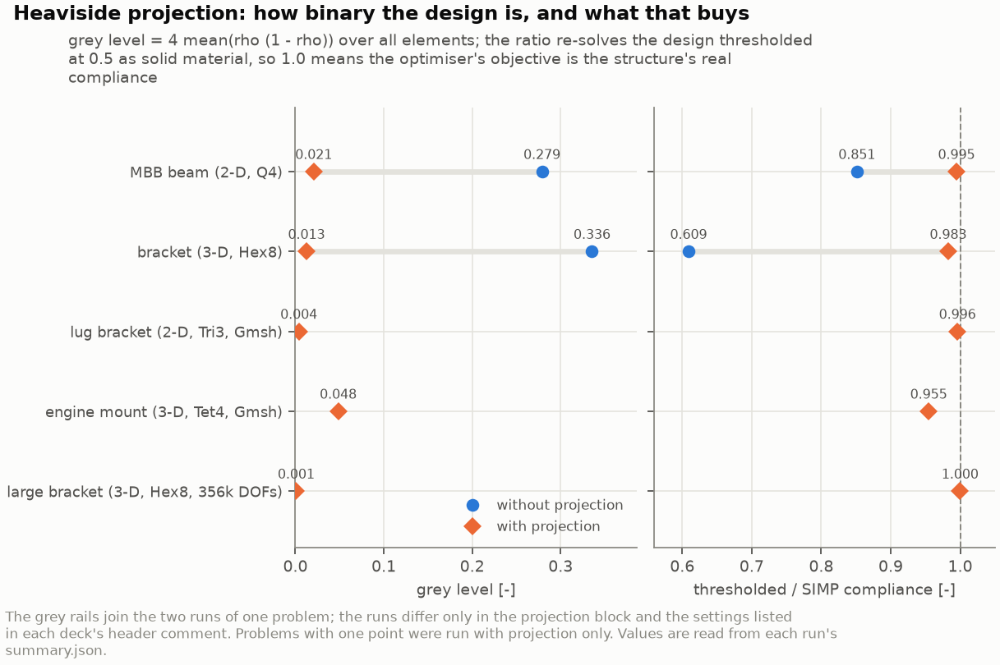
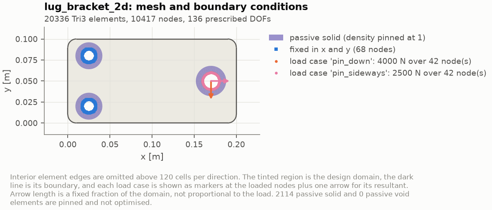
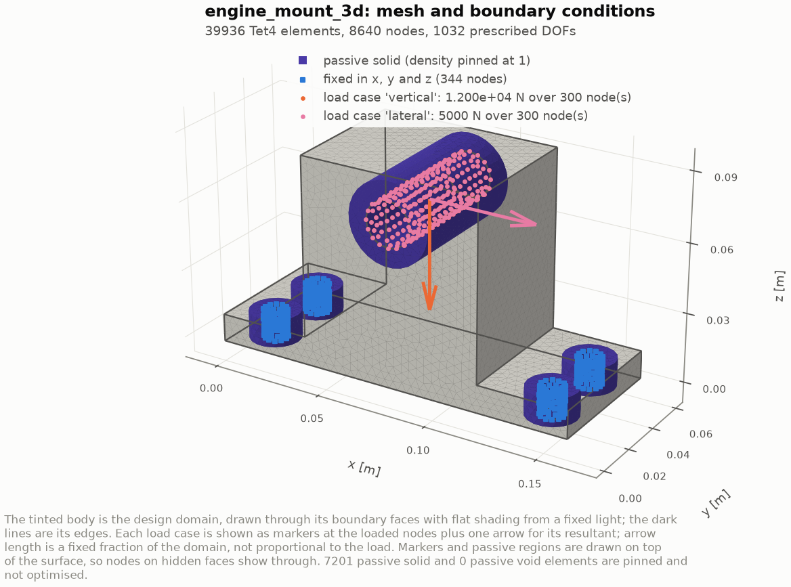
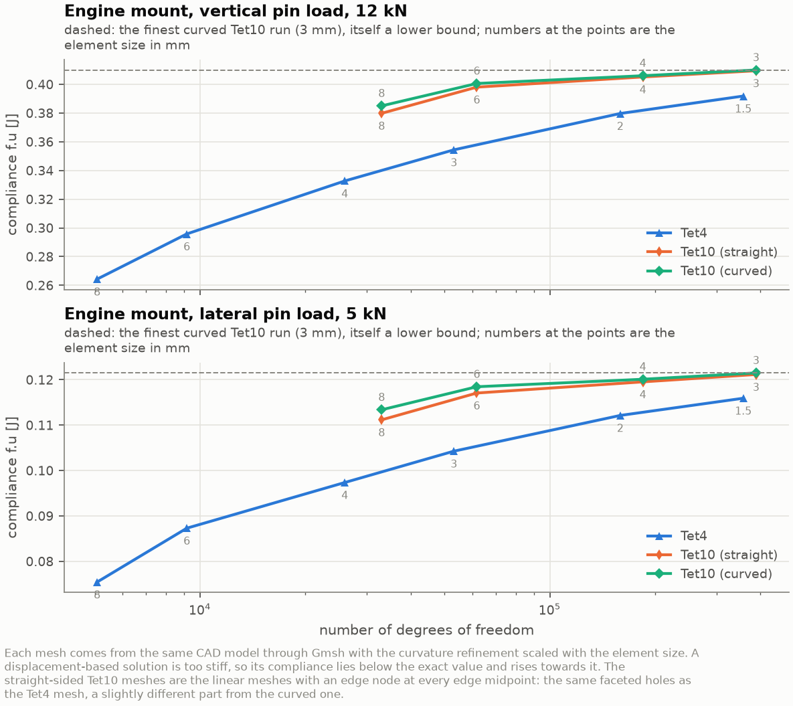
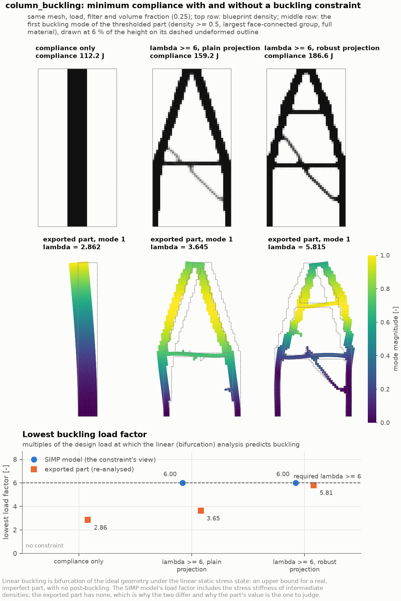
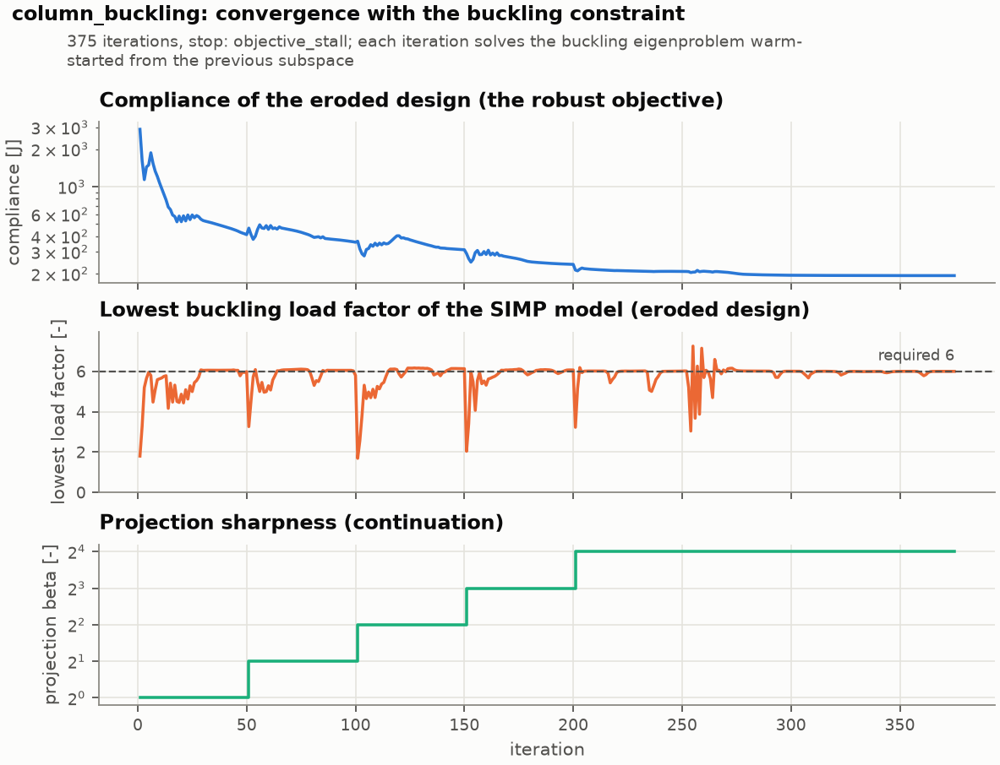
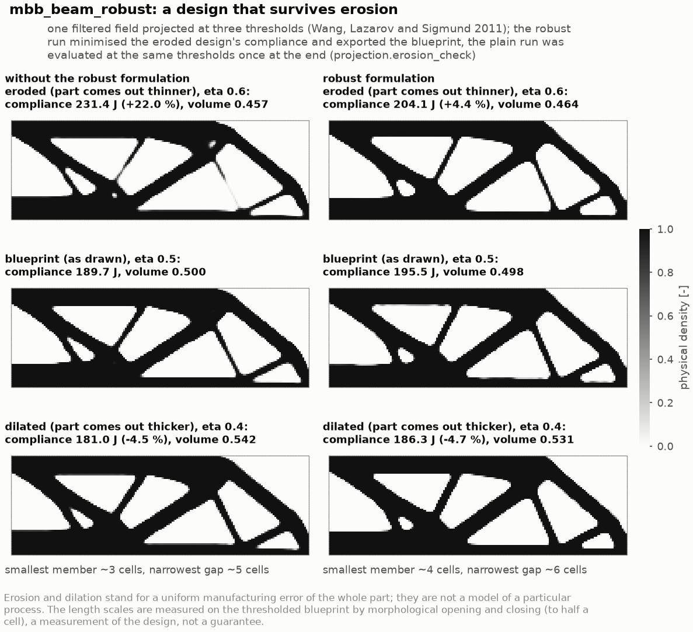
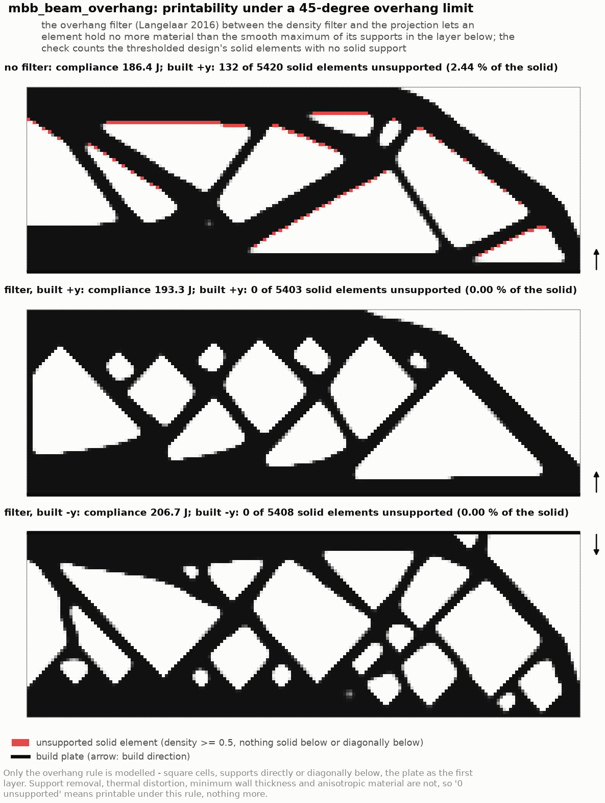
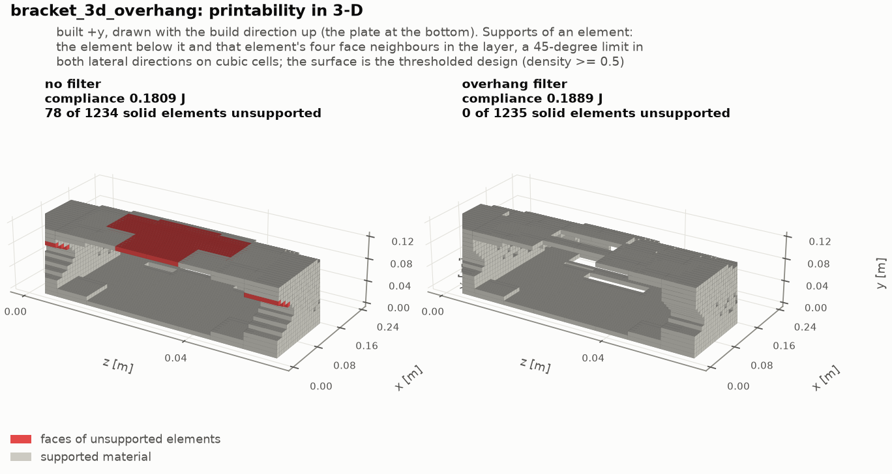
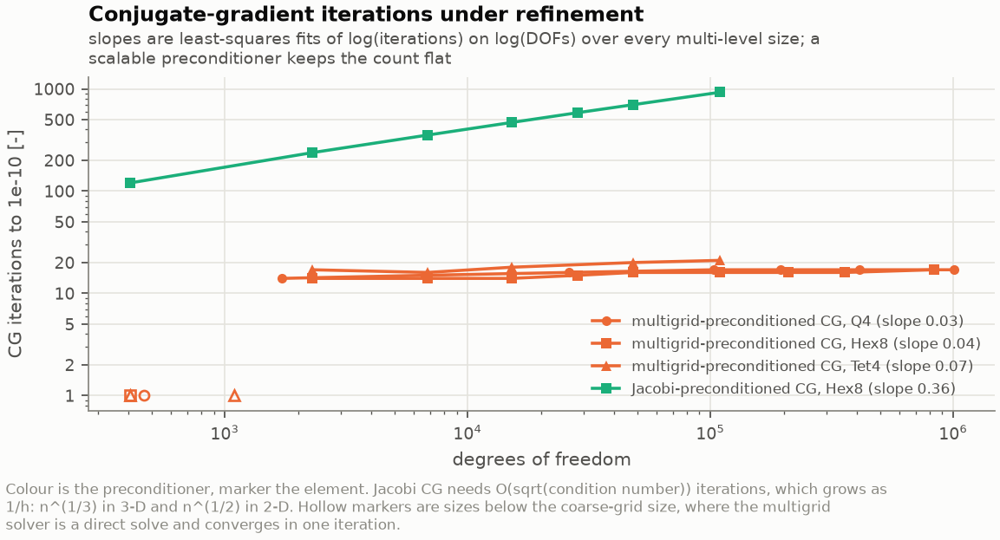

# Benchmark results

Every number here comes from the `summary.json` of the run named beside it.
`docs/results/README.md` carries the same data as a machine-generated table and
is refreshed by `make results`; this document adds the interpretation.

Reproduce all of it with:

```bash
make benchmarks     # all fifteen decks, two analysis decks and seven comparison runs, a little over an hour
make figures        # every figure and the animations
make results        # refresh the generated tables
```

Machine for every timing below: 4-core container, GCC 13.3.0, `-O3 -DNDEBUG`,
Eigen 3.4.0. The element loops and the sparse Cholesky factorisation
(`SimplicialLDLT`, AMD ordering) run on one core. The multigrid solver's
kernels use OpenMP on all four, and so does the matrix-vector product inside
Eigen's Jacobi-preconditioned CG; both give the same bits on one core.
Absolute times will differ elsewhere; the scaling exponents are the portable
part.

## Summary

| Case | Elements | DOFs | Method | Solver | `nu` target | Iterations | Stop reason | Compliance [J] | Equal-mass plate [J] | Stiffness gain | Grey | Optimisation [s] |
|------|---------:|-----:|--------|--------|------------:|-----------:|-------------|---------------:|---------------------:|---------------:|-----:|-----------------:|
| `cantilever_beam` | 12 800 Q4 | 26 082 | OC | Cholesky | 0.40 | 362 | design change | 1.11252 | 1.37813 | **1.239** | 0.0947 | 48.9 |
| `mbb_beam` | 10 800 Q4 | 22 082 | OC | Cholesky | 0.50 | 434 | design change | 221.551 | 259.521 | **1.171** | 0.279 | 56.6 |
| `mbb_beam_projected` | 10 800 Q4 | 22 082 | OC + projection (`beta` 32) | Cholesky | 0.50 | 218 | objective stall | 189.654 | 259.521 | **1.368** | 0.0207 | 31.6 |
| `aerospace_bracket` | 38 400 Q4 | 77 602 | OC | Cholesky | 0.35 | 375 | objective stall | 3.00015 | 3.19665 | **1.065** | 0.116 | 443.9 |
| `wing_rib` | 12 500 Q4 | 25 602 | OC | Cholesky | 0.40 | 530 | objective stall | 1.35608 | 1.21194 | **0.894** | 0.221 | 64.9 |
| `l_bracket_stress` | 4 096 Q4 | 8 450 | MMA + stress | Cholesky | 0.35 | 494 | design change | 0.0895584 | (see section 5) | - | 0.118 | 22.1 |
| `bracket_3d` | 4 096 Hex8 | 15 147 | OC | Cholesky | 0.30 | 157 | design change | 0.289513 | n/a (solid) | - | 0.336 | 450.5 |
| `bracket_3d_projected` | 4 096 Hex8 | 15 147 | OC + projection (`beta` 16) | multigrid CG | 0.30 | 190 | objective stall | 0.181884 | n/a (solid) | - | 0.0125 | 99.6 |
| `lug_bracket_2d` | 20 336 Tri3 | 20 834 | OC + projection (`beta` 32) | Cholesky | 0.35 | 211 | objective stall | 0.828909 | 0.950635 | **1.147** | 0.00387 | 37.7 |
| `engine_mount_3d` | 39 936 Tet4 | 25 920 | OC + projection (`beta` 16) | multigrid CG | 0.25 | 265 | objective stall | 0.443669 | n/a (solid) | - | 0.0484 | 278.5 |
| `bracket_3d_large` | 110 592 Hex8 | 356 475 | OC + projection (`beta` 16) | multigrid CG | 0.30 | 171 | objective stall | 0.170987 | n/a (solid) | - | 0.000862 | 1339.9 |
| `column_buckling` | 3 200 Q4 | 6 642 | MMA + buckling + robust projection (`beta` 16) | Cholesky | 0.25 | 375 | objective stall | 186.636 | 155.286 | 0.832 | 0.0426 | 156.7 |
| `mbb_beam_robust` | 10 800 Q4 | 22 082 | OC + robust projection (`beta` 32) | Cholesky | 0.50 | 236 | objective stall | 195.485 | 260.601 | **1.333** | 0.0253 | 35.2 |
| `mbb_beam_overhang` | 10 800 Q4 | 22 082 | MMA + projection (`beta` 32) + overhang filter | Cholesky | 0.50 | 211 | objective stall | 193.255 | 259.526 | **1.343** | 0.0166 | 26.4 |
| `bracket_3d_overhang` | 4 096 Hex8 | 15 147 | MMA + projection (`beta` 16) + overhang filter | multigrid CG | 0.30 | 177 | objective stall | 0.188922 | n/a (solid) | - | 0.00967 | 100.3 |

A robust run's compliance, grey level and volume are its blueprint's
(`eta` = 0.5); the optimiser minimised the eroded design's compliance
(section 13).

"Stiffness gain" is the compliance of an equal-mass *uniform* plate divided by
the optimised compliance, so above 1 means the optimisation paid off. The
wing rib's value below 1 is real and is explained in its own section - it is the
most interesting result in the set. The column's is real too, and says
something about the plane model rather than the optimiser (section 12). The
equal-mass plate is taken at the achieved volume fraction, which is why the
robust MBB's differs from the plain one's. The L-bracket's baseline plate would fill
the passive void quadrant, so the ratio is not a fair one there and is not
quoted; a solid has no thickness to thin, so the solid cases have no such
baseline at all (section 6). A projected run's gain is higher than its
unprojected twin's because its objective describes the thresholded part
rather than a grey field (section 7), not because the part is stiffer.

**Volume constraint.** Every OC run but the robust one meets it at the
returned design to the multiplier-bisection tolerance: the relative
violations lie between `1.1e-11` and `9.6e-11` in magnitude. Without the
projection it also holds at every recorded iteration. With it, two kinds of
iterate are analysed before an update has put them on the target: the
starting design seen through the first projection, off by up to 16 % (the
lug bracket), and the first design after each `beta` step, off by up to
1.8 % (the projected solid bracket). The robust run constrains the *dilated*
design, which meets its rescaled target to `9.6e-11`; the blueprint follows
only through the ratio of the two volumes and ends 0.41 % under the fraction
(section 13). The MMA runs meet it between `-2.0e-4` (section 5) and
`-2.8e-6`, on the feasible side.

## The equal-mass baseline

Comparing an optimised design against the full solid domain is not a fair
comparison - the solid domain has more material. The right baseline is a
structure of the **same mass**, and in this 2-D idealisation there is a clean
one.

Both `K` and `M` scale linearly with thickness, so scaling the thickness by the
volume fraction `nu`:

* multiplies the mass by `nu`;
* multiplies the compliance by `1/nu`;
* leaves every natural frequency **unchanged**.

So a uniformly thinned plate of the same mass as the optimised design has
compliance `C_solid / nu` and exactly the full-solid frequencies. Each run
verifies the frequency invariance numerically rather than assuming it; the
measured maximum relative difference over the reported modes is `2.5e-12`
(cantilever), `2.6e-11` (bracket) and `3.8e-12` (rib).

That is why the "full solid domain" and "equal-mass uniform plate" rows of the
modal table are identical, and why the full-solid frequencies double as the
equal-mass baseline.

## 1. Cantilever beam

`configs/benchmarks/cantilever_beam.json` - 0.40 x 0.20 m domain, 4 mm thick,
Al 7075-T6, clamped left edge, 2 kN downward resultant spread over three tip
nodes at mid-height. 160 x 80 mesh, density filter radius 2 cells (5 mm,
support 8.9 elements), `p = 3`, no continuation.


| Quantity | Value |
|----------|-------|
| Compliance, uniform start | 8.6133 J |
| Compliance, optimised | 1.11252 J (**7.74x** improvement) |
| Full solid domain | 0.551251 J at 0.8992 kg |
| Equal-mass uniform plate | 1.37813 J at 0.3597 kg |
| Optimised | 1.11252 J at 0.3597 kg (**1.239x stiffer** than the plate) |
| Volume fraction | 0.40000000 (violation `-3.0e-11`) |
| Grey level | 0.0947 |
| Interpretation at `rho >= 0.5` | 5 122 of 12 800 elements, **1** connected group, **0** discarded as islands |
| Runtime | 48.9 s, 362 iterations, 363 linear solves, 0.135 s/iteration |

The result is the expected two-bar / tied-arch layout: a straight tension
member along the top, a compression member along the bottom, and a diagonal web
transferring the tip shear to the root. The design is essentially binary
(grey 0.0947) and forms a single connected structure with nothing discarded.

**Modal comparison.**

| Structure | Mass [kg] | f1 [Hz] | f2 [Hz] | f3 [Hz] | f4 [Hz] |
|-----------|----------:|--------:|--------:|--------:|--------:|
| Full solid domain | 0.8992 | 872.1 | 3173.0 | 3314.3 | 6938.0 |
| Equal-mass uniform plate | 0.3597 | 872.1 | 3173.0 | 3314.3 | 6938.0 |
| Optimised topology | 0.3598 | **1016.4** | 1685.7 | 1935.3 | 2405.1 |

The optimised design is **16.5% higher in `f1` than the equal-mass plate**, at
40% of the solid mass. Removing material from the low-stress core raises the
stiffness-to-mass ratio in the fundamental mode, which is exactly what a
compliance-minimal layout should do.

The higher modes tell the other half of the story: `f2` through `f4` drop sharply
(3173 -> 1686 Hz). The truss has *local* member modes that the continuous plate
does not, and they sit below the plate's second global mode. **Compliance
optimisation raises the fundamental frequency and lowers the higher ones**; it
does not improve the whole spectrum, and a design driven by a higher-mode
requirement would need a frequency constraint, which this optimiser cannot
carry.

**Interpretation check.** Running a solid FE model on the thresholded structure
gives 1.0403 J against the SIMP field's 1.11252 J, a ratio of 0.935. The
thresholded structure is *stiffer*, because thresholding converts the filter's
grey boundary layer into fully solid material - and it does so at essentially no
extra volume, since the retained 5 122 elements are 40.02% of the domain against
a 40% target. This is the sense in which the SIMP penalty makes intermediate
density inefficient: the field pays for grey material without getting solid
stiffness from it.

Corrected to the interpreted structure's own mass, the stiffness gain over an
equal-mass plate is **1.324** rather than the 1.239 the objective implies. The
design study shows how far that gap can go and why the interpreted number is
the one to compare: [`aerospace_study.md`](aerospace_study.md).

## 2. MBB beam

`configs/benchmarks/mbb_beam.json` - the standard reference problem. Half model
of a simply supported beam under a central point load: symmetry condition
`u_x = 0` on the left edge, a vertical roller at the bottom-right corner, unit
downward load at the top-left corner. Dimensionless settings (`E = 1 Pa`, 1 m
cell, `F = 1 N`) on a 180 x 60 mesh, volume fraction 0.50, `p = 3`, density
filter radius 4.5 cells - the same *physical* radius as the customary 1.5 cells
at 60 x 20.


| Quantity | Value |
|----------|-------|
| Compliance, uniform start | 1038.08 J |
| Compliance, optimised | 221.551 J (**4.69x** improvement) |
| Full solid domain | 129.76 J |
| Equal-mass uniform plate | 259.521 J |
| Stiffness gain over the plate | 1.171 |
| Volume fraction | 0.50000000 (violation `-1.5e-11`) |
| Grey level | 0.279 |
| Interpretation at `rho >= 0.5` | 5 507 of 10 800 elements, **1** connected group, **0** islands |
| Runtime | 56.6 s, 434 iterations |

The topology is the familiar MBB result: solid top and bottom flanges joined by
a diagonal truss web that fans from the load point to the roller, with the
characteristic triangulated cells.

**Interpretation check.** Thresholding the design at 0.5 leaves 5 507 of the
10 800 elements in a single group, 1.98 % more material than the 5 400 the
constraint allowed for, and a compliance of 188.60 J against the SIMP field's
221.55 J (ratio 0.851). Compared against a uniform plate of the interpreted
structure's own mass the gain is **1.349** rather than the 1.171 the objective
implies - the same direction and roughly the same size as on the bracket.

**On comparing with published values.** SparLab reports what it computes and
does not claim agreement with a literature number. Running the same problem at
60 x 20 with a 1.5-cell radius gives, on this build:

| Filter | Compliance [J] | Iterations | Grey level |
|--------|---------------:|-----------:|-----------:|
| Density (default) | 218.80 | 126 | 0.269 |
| Sensitivity (Sigmund) | 203.17 | 94 | 0.174 |
| None | 203.21 | 63 | 0.012 |

The ordering is the informative part. The **density** filter imposes a genuine
minimum length scale and therefore costs stiffness. The **sensitivity** filter
only smooths the search direction, so it reaches a lower compliance without
enforcing a length scale. **No** filter reaches the same compliance with a grey
level of 0.012 - an almost perfectly 0/1 design - but that 0/1 pattern *is* the
checkerboard, a numerical artefact of the Q4 displacement field rather than a
structure. A low grey level is not by itself evidence of a good design.

Which of these a published value corresponds to depends on the filter variant,
the radius convention, the convergence criterion and the penalty schedule, so
quoting agreement without re-deriving the reference under identical settings
would be guesswork. What supports the result instead is internal: the gradient
is verified against finite differences to `2.2e-08`, the volume constraint is
exact to `1.5e-11`, and at the converged design the KKT quantity
`B_e = -(dc/dx_e)/(dv/dx_e)` across elements strictly inside their bounds has a
5-95 percentile spread of about **9%**, which is the residual expected of
optimality criteria with a move limit and a finite change tolerance.

## 3. Aerospace mounting bracket

`configs/benchmarks/aerospace_bracket.json` - the primary aerospace case.
A 0.30 x 0.20 m machined plate, 8 mm thick, Al 7075-T6, bolted to structure
through two holes on the left and transferring load through a pin lug on the
right. 240 x 160 mesh (38 400 elements, 77 602 DOFs), volume fraction 0.35,
density filter radius 3 cells (3.75 mm), `p` ramped 1.5 -> 3.0 in three stages
of 30 iterations.


**Attachment representation** - and what it is not. Bolt holes and the lug hole
are passive void; bearing collars around each are passive solid; every node
inside a bolt hole is fixed, i.e. the bolt shank is idealised as rigid; the lug
load is applied to the ring of nodes around the lug hole, i.e. the pin bears on
the hole wall. 1 520 elements are passive solid and 528 passive void, leaving
36 352 free variables. None of this is a joint model - see
`docs/limitations.md`.

**Three load cases**, weights normalised from (1.0, 0.5, 0.5):

| Load case | Load | Weight | Compliance at the optimum [J] |
|-----------|------|-------:|------------------------------:|
| `down_limit` | 9 kN down through the lug | 0.50 | 5.1699 |
| `up_reversal` | 4.5 kN up | 0.25 | 1.2925 |
| `lateral` | 4.5 kN sideways | 0.25 | 0.3684 |
| **weighted objective** | | | **3.00015** |

| Quantity | Value |
|----------|-------|
| Compliance, uniform start | 4.54752 J |
| Compliance, optimised | 3.00015 J (1.52x improvement) |
| Full solid domain | 1.11883 J at 1.3488 kg |
| Equal-mass uniform plate | 3.19665 J at 0.4721 kg |
| Optimised | 3.00015 J at 0.4721 kg (**1.065x stiffer** than the plate) |
| Volume fraction | 0.35000000 (violation `-7.2e-11`) |
| Grey level | 0.116 |
| Interpretation at `rho >= 0.5` | 13 476 of 38 400 elements, **1** connected group, **0** islands |
| Runtime | 443.9 s, 375 iterations, 1 128 linear solves, 1.184 s/iteration |

The topology is a symmetric double fan: two pairs of diagonal members running
from each bolt collar out to the lug, tied by a vertical member at the lug and
by short members between the two bolt bosses. The symmetry about the horizontal
mid-plane is not imposed - it emerges, which is what the symmetric load set and
geometry should produce, and its appearance is itself a useful check on the
implementation.

The stiffness gain of 1.065 is modest compared with the cantilever's 1.239, and
the reason is instructive: three load cases pulling in different directions
leave much less room for a specialised load path than a single tip load does.
The design has to serve a down-load, its reversal and a lateral case at once.

**Modal comparison.**

| Structure | Mass [kg] | f1 [Hz] | f2 [Hz] | f3 [Hz] | f4 [Hz] |
|-----------|----------:|--------:|--------:|--------:|--------:|
| Full solid domain | 1.3488 | 1437.2 | 4252.3 | 5158.7 | 9476.8 |
| Equal-mass uniform plate | 0.4721 | 1437.2 | 4252.3 | 5158.7 | 9476.8 |
| Optimised topology | 0.4733 | **2027.4** | 3917.9 | 5297.8 | 5493.7 |

`f1` rises by **41%** while the mass falls to 35% of the solid domain. Against
the equal-mass plate - which is the fair comparison - the optimised bracket is
41% higher in fundamental frequency *and* 6.5% stiffer in weighted compliance.
For this bracket the compliance-optimal layout happens to be a good
vibration-performance layout too, and `f3` even rises slightly. `f2` and `f4`
fall, for the same local-member reason as the cantilever.

**Interpretation check.** The thresholded solid structure gives 2.5514 J against
the SIMP field's 3.00015 J (ratio 0.850), at 13 476 elements = 35.1% of the
domain against a 35% target. Its peak von Mises stress is 160 MPa. Against the
7075-T6 tensile yield of roughly 500 MPa that is a margin of about 3 on the
weighted design loads - but this deck runs without a stress constraint (section
5 shows what one does), so this is a *post-hoc observation*, not a
substantiation, and point-load and re-entrant-corner stresses in a density
design are mesh sensitive.

## 4. Wing rib

`configs/benchmarks/wing_rib.json` - the web of a wing rib between a front and
a rear spar. 0.50 x 0.10 m, 2 mm thick, Al 2024-T3. Front spar attachment fixed
in both directions, rear spar a vertical roller (free chordwise). 250 x 50 mesh,
volume fraction 0.40, filter radius 2 cells (4 mm), `p` ramped 1.5 -> 3.0.


Passive regions: one-element skin-attachment flanges top and bottom, spar
attachment pads at both ends, and two system cutouts - 1 172 elements passive
solid and 416 passive void, leaving 10 912 free. Load cases: a chordwise-decaying
download on the upper skin plus a download on the lower skin
(`positive_manoeuvre`, weight 1.0), the reverse at a lower factor
(`negative_manoeuvre`, 0.4), and a 4 kN systems/actuator fitting load picked up
at mid chord (`fitting_load`, 0.6).

| Quantity | Value |
|----------|-------|
| Compliance, uniform start | 1.53023 J |
| Compliance, optimised | 1.35608 J (1.13x improvement) |
| Full solid domain | 0.484776 J at 0.2780 kg |
| Equal-mass uniform plate | 1.21194 J at 0.1112 kg |
| Optimised | 1.35608 J at 0.1112 kg (**0.894x**, i.e. *less* stiff) |
| Volume fraction | 0.40000000 (violation `+1.1e-11`) |
| Grey level | 0.221 |
| Interpretation at `rho >= 0.5` | 5 063 of 12 500 elements, **1** connected group, **0** islands |
| Runtime | 64.9 s, 530 iterations, 1 593 linear solves |

The topology is a recognisable lightened rib web: a heavy vertical post under
the mid-chord fitting, diagonal braces fanning from it to both spar
attachments, and large lightening cut-outs between them - which is what a real
machined rib looks like.

### The optimised rib is less stiff than a uniform web of the same mass

Stiffness gain 0.894, i.e. 10.6% *worse* than uniform thinning. That is a real
result, not a solver failure, and it is worth spelling out because it is the
kind of finding a study is for. Two diagnostic runs isolate the cause (same
deck, same loads, only the passive regions changed):

| Configuration | Compliance [J] | vs equal-mass plate (1.21194 J) |
|---------------|---------------:|--------------------------------:|
| No passive regions at all | 1.15916 | **1.046x stiffer** |
| Spar attachment pads only | 1.28501 | 0.943x |
| As specified: pads + flanges + cutouts | 1.35608 | 0.894x |

With full design freedom the optimiser *does* beat uniform thinning, by 4.6%.
Adding the mandated spar pads costs 10.9%, and the skin flanges a further 5.5%.
**The attachment hardware, not the optimiser, is what costs the stiffness** - it
forces solid material into places the load path does not want it, and that
material is charged against the same volume budget.

The comparison is also unfair to the uniform plate in an important way: a
uniformly thinned web has no attachment land at all, so it is not a producible
alternative. The honest reading is that on this component the mandated
attachment features dominate the achievable stiffness, and the payoff from
topology optimisation would come from revisiting *where and how the rib
attaches*, not from optimising harder inside the given constraints. That is a
result about the problem statement, which is often the most useful thing a
design study produces.

**And one correction to the headline.** The 0.894 is measured on the *objective*
- the penalised SIMP field. Thresholding the design at 0.5 and re-solving it
gives 1.1897 J at 1.26% more mass, which is a mass-corrected gain of **1.006**:
the structure a threshold produces is level with the equal-mass plate, not
10.6% short of it. The shortfall is in the relaxed model, not in the design.
Both numbers are in the summary, and the reason they differ - and why it can be
much larger than this - is the subject of
[`aerospace_study.md`](aerospace_study.md).

Reproduce the diagnostics by copying the deck, deleting the `passive_regions`
entries and re-running.

**Modal comparison** - and a second cautionary result.

| Structure | Mass [kg] | f1 [Hz] | f2 [Hz] | f3 [Hz] | f4 [Hz] |
|-----------|----------:|--------:|--------:|--------:|--------:|
| Full solid domain | 0.2780 | 1488.7 | 2623.1 | 3809.5 | 6624.1 |
| Equal-mass uniform plate | 0.1112 | 1488.7 | 2623.1 | 3809.5 | 6624.1 |
| Optimised topology | 0.1126 | **386.6** | 487.1 | 711.5 | 856.6 |

`f1` falls by a factor of 3.85 while the mass falls by 2.47. Unlike the
cantilever and the bracket, this design is markedly *worse* in vibration than an
equal-mass uniform web.

The mechanism is clear from the shapes: the optimised rib is a slender truss
whose lowest modes are local bending of its individual thin diagonals, whereas
the uniform web is a continuous shear panel with no such soft members. A
compliance objective sees only the static load path; it has no reason to keep
the lowest eigenvalue high, and here it trades it away. Any real rib with a
vibration or flutter requirement would need that requirement in the
optimisation, not checked afterwards - and this optimiser, with its single
volume constraint, cannot carry it.

## 5. Stress-constrained L-bracket (MMA)

`configs/benchmarks/l_bracket_stress.json` - the canonical stress-constrained
test case. A 0.40 x 0.40 m square, 10 mm thick, Al 7075-T6, on a 64 x 64
mesh (4 096 elements, 8 450 DOFs) whose upper-right quadrant is passive void
(1 444 elements). The remaining left arm is clamped along its top edge; a
600 N downward resultant is applied at the tip of the lower arm through a
passive solid pad (60 elements), so the load-application stress is not
design dependent. Volume fraction 0.35, density filter radius 1.5 cells
(9.4 mm, support 8.8 elements), `p = 3`, no continuation, MMA with a move
limit of 0.1, and one aggregated von Mises constraint with limit
**9.4 MPa** (`P = 8`, `q = 0.5`). The same deck is run once more with the
constraint switched off (`--no-stress`) as the reference.


| Quantity | Constraint off | Constraint on |
|----------|---------------:|--------------:|
| Iterations, stop reason | 115, objective stall | 494, design change |
| Linear solves (one adjoint per iteration when constrained) | 116 | 989 |
| Compliance, uniform start | 1.35322 J | 1.35322 J |
| Compliance, optimised | 0.085276 J | **0.089558 J** (+5.0 %) |
| Volume fraction | 0.349999 (`-2.1e-06`) | 0.349929 (`-2.0e-04`, feasible) |
| Grey level | 0.122 | 0.118 |
| Relaxed stress peak of the design, `rho^0.5 sigma_vm` | 15.6 MPa (1.66 x limit) | 9.34 MPa (**0.994** x limit) |
| p-norm aggregate over the limit, and its scale | - | 1.187, `c = 0.842` |
| Interpretation at `rho >= 0.5` | 1 440 elements, 1 group, 0 islands | 1 438 elements, 1 group, 0 islands |
| Re-solved structure: compliance | 0.075180 J | 0.079330 J (+5.5 %) |
| Re-solved structure: peak von Mises | 10.13 MPa (**1.078** x limit) | 7.62 MPa (**0.810** x limit) |
| Runtime | 3.8 s | 22.1 s |

The unconstrained design does what a compliance objective always does at a
re-entrant corner: it fills it, and concentrates stress there. Its re-solved
structure exceeds the 9.4 MPa limit by 7.8 % at the corner (the yellow spot in
the upper panel). With the constraint on, the corner is rounded - material
moves from the corner into a second diagonal - and the re-solved structure
sits at 81 % of the limit, a **25 % lower peak stress for 5.0 % more
compliance**. That is the trade a stress constraint is for.

Three readings of the table need care:

* the constraint acts on the **relaxed** stress of the SIMP model, whose peak
  at the returned design is 0.994 of the limit: active, feasible, and
  hovering just inside the limit as the adaptive p-norm scale is re-fitted
  each iteration (`l_bracket_stress_convergence.png`, fourth panel). The
  re-solved structure's 0.810 is a different, better number because
  thresholding promotes the corner's intermediate densities to solid
  material and its stress drops. Both are reported; the second is the one
  that says whether the *structure* meets the limit;
* the "unconstrained relaxed peak" of 15.6 MPa is measured by running the
  deck with the constraint switched off but the stress evaluation on
  (`--stress-limit 1e30`); the limit was set at 60 % of it;
* neither run's compliance is comparable with an equal-mass uniform plate
  of the *square* domain, since that plate would fill the passive quadrant.
  The fair reference for the constrained design is the unconstrained one,
  which is why the deck is run twice.

**Convergence.** MMA with a stress constraint oscillates more than OC on a
compliance-only problem, because the constraint surface moves with the
p-norm scale. At the compliance decks' move limit of 0.2 the run hit its
cap with a handful of corner elements still flipping between their bounds
(feasible, but not converged). At 0.1 the design still spends long stretches
in a cycle of period 5 at the move limit - around iteration 120 the relaxed
stress ratio goes round `0.96, 1.09, 1.14, 1.03, 0.83` with every step at
the move limit - before it settles, and it converges on the
design-change criterion after 494 iterations (`max |dx| = 0.0094`),
feasible, with the largest constraint value at `-2.0e-4`.

Two changes in this version of the code are visible here. An earlier build
stopped this deck after 240 iterations on the objective-stall criterion,
which then compared two compliances 20 iterations apart; a cycle whose
period divides the window returns to the same compliance, and on a slightly
different trajectory (round-off from unrelated changes is enough) the test
fired at iteration 129 in the middle of the cycle, with the design still
moving by the full move limit. The criterion now measures the spread of the
whole window, which a cycle cannot satisfy (`docs/topology_optimization.md`
section 8). And one MMA subproblem on the way - iteration 123 - needed 392
Newton iterations in all, about 220 of them at the final barrier level,
where the previous budget was 200 per level: the step to the final barrier
threw the multipliers off the central path. The budget is now 500, and
running out of it remains an error. The other 493 subproblems took 21 to
192 Newton iterations each (median 58).

## 6. Solid bracket (Hex8)

`configs/benchmarks/bracket_3d.json` - the 3-D case. A 0.24 x 0.12 x 0.06 m
aluminium block (Al 7075-T6) clamped on its `x = 0` face (153 nodes,
459 DOFs), with two load cases at the far end: `down_limit`, 3 kN in `-y`
spread over the nine nodes of the tip's bottom edge (weight 1.0), and
`lateral`, 1.2 kN in `+z` over the nine nodes of the tip's mid-height line
(weight 0.5). 32 x 16 x 8 Hex8 mesh (4 096 elements, 15 147 DOFs), volume
fraction 0.30, density filter radius 1.5 cells (11.25 mm, support 16.9
elements), `p = 3`, optimality criteria, six modes of the solid and of the
interpreted structure.


| Quantity | Value |
|----------|-------|
| Compliance, uniform start | 2.77535 J |
| Compliance, optimised | 0.289513 J (**9.6x** improvement); `down_limit` 0.33669 J, `lateral` 0.19516 J |
| Full solid domain | 0.074935 J at 4.8557 kg |
| Optimised design | 0.289513 J at 1.4567 kg (3.86x the solid's compliance at 30 % of its mass) |
| Volume fraction | 0.30000000 (violation `8.0e-11`) |
| Grey level | 0.336 |
| Interpretation at `rho >= 0.5` | 1 278 of 4 096 elements, **1** connected group, **0** discarded as islands |
| Re-solved structure | 0.176349 J (ratio **0.609** to the SIMP field) at 1.5150 kg; peak von Mises 12.7 MPa |
| Geometry export | 5 356 triangles, closed, 32 non-manifold edges, enclosed volume equal to the cell volume to `3.5e-14` |
| Runtime | 450.5 s for 157 iterations (2.87 s each), 316 linear solves with the sparse Cholesky solver; 460.9 s in total with both modal analyses |

The topology is a cantilevered box girder: two webs along the sides joined by
a tapered top flange, thinning towards the tip where the bending moment is
smallest, with the `lateral` case keeping both webs rather than letting the
design collapse onto a single vertical plate. The structure is one connected
group and nothing is discarded.

Two numbers stand out against the plane cases:

* **the grey level is 0.336**, three times the cantilever's. In 3-D a filter
  of radius 1.5 cells averages over 17 elements rather than 9, and the
  intermediate boundary layer is a *surface* of the structure rather than a
  curve, so it holds a larger share of the volume. The re-solve shows what
  that costs: the thresholded structure is **39 % stiffer** than the SIMP
  field (ratio 0.609) for 4 % more mass, because the threshold promotes that
  whole grey shell to solid material. On a 3-D density design the reported
  objective is even more pessimistic than on a plane one, and the re-solved
  number is the one to plan with;
* **there is no equal-mass baseline.** A solid has no thickness to scale, so
  the uniformly thinned plate that made "stiffness gain" a clean comparison
  in 2-D does not exist; the only reference reported is the full solid
  domain, and the summary says so in its `mass_stiffness_comparison.note`.

**Modal comparison.**

| Structure | Mass [kg] | f1 [Hz] | f2 [Hz] | f3 [Hz] | f4 [Hz] |
|-----------|----------:|--------:|--------:|--------:|--------:|
| Full solid domain | 4.8557 | 835.0 | 1471.0 | 2531.6 | 4201.0 |
| Optimised topology | 1.5150 | **917.1** | 1664.9 | 2661.2 | 3326.3 |

`f1` rises by 9.8 % at 31 % of the solid's mass, and `f2` and `f3` rise too;
`f4` falls, for the local-member reason the plane cases show. Without a
thinned-solid baseline the honest comparison is only against the full block,
and the mass ratio has to be read alongside the frequencies.

**Geometry.** `structure_after.stl` is the boundary of the 1 278 retained
cells: closed and outward, with its enclosed volume equal to the cell volume
to round-off, but with 32 edges where two retained cells touch only along an
edge. The surface is therefore not a 2-manifold and a slicer may split it
into shells at those edges; the summary and the console report the count, and
the interpretation threshold and connectivity rule - not the STL writer -
decide whether such cells belong to one part.

The deck names the sparse Cholesky solver, which costs 2.87 s per iteration
at 15 147 DOFs, where the plane bracket needs 1.18 s per iteration for
77 602. The direct solver's fill-in grows far faster in three dimensions
(see *Runtime and scaling* below). The same bracket with the multigrid
solver and the projection (section 7) costs 0.52 s per iteration, and
section 10 solves it at 23.5 times the unknowns.

## 7. Heaviside projection: the same problems with and without it

A density filter leaves a band of intermediate density along every boundary
between material and void, and a threshold has to decide what that band
becomes. The Heaviside projection (`docs/topology_optimization.md`, section
3b) passes the filtered density through a smoothed step at `eta = 0.5` whose
sharpness `beta` rises in steps, so the density the finite-element model
sees tends to 0 or 1. Two pairs of runs show what it changes:

* `mbb_beam_projected` is section 2's MBB beam with the projection, `beta`
  from 1 to 32, doubling every 40 iterations;
* `bracket_3d_projected` is section 6's solid bracket with the projection,
  `beta` from 1 to 16, solved with the multigrid solver.

Mesh, material, supports, loads, volume fraction and filter are those of
the unprojected decks. The stopping settings differ, for the reason given
at the end of this section: every projected deck uses a move limit of 0.1
and an objective-stall criterion of 0.1 % over 10 iterations.

| Run | Projection | Iterations, stop | Grey | Grey before projection | Optimised compliance [J] | Thresholded structure [J] | Thresholded / optimised | Thresholded volume fraction | Optimisation [s] |
|-----|------------|------------------|-----:|-----------------------:|-------------------------:|--------------------------:|------------------------:|----------------------------:|-----------------:|
| `mbb_beam` | none | 434, design change | 0.279 | - | 221.551 | 188.602 | 0.851 | 0.510 | 56.6 (Cholesky) |
| `mbb_beam_projected` | `beta` 1 to 32 | 218, objective stall | 0.0207 | 0.324 | 189.654 | 188.630 | **0.995** | 0.501 | 31.6 (Cholesky) |
| `bracket_3d` | none | 157, design change | 0.336 | - | 0.289513 | 0.176349 | 0.609 | 0.312 | 450.5 (Cholesky) |
| `bracket_3d_projected` | `beta` 1 to 16 | 190, objective stall | 0.0125 | 0.354 | 0.181884 | 0.178738 | **0.983** | 0.302 | 99.6 (multigrid CG) |

"Thresholded structure" is the design cut at a physical density of 0.5 and
re-solved as solid material, and its volume fraction is what that cut
keeps.




Four things to read from it:

* **the reported compliance describes the part.** Without the projection
  the thresholded structure is 15 % (MBB) and 39 % (bracket) stiffer than
  the compliance the optimiser reported, because the threshold promotes the
  grey band to solid material. With it, the two agree to 0.5 % and 1.7 %;
* **the part itself changes little.** The two MBB structures have the same
  compliance to 0.02 % (188.630 J and 188.602 J), and the projected one
  keeps 1.8 % less material. The projected bracket's structure is 1.4 %
  more compliant than the unprojected one's, at 3.1 % less material. What
  the projection buys is an objective that means what it says, not a
  stiffer part;
* **the grey band is still in the design variables.** The density before
  projection stays grey, 0.324 and 0.354: the projection does not remove
  the filter's boundary band, it maps it to solid or void at `eta`. On its
  own it gives no minimum length scale either; section 13 adds the robust
  formulation for that, and measures what it secures;
* **the stopping rule has to change with it.** The MBB deck with only the
  projection switched on (`sparlab_topopt --projection`, schedule `beta` 1
  to 32 every 50 iterations) ran to its 600-iteration cap. At `beta = 32`
  single elements on the solid-void interface flip by the whole move limit
  of 0.2, so the design change never fell to 0.01. The compliance moved
  within a 0.39 % band over the last 101 iterations, far above that deck's
  stall tolerance of `5e-5`. Its design was as good as the projected
  deck's: a thresholded structure of 187.63 J at a volume fraction of
  0.501, grey level 0.029. Neither criterion could say so. With a move limit of 0.1 and a stall criterion of 0.1 %
  over 10 iterations, the MBB beam stops after 218 iterations, 18 of them
  at `beta = 32`, and the bracket after 190, 30 of them at `beta = 16`.

The runtimes are not a measure of the projection alone. The MBB pair
differs in its stopping settings as well, and the bracket pair in its
solver too: 2.87 s per iteration with Cholesky against 0.52 s with
multigrid. The convergence figures mark the design analysed right after
each `beta` step. Its volume is off the target, by up to 0.8 % on the MBB
beam and 1.8 % on the bracket, until the next update restores it.

## 8. Lug bracket from a Gmsh mesh (Tri3)

`configs/benchmarks/lug_bracket_2d.json` - real geometry instead of a box.
A 200 x 100 mm, 6 mm thick 7075-T6 plate with 10 mm corner radii, two 16 mm
bolt holes on the left and a 20 mm lug hole on the right, drawn and meshed
in Gmsh by `python/scripts/make_meshes.py`: element size 1.5 mm, 20 336
linear triangles, 10 417 nodes, 20 834 DOFs, triangle quality `0.761`
minimum and `0.993` mean. The mesh is in millimetres and is read with
`mesh.scale = 0.001`. Its physical groups are the deck's regions: the
bolt-hole edges (`bolt_holes`, 68 nodes) are clamped, the lug-hole edge
(`load_hole`, 42 nodes) takes a 4 kN downward and a 2.5 kN sideways pin load
as two equally weighted load cases, and an 8 mm rim around every hole
(`hole_rims`, 2 114 triangles) is kept solid so the holes stay holes. Volume
fraction 0.35 with the rims counted, density filter of 2.5 mean edge lengths
(3.7 mm, about 41 triangles), `p = 3`, OC with a move limit of 0.1, and the
Heaviside projection from `beta = 1` to 32, doubling at most every 40
iterations.




| Quantity | Value |
|----------|------:|
| Iterations, stop reason | 211, objective stall at `beta = 32` |
| Compliance, uniform start to optimised | 6.494 J to **0.8289 J** (7.8x) |
| Equal-mass uniform plate, stiffness gain | 0.9506 J, **1.147** |
| Volume fraction (relative violation) | 0.35000 (`9.6e-11`) |
| Grey level, projected / before projection | **0.0039** / 0.176 |
| Interpretation at `rho >= 0.5` | 7 165 triangles, 1 group, nothing discarded |
| Thresholded structure re-solved | 0.8255 J (**0.996** of the objective), peak von Mises 128.6 MPa under the downward pin load |
| `f1` full plate (and equal-mass plate) / optimised | 2202 Hz / **2902 Hz** |
| Linear solver | `auto`: sparse Cholesky, 20 698 free unknowns |
| Runtime | 40.6 s, 0.18 s per iteration |

Three things to read from it:

* **the objective is the structure.** With the projection at `beta = 32`
  the physical density is almost binary, and the thresholded part re-solved
  as solid aluminium is within 0.4 % of the compliance the optimiser
  minimised. Without a projection the compliance of the MBB beam's
  thresholded structure is 15 % below its objective and the solid bracket's
  39 % below (section 7);
* **it stops on the objective, as the deck says it will.** At a sharp
  projection single triangles on the solid-void boundary keep flipping by
  the whole move limit while the compliance is stationary, so the design
  change never falls to 0.01. The run ends at the final `beta` when the
  compliance spread over the last 11 iterations falls below 0.1 %
  (`9.7e-4`), with the design change still at 0.1;
* **real geometry changes what the baseline means.** The bolt and lug holes
  and the rims are in both the optimised part and the equal-mass plate, so
  the 1.147 gain is a like-for-like comparison, and the first frequency
  rises by 32 % at 35 % of the plate's mass, while `f2` to `f4` fall (5578,
  5694 and 8037 Hz against 7193, 7838 and 16255), the member-mode pattern
  the rectangular cases show.

The exported `structure_after.stl` (16 156 triangles) is closed and
2-manifold. The same mesh at `nu = 0` is one of the cross-validation
problems: scikit-fem agrees to `6e-13` and CalculiX to `4.3e-6`
(`docs/verification.md`, section 14).

## 9. Engine mount from an Abaqus mesh (Tet4, multigrid)

`configs/benchmarks/engine_mount_3d.json` - a solid part read from a mesh
file. A 160 x 60 x 12 mm base slab with four vertical 10 mm bolt holes
carries an 80 x 60 x 78 mm upright block, through which a 20 mm pin hole
runs along `y`. `python/scripts/make_meshes.py` draws and meshes it in Gmsh
(4 mm element size) and writes an Abaqus / CalculiX input file: 39 936
linear tetrahedra, 8 640 nodes and 25 920 DOFs, 24 888 of them free, with
a tetrahedron quality of `0.230` minimum and `0.755` mean. The mesh is in
millimetres and is read with `mesh.scale = 0.001`. Its element sets are the
deck's regions. The bolt-hole faces (`bolt_holes`) are clamped. The pin
hole (`pin_hole`) carries a 12 kN downward and a 5 kN lateral load as two
equally weighted load cases. Rings of 6 mm around the bolt holes and 8 mm
around the pin hole (`rings`, 7 201 tetrahedra, 12 % of the volume) are
kept solid. Volume fraction 0.25 with the rings counted, density filter of
1.8 mean edge lengths (8.9 mm, 205 tetrahedra on average), `p = 3`, OC with
a move limit of 0.1, and the Heaviside projection from `beta = 1` to 16.
With 24 888 free unknowns the `auto` solver chooses multigrid CG.




| Quantity | Value |
|----------|-------|
| Iterations, stop reason | 265, objective stall at `beta = 16`: compliance spread `9.9e-4` over the last 11 iterations |
| Compliance, starting design to optimised | 29.83 J to **0.44367 J**; `vertical` 0.65638 J, `lateral` 0.23096 J |
| Full solid part | 0.21705 J at 1.3136 kg |
| Volume fraction | 0.25000000 (violation `-8.8e-11`) |
| Grey level, projected / before projection | **0.048** / 0.354 |
| Interpretation at `rho >= 0.5` | 12 059 of 39 936 tetrahedra, **1** connected group, nothing discarded |
| Thresholded structure re-solved | 0.42352 J (**0.955** of the objective) at 0.3281 kg; peak von Mises 116.6 MPa under the vertical load |
| Geometry export | 5 818 triangles, closed, 4 non-manifold edges, enclosed volume equal to the cell volume to `4e-15` |
| Multigrid hierarchy | 3 levels of 24 888, 2 598 and 186 unknowns; operator complexity 1.50 |
| Linear solver work | 13 404 CG iterations over 532 solves, 25.2 per solve |
| Runtime | 278.5 s for 265 iterations (1.05 s each); 292.4 s in total |

**Modal comparison.**

| Structure | Mass [kg] | f1 [Hz] | f2 [Hz] | f3 [Hz] | f4 [Hz] |
|-----------|----------:|--------:|--------:|--------:|--------:|
| Full solid part | 1.3136 | 1278.0 | 3001.9 | 3149.8 | 6478.3 |
| Optimised topology | 0.3281 | **1795.4** | 4249.7 | 4604.0 | 5157.0 |

Three things to read from it:

* **the starting design matters when passive material fills the budget.**
  The rings are 12 % of the part and 48 % of its material budget. The first
  run of this deck started from a uniform 0.25 and stopped before its first
  update: *"the optimality-criteria bisection cannot bracket the volume
  target 0.000116869 m^3: the move-limited box yields volumes in
  [0.000117276, 0.000200172] m^3"*. With a move limit of 0.1 the free
  elements could fall no lower than 0.15 in one step, which still left the
  part 0.35 % over its budget. The deck now starts at 0.15, where the first
  design is 0.35 % over the target and the first update can reach it. The
  run failed with the reason rather than returning an infeasible design;
* **the objective is 4.5 % pessimistic here.** The grey level ends at
  0.048, higher than on the other projected runs: `beta` stops at 16, and
  a radius of 1.8 mean edge lengths averages over 205 tetrahedra. The
  thresholded part is correspondingly 4.5 % stiffer than the compliance
  the optimiser reported;
* **the multigrid solver handles a real tetrahedral mesh as it handles the
  structured blocks.** It needs 25.2 CG iterations per solve, against 23.5
  on the 356 475-DOF bracket. The operator complexity is higher, 1.50
  against 1.16. The tetrahedral matrix is the sparser one, 40 entries per
  row against 77, while its first coarse level holds 181 per row against
  141, so the coarse levels weigh more next to the fine one. A static
  analysis of the full part, both load cases, takes 0.72 s with multigrid
  CG and 6.1 s with the sparse Cholesky factorisation, and the two agree on
  the compliance to 12 digits.

The first frequency of the optimised part is 40.5 % above the solid
part's, at 25 % of its mass; `f2` and `f3` rise too, and `f4` falls. The
same mesh is a cross-validation problem: scikit-fem agrees to `1.5e-12`
and CalculiX to `2.0e-6` (`docs/verification.md`, section 14).

## 10. Solid bracket at 356 475 DOFs (Hex8, multigrid)

`configs/benchmarks/bracket_3d_large.json` - the bracket of section 6 on a
mesh three times finer in every direction: 96 x 48 x 24 Hex8 with a 2.5 mm
cell, 110 592 elements, 118 825 nodes and 356 475 DOFs, 352 800 of them
free. Block, material, supports and load cases are section 6's. The filter
radius stays at 1.5 cells (3.75 mm, 18.3 elements on average), so the finer
mesh can resolve thinner members instead of reproducing the coarse design.
The Heaviside projection runs from `beta = 1` to 16, doubling every 40
iterations, with OC and a move limit of 0.1. The linear solver is conjugate
gradients preconditioned by smoothed-aggregation multigrid with a degree-3
Chebyshev smoother. Each solve starts from the previous design's
displacements, and each new hierarchy reuses the previous design's
aggregates.


| Quantity | Value |
|----------|-------|
| Iterations, stop reason | 171, objective stall at `beta = 16`: compliance spread `2.1e-4` over the last 11 iterations, design change still at the move limit |
| Compliance, uniform start to optimised | 3.3297 J to **0.170987 J** (19.5x); `down_limit` 0.20564 J, `lateral` 0.10169 J |
| Full solid domain | 0.078258 J at 4.8557 kg |
| Volume fraction | 0.30000000 (violation `-2.1e-11`) |
| Grey level, projected / before projection | **0.00086** / 0.124 |
| Interpretation at `rho >= 0.5` | 33 164 of 110 592 elements, **1** connected group, nothing discarded |
| Thresholded structure re-solved | 0.170942 J (**0.9997** of the objective) at 1.4561 kg; peak von Mises 38.3 MPa under `down_limit` |
| Geometry export | 52 744 triangles, closed and 2-manifold, enclosed volume equal to the cell volume to `3.9e-13` |
| Multigrid hierarchy | 3 levels of 352 800, 29 376 and 1 188 unknowns; operator complexity 1.157 |
| Linear solver work | 8 086 CG iterations over 344 solves, 23.5 per solve, each to a relative residual of `1e-10`; 1.12 s for the last hierarchy setup |
| Runtime | 1 340 s for 171 iterations (7.84 s each); 1 681 s in total, 321 s of it in the two modal analyses |

**Modal comparison.**

| Structure | Mass [kg] | f1 [Hz] | f2 [Hz] | f3 [Hz] | f4 [Hz] |
|-----------|----------:|--------:|--------:|--------:|--------:|
| Full solid domain | 4.8557 | 829.6 | 1466.4 | 2521.0 | 4167.8 |
| Optimised topology | 1.4561 | **1042.5** | 1787.4 | 2821.4 | 2947.4 |

Four things to read from it:

* **the finer mesh finds a better structure.** Compare each design with the
  full solid on its own mesh, because the two meshes do not give the same
  answer for the solid. The coarse mesh is stiffer, and the tip loads act
  on an edge, where the displacement under the load keeps growing as the
  mesh is refined. The solid's compliance is 4.4 % higher on this mesh
  than on the 32 x 16 x 8 one. On that basis the thresholded structure here
  is 2.18 times as compliant as the solid block, at 30 % of its mass. The
  coarse-mesh designs, thresholded and re-solved the same way, reach 2.35
  without the projection (section 6) and 2.39 with it (section 7). The
  first frequency here is 1042.5 Hz, 25.7 % above the solid block's. The
  coarse designs reach 917.1 and 942.3 Hz, against 835.0 Hz for their
  solid;
* **the objective is the structure.** At `beta = 16` the grey level is
  0.00086, and the thresholded part re-solved as solid aluminium is within
  0.03 % of the compliance the optimiser minimised;
* **the multigrid solver is what makes the run possible.** The CG iteration
  count grows slowly with the mesh. This run needs 23.5 iterations per
  solve, and the projected bracket of section 7 needs 18.1 at 23.5 times
  fewer unknowns. A sparse Cholesky factorisation at this size was not
  attempted. Extrapolating the measured `n^2.35` growth from 43 s at
  47 775 unknowns (*Runtime and scaling* below) gives roughly 100 minutes
  per factorisation. That is an extrapolation, not a measurement, and
  memory would be the other limit;
* **the modal analyses are a fifth of the cost.** They take 321 s against
  1 340 s for the optimisation. Subspace iteration needs many solves with
  the same matrix, which a factorisation makes cheap. Here each of those
  solves is a new CG run (4 485 CG iterations for the two analyses).

This design's `structure_after.stl` is 2-manifold: no two retained cells
touch only along an edge. The coarse design of section 6 has 32 such edges.

## 11. Linear against quadratic tetrahedra on the engine mount

`python/scripts/tet10_part_study.py` (`make tet10-study`) meshes the engine
mount of section 9 from its CAD model with Gmsh at element sizes of 8, 6, 4
and 3 mm, each with linear and with quadratic tetrahedra, plus linear meshes
at 2 and 1.5 mm. Gmsh's curvature refinement (elements per full circle on the
holes) scales with the element size - 12 at 4 mm, where the linear mesh is
section 9's own 39 936 cells - so the holes refine with the rest of the part.
Each mesh is solved by `sparlab_solve` in up to three ways:

* **Tet4** - the linear mesh as it is;
* **Tet10, straight** - the same mesh elevated in SparLab (`mesh.order: 2`):
  an edge node at every edge midpoint, the faceted holes of the linear mesh;
* **Tet10, curved** - Gmsh's quadratic mesh, its edge nodes on the curved
  hole surfaces (mesh volume within `6e-7` of the exact CAD volume at 3 mm).

The bolt holes are clamped. Each load case is a uniform traction on the
pin-hole surface, scaled to a 12 kN vertical (5 kN lateral) resultant on the
exact cylinder and integrated consistently by every element, so every mesh
approximates the same continuous problem. The measured quantity is the
compliance `f.u`. A displacement-based solution is too stiff - its compliance
lies below the exact value and rises towards it - so each run is measured
against the finest curved Tet10 run (3 mm, 388 488 DOFs), itself a lower
bound.

| Mesh | Cells | DOFs | Vertical `f.u` [J] | vs finest Tet10 | Lateral `f.u` [J] | vs finest Tet10 |
|------|------:|-----:|-------------------:|----------------:|------------------:|----------------:|
| Tet4, 8 mm | 6 393 | 5 079 | 0.264302 | -35.5 % | 0.0754349 | -37.9 % |
| Tet4, 4 mm (section 9's mesh) | 39 936 | 25 920 | 0.332694 | **-18.9 %** | 0.0973581 | **-19.9 %** |
| Tet4, 2 mm | 279 539 | 158 916 | 0.379692 | -7.4 % | 0.112135 | -7.7 % |
| Tet4, 1.5 mm | 654 840 | 357 087 | 0.391839 | -4.4 % | 0.115920 | -4.6 % |
| Tet10 straight, 8 mm | 6 393 | 33 045 | 0.379813 | -7.4 % | 0.111162 | -8.5 % |
| Tet10 straight, 4 mm | 39 936 | 184 443 | 0.405147 | -1.2 % | 0.119529 | -1.6 % |
| Tet10 curved, 8 mm | 6 393 | 33 045 | 0.384998 | -6.1 % | 0.113381 | -6.7 % |
| Tet10 curved, 6 mm | 12 548 | 61 812 | 0.400594 | -2.3 % | 0.118455 | -2.5 % |
| Tet10 curved, 4 mm | 39 936 | 184 443 | 0.406011 | -1.0 % | 0.120104 | -1.2 % |
| Tet10 curved, 3 mm | 86 703 | 388 488 | 0.410003 | reference | 0.121500 | reference |

All fourteen runs, with volume errors and solve times, are in
`docs/results/README.md`.



Four things to read from it:

* **the part meshed with linear tetrahedra reads too stiff by a fifth.** On
  section 9's mesh the Tet4 compliance is 18.9 % below the finest Tet10 run
  for the vertical load and 19.9 % for the lateral one, and that run is
  itself below the exact value, so the shortfall is at least that. Refining
  the linear mesh to 1.5 mm - 654 840 cells and 14 times the unknowns - still
  leaves 4.4 %;
* **per unknown, the quadratic element wins by a wide margin.** The curved
  Tet10 at 6 mm, 61 812 DOFs, already reads a higher compliance - closer to
  the exact value, which lies above both - than the Tet4 at 1.5 mm with 5.8
  times as many unknowns;
* **most of the gain is the element, the rest the geometry.** The
  straight-sided elevation of a Tet4 mesh comes within 1.4 % (8 mm) to 0.13 %
  (3 mm) of the curved mesh of the same cells. Its faceted holes are
  inscribed polygons: 0.35 % too much volume at 8 mm, and a pin surface whose
  traction carries 11 795 N instead of 12 000 N. Elevating an existing linear
  mesh removes most of the stiffness error; putting the edge nodes on the
  CAD surface removes the geometric error, which matters on coarse meshes;
* **no extrapolated exact value is claimed.** Richardson extrapolation over
  the three finest curved runs finds no consistent order: the increments are
  0.0054 J (6 to 4 mm) and 0.0040 J (4 to 3 mm), too slow a decrease for a
  power law in `h`. Unstructured meshes are not nested refinements, and the
  clamped and re-entrant edges of the part limit the convergence rate, so the
  reference column is the finest run, not an estimate of the limit.

Solving is cheap next to the gain: the multigrid solver ("auto") takes 40 to
47 CG iterations per load case on the Tet10 meshes, and 33 s for the
388 488-DOF run (reading, assembly and both load cases). The 6 mm curved
Tet10 run, closer to the exact value than the 1.5 mm Tet4, takes 3.5 s
against the Tet4's 28.0 s. The 6 mm curved mesh is committed
(`configs/meshes/engine_mount_3d_tet10.inp`, curvature refinement 12) and
cross-validated node by node against scikit-fem and CalculiX C3D10
(`docs/verification.md`, section 14).

## 12. A column with a buckling constraint

`configs/benchmarks/column_buckling.json` - a 0.5 m x 1 m plate, 10 mm thick
(40 x 80 Q4, 7075-T6), clamped along its base and loaded by 100 kN of axial
compression on a 0.1 m pad (kept solid) at the middle of its top edge, with a
quarter of the material. Minimum compliance subject to
`topology.buckling_constraint`: the six lowest positive load factors of
`(K + lambda K_G) phi = 0` at or above 6, aggregated by a
Kreisselmeier-Steinhauser function (`P = 40`). MMA with a move limit of
0.05; the projection runs from `beta = 1` to 16 with the robust formulation
(`robust_delta = 0.05`, filter radius 3 cells), so the constraint acts on the
eroded design (`docs/topology_optimization.md`, sections 3c and 5d). After
the run the `buckling` section analyses the full solid domain and the
exported part - the density thresholded at 0.5, largest face-connected
group, full material. The deck is repeated with `--no-buckling-constraint`
and with `--no-robust`.

| Run | Compliance [J] | SIMP `lambda_1` | Mode-1 energy in solid | Exported part `lambda_1` | Iterations, stop | Linear solves | Optimisation [s] |
|-----|---------------:|----------------:|-----------------------:|-------------------------:|------------------|--------------:|-----------------:|
| compliance only | 112.182 | - | - | **2.862** | 55, design change | 58 | 1.6 |
| `lambda >= 6`, plain projection | 159.209 | 6.0005 | 0.80 | **3.645** | 298, design change | 63 407 | 107.9 |
| `lambda >= 6`, robust projection | 186.636 | 6.0020 (eroded design) | 0.66 | **5.815** | 375, objective stall | 90 702 | 156.7 |

"Mode-1 energy in solid" is the share of the SIMP model's first buckling
mode's strain energy in elements at density `>= 0.5`. The full solid domain
buckles at `lambda_1 = 149.65`.





Four things to read from it:

* **minimum compliance alone designs a column that buckles.** The
  compliance optimum is a straight strut ten cells (0.125 m) wide under the
  pad; the exported part buckles at 2.86 times the design load;
* **the constraint is met on the model it acts on.** Both constrained runs
  end with the SIMP model's `lambda_1` at 6.00 - active and satisfied. The
  material moves into two splayed legs joined by a crossbar, and the
  compliance rises by 42 % (plain projection) and 66 % (robust): the price of
  stability;
* **the exported part is what counts, and the plain projection does not
  deliver it.** The plain design's diagonal braces are grey: the SIMP model
  counts their stress stiffness, the threshold keeps fragments of them (nine
  groups above 0.5; 1.0 % of the material discarded as islands). Only 80 % of
  the SIMP mode's strain energy lies in elements at density `>= 0.5`, and the
  exported part buckles at 3.65;
* **the robust formulation closes most of the gap.** The constraint now
  holds the eroded design, so members that erosion removes do not count: the
  exported part buckles at 5.81, 3.1 % short of 6. The rest of the gap is
  still the SIMP model's: 34 % of the eroded design's first-mode energy sits
  in elements below 0.5 at `beta = 16`. A slightly higher requirement or a
  sharper final projection is the engineering answer; neither was run. At
  `robust_delta = 0.05` the erosion is mild and buys no minimum member size
  here: the length-scale scan still finds members about one cell thick, and
  a probe of one cell's radius removes 14 % of the part's solid
  (`docs/results/README.md`).

The constraint is not cheap: each iteration solves the eigenproblem with
subspace iteration warm-started from the previous design (8 to 10 subspace
iterations near the end), and one adjoint per aggregated mode, all with the
Cholesky factorisation of the static solve - 242 linear solves per iteration
against one without the constraint. Mode 5 of the robust run's SIMP spectrum
(`lambda = 13.8`) keeps 0.4 % of its energy in solid elements, a void mode the
stress interpolation `rho^p` without the `E_min` floor pushes up the spectrum;
the diagnostic names it, and at more than twice the requirement it does not
steer the constraint.

**Against the equal-mass plate the constrained column loses** (stiffness
gain 0.832 in the summary table), and the loss says more about the plane
model than about the optimiser. The uniform plate of the same mass is
2.5 mm thick instead of 10 mm. Its compliance is `C_solid / nu` = 155.286 J,
and its in-plane load factor is `nu` times the solid's: at a fixed load `K`
scales with the thickness while `K_G` - thickness times a stress that scales
with its inverse - does not, so `lambda_1 = 0.25 x 149.65 = 37.41`
(`sparlab_solve` on the thinned plate: 37.4129). In the plane model that
plate is stiffer than both constrained designs (159.209 J and 186.636 J)
and clears the requirement six times over. The optimiser cannot reach it: at uniform
density 0.25, SIMP leaves 1.6 % of the solid's stiffness, and the projection
drives the design to 0 and 1 anyway. What rules the thin plate out is what a
plane model cannot see (`docs/limitations.md`): out of its plane, a 2.5 mm
plate 1 m tall buckles at about 130 N (Euler, clamped-free wide column,
`pi^2 D b / 4 L^2`), under a thousandth of the design load. The optimised
members are not safe out of plane either - the compliance optimum's
0.125 m x 10 mm strut buckles out of plane at about 1.8 kN by the same
formula - so the benchmark is an in-plane stability problem: a web braced
out of its plane, which the plane-stress idealisation assumes.

## 13. The robust formulation on the MBB beam

`configs/benchmarks/mbb_beam_robust.json` is `mbb_beam_projected` with
`topology.projection.robust` on: the objective is the compliance of the
eroded design (threshold `eta = 0.6`), the volume constraint holds the dilated
design (`eta = 0.4`) to a target rescaled every 20 iterations so that the
blueprint (`eta = 0.5`) meets the 50 % fraction, and the blueprint is reported
and exported. `--no-robust` gives `mbb_beam_robust_off`, which reproduces
`mbb_beam_projected` to every printed digit (189.654 J, 218 iterations) and
adds two checks: the length-scale scan and `projection.erosion_check`, which
evaluates the finished plain design at the same eroded and dilated
thresholds.

| Run | Eroded (part thinner) [J] | Blueprint [J] | Dilated (part thicker) [J] | Volume fractions e / b / d | Smallest member | Narrowest gap |
|-----|--------------------------:|--------------:|---------------------------:|----------------------------|----------------:|--------------:|
| plain projection | 231.398 (**+22.0 %**) | 189.654 | 181.045 (-4.5 %) | 0.457 / 0.500 / 0.542 | 3 cells | 5 cells |
| robust formulation | 204.051 (**+4.4 %**) | 195.485 | 186.273 (-4.7 %) | 0.464 / 0.498 / 0.531 | 4 cells | 6 cells |



Three things to read from it:

* **the robust design pays 3 % as drawn.** Its blueprint is 3.1 % more
  compliant than the plain design, at 0.4 % less material. The volume
  constraint holds the dilated design; the blueprint follows it only through
  the ratio of the two volumes as of the last rescaling (iteration 221), and
  at `beta = 32` interface elements flip between iterations, so from then on
  the blueprint's fraction alternates between about 0.498 and 0.502. The
  returned design is on the low side (0.4979);
* **and gains where it was meant to.** If the part comes out uniformly
  thinner by the erosion, the plain design loses 22.0 % of its stiffness,
  because two of its diagonals are thin enough to vanish (the figure's top
  left panel); the robust design loses 4.4 %. Its worst case is 11.8 %
  better than the plain design's;
* **the measured length scale grows by a cell.** Members of at least 4
  cells and gaps of at least 6, against 3 and 5, to half a cell. The size
  the formulation secures follows from the filter radius and `robust_delta`;
  0.1 is a mild erosion, and a larger one should buy a larger minimum size
  at a higher price in compliance - not run here. The scan measures the
  design; it is not a proof of a bound.

The volume update matters with OC. Rescaled at every iteration, the dilated
target and the design fed each other: as soon as `beta` reached 32 the run
locked into a period-2 cycle, the eroded volume fraction alternating between
0.45 and 0.48, and never met a stopping criterion. Rescaled every 20
iterations a much smaller cycle remains - the eroded compliance alternates
by a few hundredths of a percent as the interface flips - and its spread
over the stall window, `8.0e-4`, is under the `1e-3` tolerance: the run
stops after 236 iterations on the objective stall. The OC update also no
longer aborts when a rescaled target lies outside what the move limit can
reach in one step: it steps as far as it can and says so.

## 14. Printable designs: the overhang filter

Two decks with `topology.overhang` (`docs/topology_optimization.md`, section
3d), each repeated with `--no-overhang-filter`, which keeps the overhang
check but not the filter:

* `configs/benchmarks/mbb_beam_overhang.json` - the projected MBB beam of
  section 7, built along +y (the plate under its bottom edge); a third run
  builds it along -y, from the top edge down;
* `configs/benchmarks/bracket_3d_overhang.json` - the projected solid
  bracket of section 7, built along +y, standing on its bottom face.

Both use MMA. With OC and the projected decks' settings the filtered runs
ended at the iteration cap in period-2 cycles at the final `beta`: the MBB
compliance alternated within 0.4 % built +y and between 236 and 260 J built
-y, the bracket's by 0.11 %, just above the stall tolerance. Lowering the OC
damping to 0.3 made the bracket converge (192 iterations, 0.186705 J, 1.2 %
below the MMA design) but left the MBB beam far from a design (292 J after
219 iterations, built +y). MMA converged in every case, so both decks use
it, and the unfiltered comparison runs use it too - which is why the
unfiltered MBB (186.441 J) differs from `mbb_beam_projected` (OC, 189.654 J).

| Run | Build | Compliance [J] | Unsupported solid elements | Unsupported volume | Groups at 0.5 | Iterations, stop |
|-----|-------|---------------:|---------------------------:|-------------------:|--------------:|------------------|
| MBB, no filter | +y | 186.441 | 132 of 5 420 | 2.44 % | 1 | 216, objective stall |
| MBB, filter | +y | 193.255 (+3.7 %) | **0** of 5 403 | 0 | 1 | 211, objective stall |
| MBB, filter | -y | 206.731 (+10.9 %) | **0** of 5 408 | 0 | 1 | 219, objective stall |
| bracket, no filter | +y | 0.180861 | 78 of 1 234 | 6.32 % | 1 | 170, objective stall |
| bracket, filter | +y | 0.188922 (+4.5 %) | **0** of 1 235 | 0 | 5 | 177, objective stall |

A solid element (density `>= 0.5`) off the build plate is unsupported when
nothing solid lies directly or diagonally below it: three elements in 2-D, a
cross of five in 3-D, a 45-degree limit on these square cells. The check
counts them on the thresholded design with the same stencil the filter uses,
and the figure script counts them again and must agree.





Four things to read from it:

* **without the filter the designs cannot be printed as they are.** The
  MBB's unsupported elements are the undersides of its shallow members; the
  bracket's are the top chord spanning its cavity, 6.3 % of its material;
* **the filtered designs have no unsupported element**, and they look it:
  members at 45 degrees and steeper, closed diamonds instead of horizontal
  spans;
* **the price depends on the direction.** Built from the bottom up, the MBB
  beam costs 3.7 % in compliance; built from the top down, 10.9 %, because
  every member must then hang at 45 degrees or steeper from the loaded top
  chord. The bracket costs 4.5 %;
* **the overhang rule and the interpretation's connectivity rule differ.** A
  45-degree staircase of cubic cells touches the cells below it along an
  edge, which the filter counts as support and the face-connectivity rule of
  the interpretation does not count as a joint: the filtered bracket's
  thresholded part falls into 5 face-connected groups, and 0.7 % of its
  material is discarded as islands. Only the overhang rule is modelled - not
  support removal, residual stress, surface finish or a minimum wall
  (`docs/limitations.md`).

## Convergence behaviour


Both stopping criteria are exercised. The cantilever, the MBB beam, the
stress-constrained L-bracket and the unprojected solid bracket stop on the
design change; the aerospace bracket, the wing rib and all nine projected
runs stop on the objective stall. The stall measure is the relative spread
`(max - min) / |C|` of the last `objective_window + 1` compliances, which an
oscillating design cannot satisfy mid-cycle. The design-change tolerance is
0.01 in every deck; the stall tolerance is set per deck. Final indicator
values:

| Case | Stop reason | Final `max |dx|` | Final compliance spread | Stall tolerance | Window [iterations] |
|------|-------------|-----------------:|------------------------:|----------------:|--------------------:|
| `cantilever_beam` | design change | 0.00857 | `6.6e-05` | `5e-05` | 21 |
| `mbb_beam` | design change | 0.00697 | `6.2e-05` | `5e-05` | 21 |
| `mbb_beam_projected` | objective stall | 0.1 | `9.5e-04` | `1e-03` | 11 |
| `aerospace_bracket` | objective stall | 0.0202 | `4.9e-05` | `5e-05` | 21 |
| `wing_rib` | objective stall | 0.0112 | `4.9e-05` | `5e-05` | 21 |
| `l_bracket_stress` | design change | 0.00936 | `1.2e-03` | `5e-05` | 21 |
| `bracket_3d` | design change | 0.00988 | `1.4e-04` | `5e-05` | 21 |
| `bracket_3d_projected` | objective stall | 0.1 | `9.1e-04` | `1e-03` | 11 |
| `lug_bracket_2d` | objective stall | 0.1 | `9.7e-04` | `1e-03` | 11 |
| `engine_mount_3d` | objective stall | 0.1 | `9.9e-04` | `1e-03` | 11 |
| `bracket_3d_large` | objective stall | 0.1 | `2.1e-04` | `1e-03` | 11 |
| `column_buckling` | objective stall | 0.0398 | `6.8e-05` | `1e-04` | 11 |
| `mbb_beam_robust` | objective stall | 0.1 | `8.0e-04` | `1e-03` | 11 |
| `mbb_beam_overhang` | objective stall | 0.0811 | `7.9e-04` | `1e-03` | 11 |
| `bracket_3d_overhang` | objective stall | 0.0446 | `9.8e-04` | `1e-03` | 11 |

The projected OC runs all stop on the stall with the design change at the
move limit of 0.1. At a sharp projection single elements on the solid-void
interface flip between their bounds while the compliance stands still
(section 7). The three MMA runs stop on the stall too, with the design
change below their move limits (0.05 for the column, 0.1 for the overhang
decks). Of the comparison runs, the column without the constraint and the
column without the robust formulation stop on the design change (55 and 298
iterations); the rest stop on the stall.

The objective criterion is what makes the fine-mesh cases terminate. A measured
example on the cantilever benchmark, with both criteria disabled and the cap
raised to 800 iterations:

| Iteration | Compliance [J] | `max |dx|` | Compliance spread over 21 iterations |
|----------:|---------------:|-----------:|-------------------------------------:|
| 250 | 1.115120 | 0.0873 | `5.0e-04` |
| 400 | 1.112387 | 0.0787 | `9.7e-05` |
| 600 | 1.111742 | 0.0429 | `5.7e-05` |
| 800 | 1.111238 | 0.0011 | `1.3e-06` |

The compliance improves by 0.35% between iteration 250 and iteration 800,
while `max |dx|` stays between 0.004 and 0.09 in nine iterations out of ten,
reaches the move limit of 0.2 around iteration 260, and falls below 0.004
only after iteration 775 - thin members migrating one cell at a time long
after the objective has settled. The benchmark deck stops at iteration 362,
0.12 % above the 800-iteration compliance. A design-change-only rule would
report non-convergence on a design that is converged for engineering
purposes, which is exactly why both indicators are tracked and both are
recorded.

## Runtime and scaling

`sparlab_bench` times one compliance evaluation on a tip-loaded cantilever of
increasing size, phase by phase. The phases are assembling `K`, factorising
it or setting up the multigrid hierarchy, one solve, and "objective +
gradient", which is everything one optimiser iteration does for one load
case. Each time is the minimum over the repeats. `make scaling` runs every
table below, and `docs/results/README.md` carries all of them in full.

### Plane stress (Q4), sparse Cholesky


| Mesh | Elements | DOFs | Nonzeros | Assemble [s] | Factorise [s] | Solve [s] | Obj+grad [s] |
|------|---------:|-----:|---------:|-------------:|--------------:|----------:|-------------:|
| 20 x 10 | 200 | 462 | 7 192 | 1.76e-05 | 0.000516 | 1.56e-05 | 0.000918 |
| 40 x 20 | 800 | 1 722 | 28 792 | 8.01e-05 | 0.00291 | 7.12e-05 | 0.00309 |
| 80 x 40 | 3 200 | 6 642 | 115 192 | 0.000289 | 0.0196 | 0.000441 | 0.0181 |
| 120 x 60 | 7 200 | 14 762 | 259 192 | 0.000992 | 0.0574 | 0.00152 | 0.0563 |
| 160 x 80 | 12 800 | 26 082 | 460 792 | 0.00194 | 0.114 | 0.00409 | 0.111 |
| 240 x 120 | 28 800 | 58 322 | 1 036 792 | 0.00419 | 0.591 | 0.0106 | 0.601 |
| 320 x 160 | 51 200 | 103 362 | 1 843 192 | 0.00802 | 1.56 | 0.0244 | 1.68 |
| 440 x 220 | 96 800 | 194 922 | 3 484 792 | 0.0146 | 3.93 | 0.0454 | 3.95 |

Fitted slopes of `log(time)` against `log(DOFs)` over the largest three sizes:

| Phase | Slope | Expected |
|-------|------:|----------|
| Assemble `K` | 1.03 | `O(n)` |
| Sparse Cholesky factorisation | **1.57** | close to the `O(n^1.5)` of a good 2-D fill-reducing ordering |
| One back-substitution | 1.20 | between `O(n)` and the `O(n log n)` of the factor's nonzero count |
| Objective + gradient | 1.56 | dominated by the factorisation |

Assembly costs 0.015 s at 194 922 DOFs. `K` is now assembled into a cached
sparsity pattern instead of from triplets (`docs/formulation.md`), and the
previous commit's binary, timed in the same session, needs 0.16 s for the
same matrix. The factorisation dominates: one optimiser iteration costs
essentially one factorisation,
3.95 s at 194 922 DOFs. A 400-iteration run on a 440 x 220 mesh would take
about 26 minutes with this solver. The benchmark runs agree with the table:
0.12 to 0.14 s per iteration at 22 000 to 26 000 DOFs (cantilever, MBB
beam, wing rib), and 1.18 s at 77 602 DOFs with three load cases (aerospace
bracket).

`K` itself stores 15.6 to 17.9 entries per DOF at every size, as expected
for a fixed-stencil structured Q4 mesh. The growth comes from fill-in during
the elimination: the factor holds 22 entries per DOF on the smallest mesh and
99 on the largest.

**How far to trust an absolute time.** The factorisation code did not change
in this revision, yet at 194 922 DOFs, in one session and alternating, the
previous binary measured 3.77 s and 3.87 s and the new one 4.15 s and
4.06 s. The table's 3.93 s comes from a third run, and earlier revisions of
this document quoted 3.28 s. Differences of 10 to 20 % between builds and
sessions are noise from code layout, memory placement and the shared
machine. Compare slopes and ratios measured in one run, not absolute times
across documents.

### Solid elements (Hex8), sparse Cholesky


The same protocol on a Hex8 block of `nx x nx/2 x nx/4` cells
(`sparlab_bench --dim 3`):

| Mesh | Elements | DOFs | Nonzeros | Assemble [s] | Factorise [s] | Solve [s] | Obj+grad [s] | Factor entries / DOF |
|------|---------:|-----:|---------:|-------------:|--------------:|----------:|-------------:|---------------------:|
| 8 x 4 x 2 | 64 | 405 | 18 018 | 5.08e-05 | 0.00132 | 2.38e-05 | 0.00147 | 45 |
| 16 x 8 x 4 | 512 | 2 295 | 134 550 | 0.000379 | 0.0297 | 0.000434 | 0.0267 | 138 |
| 24 x 12 x 6 | 1 728 | 6 825 | 442 890 | 0.00195 | 0.394 | 0.00372 | 0.445 | 273 |
| 32 x 16 x 8 | 4 096 | 15 147 | 1 036 350 | 0.00557 | 2.86 | 0.0137 | 2.96 | 443 |
| 40 x 20 x 10 | 8 000 | 28 413 | 2 008 242 | 0.0102 | 8.70 | 0.0321 | 8.94 | 559 |
| 48 x 24 x 12 | 13 824 | 47 775 | 3 451 878 | 0.0203 | 43.4 | 0.0884 | 47.7 | 789 |

| Phase | Slope (3-D) | Slope (2-D) | Expected |
|-------|------------:|------------:|----------|
| Assemble `K` | 1.12 | 1.03 | `O(n)` |
| Sparse Cholesky factorisation | **2.35** | 1.57 | a 3-D fill-reducing ordering is close to `O(n^2)`; AMD does somewhat worse |
| One back-substitution | 1.61 | 1.20 | the factor has `O(n^(4/3))` nonzeros in 3-D |
| Objective + gradient | 2.40 | 1.56 | factorisation-dominated |

At 28 413 DOFs one factorisation costs 8.7 s, against 0.11 s for the plane
mesh with 26 082. At 47 775 DOFs it costs 43 s, and the factor holds 789
entries per DOF there, where `K` holds 72. The last step of the table is
the steepest: 8.7 s to 43.4 s for 1.7 times the unknowns. The Tet4 block (each cell split into six
tetrahedra, the same nodes) behaves the same way, with a factorisation
slope of 2.32. With this solver the 3-D bracket of section 6 costs 2.87 s
per iteration at 15 147 DOFs.

### Direct against multigrid


One solve from scratch with each solver: the factorisation plus one
back-substitution, or the hierarchy setup plus CG from a zero start to a
relative residual of `1e-10`. The table compares them at the largest mesh
both ran, then shows the largest mesh multigrid ran:

| Element | Mesh | DOFs | Cholesky [s] | Multigrid CG [s] | Cholesky / multigrid | CG iterations | Levels |
|---------|------|-----:|-------------:|-----------------:|---------------------:|--------------:|-------:|
| Q4 | 440 x 220 | 194 922 | 3.98 | 0.571 | **7.0** | 17 | 4 |
| Q4 | 1000 x 500 | 1 003 002 | - | 3.06 | - | 17 | 5 |
| Hex8 | 48 x 24 x 12 | 47 775 | 43.5 | 0.637 | **68** | 16 | 3 |
| Hex8 | 128 x 64 x 32 | 830 115 | - | 13.0 | - | 17 | 4 |
| Tet4 | 32 x 16 x 8 | 15 147 | 1.90 | 0.325 | **5.9** | 18 | 2 |
| Tet4 | 64 x 32 x 16 | 109 395 | - | 1.56 | - | 21 | 3 |

Over the largest three sizes of each series the multigrid time grows with
a slope of 1.03 (Q4), 0.95 (Hex8) and 0.78 (Tet4), against 1.56, 2.35 and
2.32 for the factorisation. A slope below 1 cannot last. It means the
setup's fixed costs still weigh on the smaller of those meshes.



The iteration counts are what the preconditioner buys. Multigrid needs 14
to 17 CG iterations on the Hex8 block from 2 295 to 830 115 unknowns, and
14 to 17 on the Q4 plate from 1 722 to 1 003 002. On the Tet4 block it
needs 16 to 21. Preconditioned only by the diagonal, CG needs 120
iterations at 405 unknowns and 926 at 109 395 on the Hex8 block, growing
like `n^0.36`.

For one solve from scratch, Jacobi-preconditioned CG keeps up with
multigrid longer than those counts suggest. It is as fast up to 28 413
unknowns on the Hex8 block, and 1.4 times slower at 109 395 (2.38 s
against 1.69 s). At these sizes the hierarchy setup costs about as much as
the iterations it saves. The difference is the growth: Jacobi's time
grows with a slope of 1.47. In an optimisation loop the setup also gets
cheaper, because the aggregates are reused. The last setup of section 10's
run took 1.12 s, where the benchmark's setup from scratch on the same mesh
takes 2.70 s.

What the multigrid solver stores beyond `K` levels off at 52 to 54 entries
per DOF on the Q4 plate, 152 to 167 on the Hex8 block and about 150 on the
Tet4 block. The Cholesky factor keeps growing. On the smallest meshes the
multigrid curves have a bump, in time and in storage. There the coarsest
level, factorised as a dense matrix of up to 1 500 unknowns, is large next
to the whole problem.

**The automatic choice** (`solver.linear.type: auto`, the default) keeps the
factorisation up to 50 000 free unknowns in 2-D and 10 000 in 3-D. That is
later than the single-solve crossover in these measurements, which lies
between 6 642 and 26 082 DOFs on the Q4 plate and near 2 300 on the Hex8
block. The margin is a design choice, not a measurement of whole runs. A
factorisation serves every load case of an iteration and every solve of a
modal analysis, and it has no iteration count that can go wrong. At the
limits one factorisation costs about half a second in 2-D and about a
second in 3-D.

## Where the time goes

From the `timings_s` block of each summary:

| Case | Optimisation [s] | Modal or buckling [s] | Solid reference [s] | Re-solve [s] | Output [s] | Total [s] |
|------|-----------------:|----------------------:|--------------------:|-------------:|-----------:|----------:|
| `cantilever_beam` | 48.9 | 3.09 | 0.12 | 0.04 | 0.49 | 52.7 |
| `mbb_beam` | 56.6 | - | 0.09 | 0.03 | 0.28 | 57.2 |
| `mbb_beam_projected` | 31.6 | - | 0.09 | 0.03 | 0.26 | 32.2 |
| `aerospace_bracket` | 443.9 | 15.99 | 1.24 | 0.15 | 2.45 | 464.3 |
| `wing_rib` | 64.9 | 2.49 | 0.12 | 0.04 | 0.89 | 68.6 |
| `l_bracket_stress` | 22.1 | - | 0.03 | 0.01 | 0.10 | 22.2 |
| `bracket_3d` | 450.5 | 6.73 | 3.17 | 0.16 | 0.33 | 460.9 |
| `bracket_3d_projected` | 99.6 | 22.06 | 0.52 | 0.26 | 0.32 | 122.9 |
| `lug_bracket_2d` | 37.7 | 1.72 | 0.10 | 0.03 | 0.78 | 40.6 |
| `engine_mount_3d` | 278.5 | 10.15 | 0.53 | 0.16 | 1.67 | 292.4 |
| `bracket_3d_large` | 1339.9 | 320.75 | 7.82 | 4.36 | 6.58 | 1681.0 |
| `l_bracket_unconstrained` | 3.8 | - | 0.03 | 0.01 | 0.10 | 4.0 |
| `column_buckling` | 156.7 | 0.64 (buckling) | 0.02 | 0.01 | 0.15 | 157.6 |
| `mbb_beam_robust` | 35.2 | - | 0.11 | 0.04 | 0.33 | 35.9 |
| `mbb_beam_overhang` | 26.4 | - | 0.10 | 0.03 | 0.32 | 27.0 |
| `bracket_3d_overhang` | 100.3 | - | 0.59 | 0.31 | 0.26 | 101.5 |

The optimisation loop dominates everywhere, which is the intended cost
profile. The modal analyses of the solid domain and of the extracted
topology cost a few percent with the direct solver, where one factorisation
serves every solve of the subspace iteration. With multigrid CG each of
those solves is a new CG run, and the share rises to 18 % on the projected
bracket and 19 % on the 356 475-DOF bracket. The column's buckling check of
the solid domain and the exported part costs 0.4 % of its run; the
constraint inside the loop is what makes that run expensive (section 12).
All of the file output, including the density snapshots that drive the
animations, costs under 2 % of every run longer than ten seconds, and 2.5 %
of the 4 s unconstrained L-bracket.
