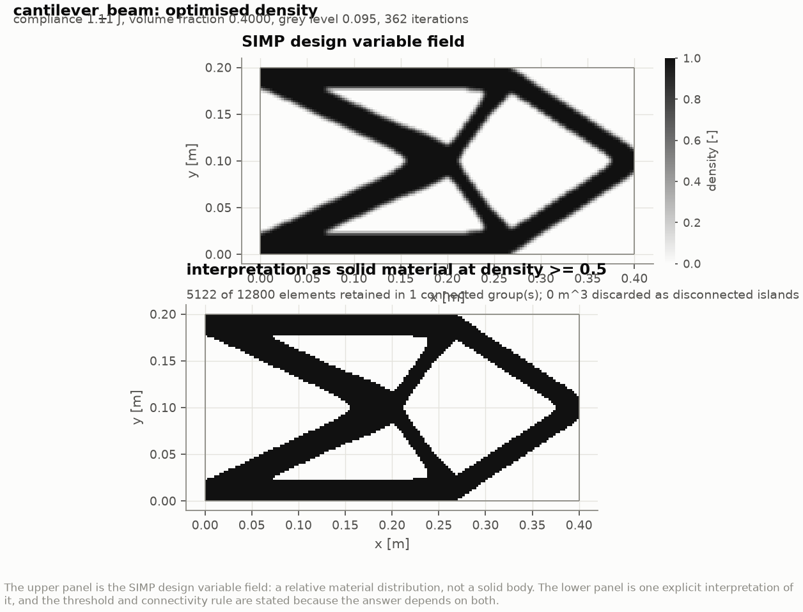
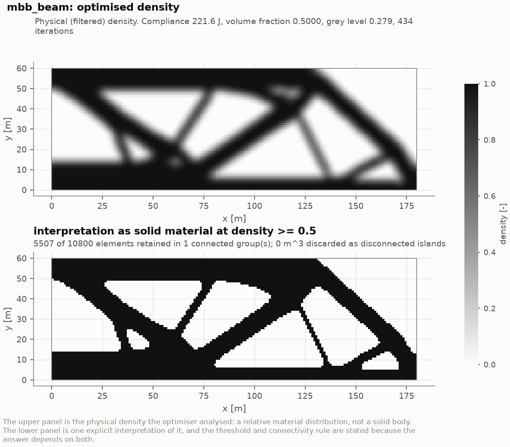
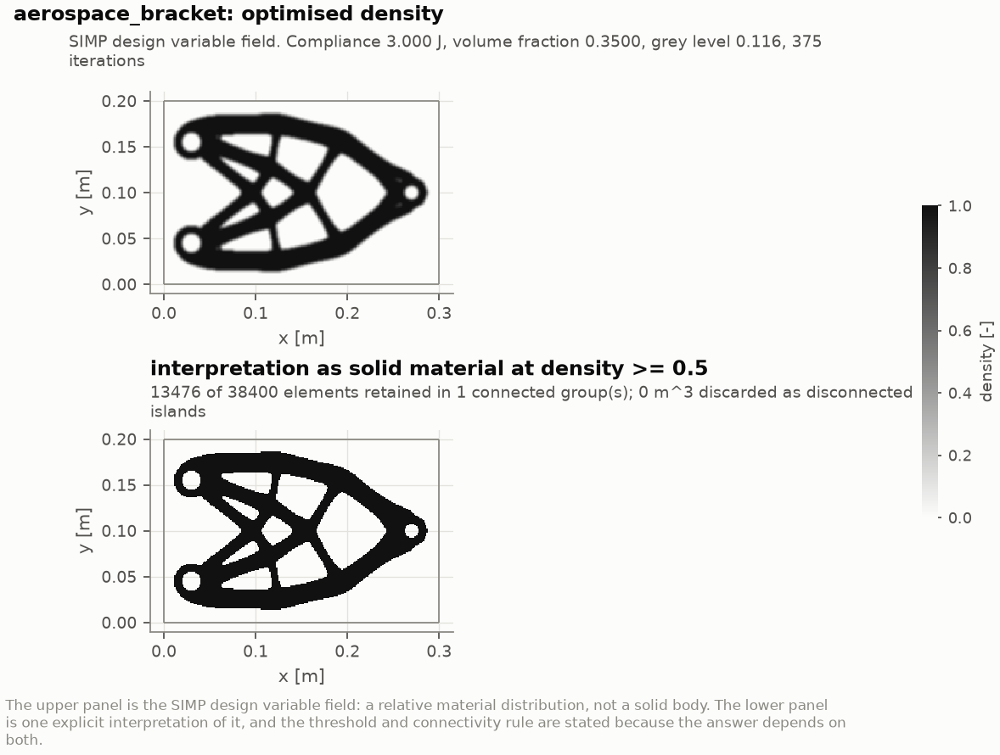
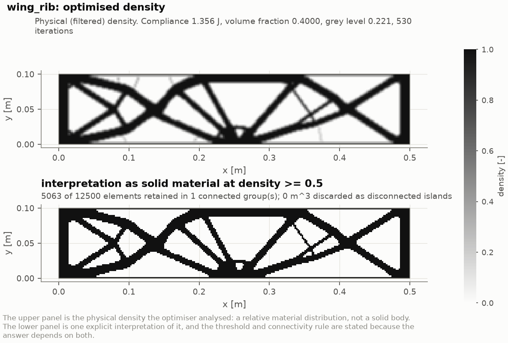
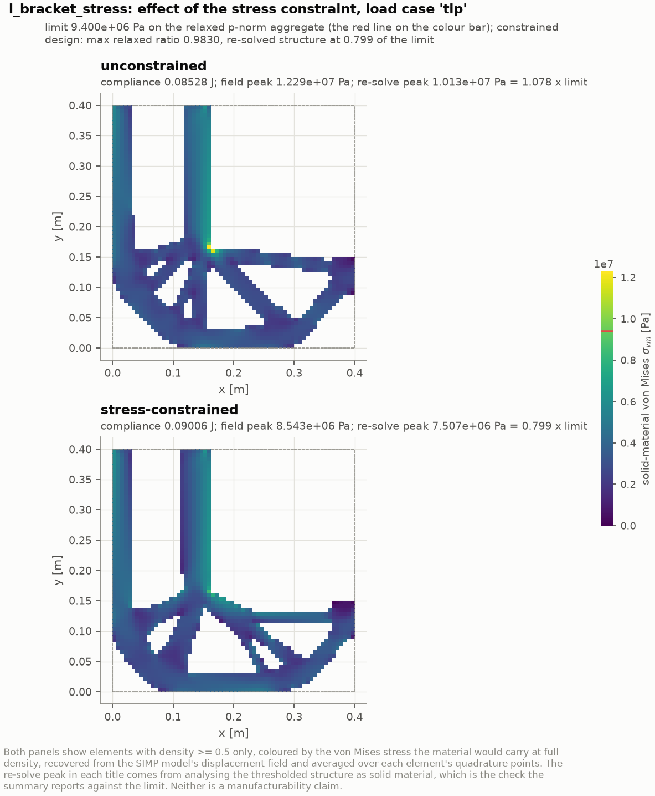
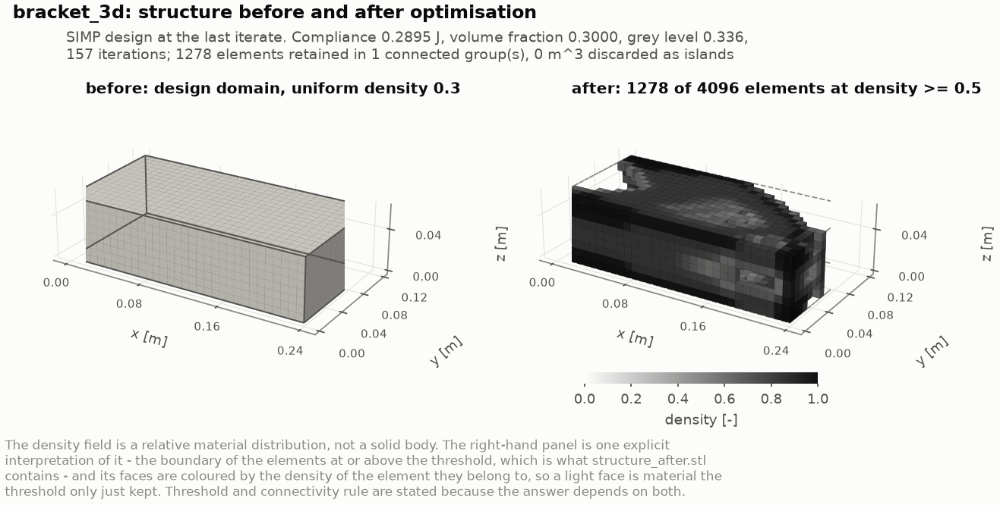
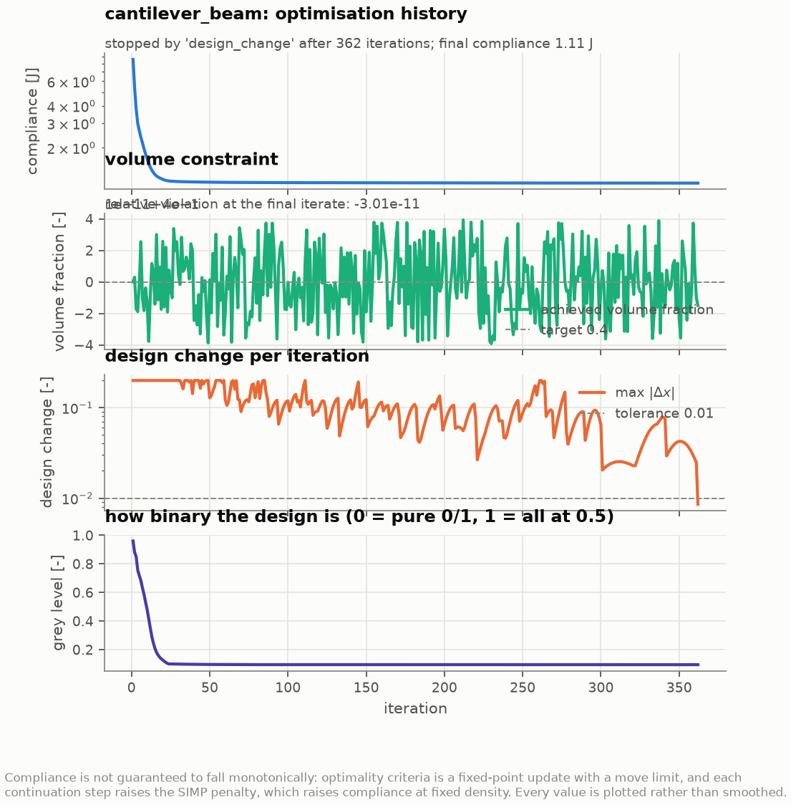
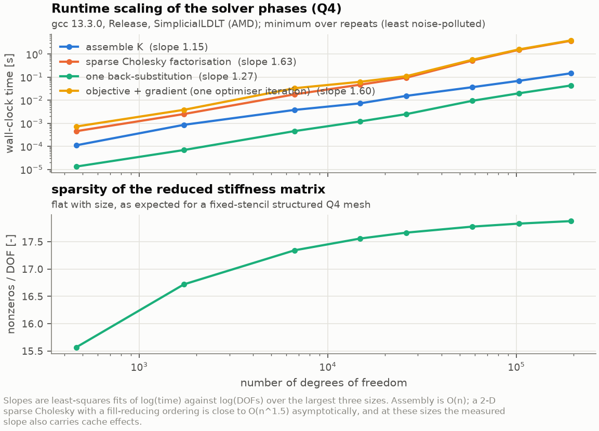
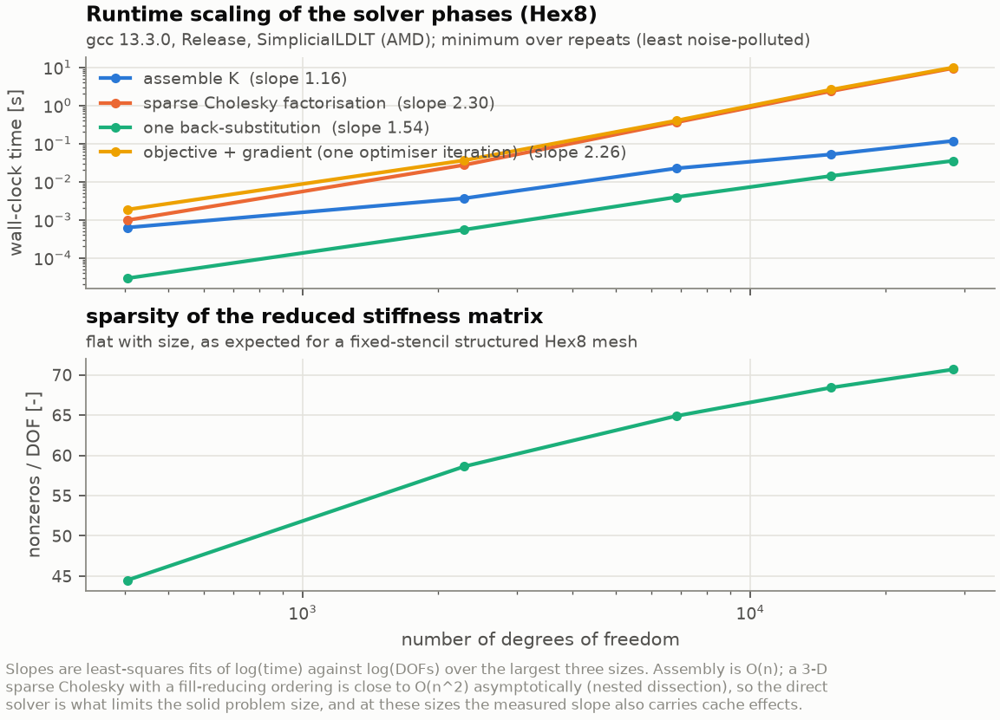

# Benchmark results

Every number here comes from the `summary.json` of the run named beside it.
`docs/results/README.md` carries the same data as a machine-generated table and
is refreshed by `make results`; this document adds the interpretation.

Reproduce all of it with:

```bash
make benchmarks     # all six cases plus the two analysis decks, about 20 minutes
make figures        # every figure and the animations
make results        # refresh the generated tables
```

Machine for every timing below: 4-core container, GCC 13.3.0, `-O3 -DNDEBUG`,
Eigen 3.4.0, `SimplicialLDLT` with AMD ordering, single-threaded element loop.
Absolute times will differ elsewhere; the scaling exponents are the portable
part.

## Summary

| Case | Elements | DOFs | Method | `nu` target | Iterations | Stop reason | Compliance [J] | Equal-mass plate [J] | Stiffness gain | Grey | Runtime [s] |
|------|---------:|-----:|--------|------------:|-----------:|-------------|---------------:|---------------------:|---------------:|-----:|------------:|
| `cantilever_beam` | 12 800 Q4 | 26 082 | OC | 0.40 | 362 | design change | 1.11252 | 1.37813 | **1.239** | 0.0947 | 44.4 |
| `mbb_beam` | 10 800 Q4 | 22 082 | OC | 0.50 | 434 | design change | 221.551 | 259.521 | **1.171** | 0.279 | 50.2 |
| `aerospace_bracket` | 38 400 Q4 | 77 602 | OC | 0.35 | 375 | objective stall | 3.00015 | 3.19665 | **1.065** | 0.116 | 422.5 |
| `wing_rib` | 12 500 Q4 | 25 602 | OC | 0.40 | 530 | objective stall | 1.35608 | 1.21194 | **0.894** | 0.221 | 56.0 |
| `l_bracket_stress` | 4 096 Q4 | 8 450 | MMA + stress | 0.35 | 240 | objective stall | 0.09006 | (see section 5) | - | 0.116 | 10.6 |
| `bracket_3d` | 4 096 Hex8 | 15 147 | OC | 0.30 | 157 | design change | 0.28951 | n/a (solid) | - | 0.336 | 442.0 |

"Stiffness gain" is the compliance of an equal-mass *uniform* plate divided by
the optimised compliance, so above 1 means the optimisation paid off. The
wing rib's value below 1 is real and is explained in its own section - it is the
most interesting result in the set. The L-bracket's baseline plate would fill
the passive void quadrant, so the ratio is not a fair one there and is not
quoted; a solid has no thickness to thin, so the 3-D bracket has no such
baseline at all (section 6).

**Volume constraint.** Satisfied in every case to the multiplier-bisection
tolerance: the relative violations are `-3.0e-11`, `-1.5e-11`, `-7.2e-11` and
`+1.1e-11`. The constraint also holds at *every recorded iteration*, not only at
the end.

## The equal-mass baseline

Comparing an optimised design against the full solid domain is not a fair
comparison - the solid domain has more material. The right baseline is a
structure of the **same mass**, and in this 2-D idealisation there is a clean
one.

Both `K` and `M` scale linearly with thickness, so scaling the thickness by the
volume fraction `nu`:

* multiplies the mass by `nu`;
* multiplies the compliance by `1/nu`;
* leaves every natural frequency **unchanged**.

So a uniformly thinned plate of the same mass as the optimised design has
compliance `C_solid / nu` and exactly the full-solid frequencies. Each run
verifies the frequency invariance numerically rather than assuming it; the
measured maximum relative difference over the reported modes is `2.5e-12`
(cantilever), `2.6e-11` (bracket) and `3.8e-12` (rib).

That is why the "full solid domain" and "equal-mass uniform plate" rows of the
modal table are identical, and why the full-solid frequencies double as the
equal-mass baseline.

## 1. Cantilever beam

`configs/benchmarks/cantilever_beam.json` - 0.40 x 0.20 m domain, 4 mm thick,
Al 7075-T6, clamped left edge, 2 kN downward resultant spread over three tip
nodes at mid-height. 160 x 80 mesh, density filter radius 2 cells (5 mm,
support 8.9 elements), `p = 3`, no continuation.



| Quantity | Value |
|----------|-------|
| Compliance, uniform start | 8.6133 J |
| Compliance, optimised | 1.11252 J (**7.74x** improvement) |
| Full solid domain | 0.551251 J at 0.8992 kg |
| Equal-mass uniform plate | 1.37813 J at 0.3597 kg |
| Optimised | 1.11252 J at 0.3597 kg (**1.239x stiffer** than the plate) |
| Volume fraction | 0.40000000 (violation `-3.0e-11`) |
| Grey level | 0.0947 |
| Interpretation at `rho >= 0.5` | 5 122 of 12 800 elements, **1** connected group, **0** discarded as islands |
| Runtime | 44.4 s, 362 iterations, 363 linear solves, 0.123 s/iteration |

The result is the expected two-bar / tied-arch layout: a straight tension
member along the top, a compression member along the bottom, and a diagonal web
transferring the tip shear to the root. The design is essentially binary
(grey 0.0947) and forms a single connected structure with nothing discarded.

**Modal comparison.**

| Structure | Mass [kg] | f1 [Hz] | f2 [Hz] | f3 [Hz] | f4 [Hz] |
|-----------|----------:|--------:|--------:|--------:|--------:|
| Full solid domain | 0.8992 | 872.1 | 3173.0 | 3314.3 | 6938.0 |
| Equal-mass uniform plate | 0.3597 | 872.1 | 3173.0 | 3314.3 | 6938.0 |
| Optimised topology | 0.3598 | **1016.4** | 1685.7 | 1935.3 | 2405.1 |

The optimised design is **16.5% higher in `f1` than the equal-mass plate**, at
40% of the solid mass. Removing material from the low-stress core raises the
stiffness-to-mass ratio in the fundamental mode, which is exactly what a
compliance-minimal layout should do.

The higher modes tell the other half of the story: `f2` through `f4` drop sharply
(3173 -> 1686 Hz). The truss has *local* member modes that the continuous plate
does not, and they sit below the plate's second global mode. **Compliance
optimisation raises the fundamental frequency and lowers the higher ones**; it
does not improve the whole spectrum, and a design driven by a higher-mode
requirement would need a frequency constraint, which this optimiser cannot
carry.

**Interpretation check.** Running a solid FE model on the thresholded structure
gives 1.0403 J against the SIMP field's 1.11252 J, a ratio of 0.935. The
thresholded structure is *stiffer*, because thresholding converts the filter's
grey boundary layer into fully solid material - and it does so at essentially no
extra volume, since the retained 5 122 elements are 40.02% of the domain against
a 40% target. This is the sense in which the SIMP penalty makes intermediate
density inefficient: the field pays for grey material without getting solid
stiffness from it.

Corrected to the interpreted structure's own mass, the stiffness gain over an
equal-mass plate is **1.324** rather than the 1.239 the objective implies. The
design study shows how far that gap can go and why the interpreted number is
the one to compare: [`aerospace_study.md`](aerospace_study.md).

## 2. MBB beam

`configs/benchmarks/mbb_beam.json` - the standard reference problem. Half model
of a simply supported beam under a central point load: symmetry condition
`u_x = 0` on the left edge, a vertical roller at the bottom-right corner, unit
downward load at the top-left corner. Dimensionless settings (`E = 1 Pa`, 1 m
cell, `F = 1 N`) on a 180 x 60 mesh, volume fraction 0.50, `p = 3`, density
filter radius 4.5 cells - the same *physical* radius as the customary 1.5 cells
at 60 x 20.



| Quantity | Value |
|----------|-------|
| Compliance, uniform start | 1038.08 J |
| Compliance, optimised | 221.551 J (**4.69x** improvement) |
| Full solid domain | 129.76 J |
| Equal-mass uniform plate | 259.521 J |
| Stiffness gain over the plate | 1.171 |
| Volume fraction | 0.50000000 (violation `-1.5e-11`) |
| Grey level | 0.279 |
| Interpretation at `rho >= 0.5` | 5 507 of 10 800 elements, **1** connected group, **0** islands |
| Runtime | 50.2 s, 434 iterations |

The topology is the familiar MBB result: solid top and bottom flanges joined by
a diagonal truss web that fans from the load point to the roller, with the
characteristic triangulated cells.

**Interpretation check.** Thresholding the design at 0.5 leaves 5 507 of the
10 800 elements in a single group, 1.98 % more material than the 5 400 the
constraint allowed for, and a compliance of 188.60 J against the SIMP field's
221.55 J (ratio 0.851). Compared against a uniform plate of the interpreted
structure's own mass the gain is **1.349** rather than the 1.171 the objective
implies - the same direction and roughly the same size as on the bracket.

**On comparing with published values.** SparLab reports what it computes and
does not claim agreement with a literature number. Running the same problem at
60 x 20 with a 1.5-cell radius gives, on this build:

| Filter | Compliance [J] | Iterations | Grey level |
|--------|---------------:|-----------:|-----------:|
| Density (default) | 218.80 | 126 | 0.269 |
| Sensitivity (Sigmund) | 203.17 | 94 | 0.174 |
| None | 203.21 | 63 | 0.012 |

The ordering is the informative part. The **density** filter imposes a genuine
minimum length scale and therefore costs stiffness. The **sensitivity** filter
only smooths the search direction, so it reaches a lower compliance without
enforcing a length scale. **No** filter reaches the same compliance with a grey
level of 0.012 - an almost perfectly 0/1 design - but that 0/1 pattern *is* the
checkerboard, a numerical artefact of the Q4 displacement field rather than a
structure. A low grey level is not by itself evidence of a good design.

Which of these a published value corresponds to depends on the filter variant,
the radius convention, the convergence criterion and the penalty schedule, so
quoting agreement without re-deriving the reference under identical settings
would be guesswork. What supports the result instead is internal: the gradient
is verified against finite differences to `2.2e-08`, the volume constraint is
exact to `1.5e-11`, and at the converged design the KKT quantity
`B_e = -(dc/dx_e)/(dv/dx_e)` across elements strictly inside their bounds has a
5-95 percentile spread of about **9%**, which is the residual expected of
optimality criteria with a move limit and a finite change tolerance.

## 3. Aerospace mounting bracket

`configs/benchmarks/aerospace_bracket.json` - the primary aerospace case.
A 0.30 x 0.20 m machined plate, 8 mm thick, Al 7075-T6, bolted to structure
through two holes on the left and transferring load through a pin lug on the
right. 240 x 160 mesh (38 400 elements, 77 602 DOFs), volume fraction 0.35,
density filter radius 3 cells (3.75 mm), `p` ramped 1.5 -> 3.0 in three stages
of 30 iterations.



**Attachment representation** - and what it is not. Bolt holes and the lug hole
are passive void; bearing collars around each are passive solid; every node
inside a bolt hole is fixed, i.e. the bolt shank is idealised as rigid; the lug
load is applied to the ring of nodes around the lug hole, i.e. the pin bears on
the hole wall. 1 520 elements are passive solid and 528 passive void, leaving
36 352 free variables. None of this is a joint model - see
`docs/limitations.md`.

**Three load cases**, weights normalised from (1.0, 0.5, 0.5):

| Load case | Load | Weight | Compliance at the optimum [J] |
|-----------|------|-------:|------------------------------:|
| `down_limit` | 9 kN down through the lug | 0.50 | 5.1699 |
| `up_reversal` | 4.5 kN up | 0.25 | 1.2925 |
| `lateral` | 4.5 kN sideways | 0.25 | 0.3684 |
| **weighted objective** | | | **3.00015** |

| Quantity | Value |
|----------|-------|
| Compliance, uniform start | 4.54752 J |
| Compliance, optimised | 3.00015 J (1.52x improvement) |
| Full solid domain | 1.11883 J at 1.3488 kg |
| Equal-mass uniform plate | 3.19665 J at 0.4721 kg |
| Optimised | 3.00015 J at 0.4721 kg (**1.065x stiffer** than the plate) |
| Volume fraction | 0.35000000 (violation `-7.2e-11`) |
| Grey level | 0.116 |
| Interpretation at `rho >= 0.5` | 13 476 of 38 400 elements, **1** connected group, **0** islands |
| Runtime | 422.5 s, 375 iterations, 1 128 linear solves, 1.127 s/iteration |

The topology is a symmetric double fan: two pairs of diagonal members running
from each bolt collar out to the lug, tied by a vertical member at the lug and
by short members between the two bolt bosses. The symmetry about the horizontal
mid-plane is not imposed - it emerges, which is what the symmetric load set and
geometry should produce, and its appearance is itself a useful check on the
implementation.

The stiffness gain of 1.065 is modest compared with the cantilever's 1.239, and
the reason is instructive: three load cases pulling in different directions
leave much less room for a specialised load path than a single tip load does.
The design has to serve a down-load, its reversal and a lateral case at once.

**Modal comparison.**

| Structure | Mass [kg] | f1 [Hz] | f2 [Hz] | f3 [Hz] | f4 [Hz] |
|-----------|----------:|--------:|--------:|--------:|--------:|
| Full solid domain | 1.3488 | 1437.2 | 4252.3 | 5158.7 | 9476.8 |
| Equal-mass uniform plate | 0.4721 | 1437.2 | 4252.3 | 5158.7 | 9476.8 |
| Optimised topology | 0.4733 | **2027.4** | 3917.9 | 5297.8 | 5493.7 |

`f1` rises by **41%** while the mass falls to 35% of the solid domain. Against
the equal-mass plate - which is the fair comparison - the optimised bracket is
41% higher in fundamental frequency *and* 6.5% stiffer in weighted compliance.
For this bracket the compliance-optimal layout happens to be a good
vibration-performance layout too, and `f3` even rises slightly. `f2` and `f4`
fall, for the same local-member reason as the cantilever.

**Interpretation check.** The thresholded solid structure gives 2.5514 J against
the SIMP field's 3.00015 J (ratio 0.850), at 13 476 elements = 35.1% of the
domain against a 35% target. Its peak von Mises stress is 160 MPa. Against the
7075-T6 tensile yield of roughly 500 MPa that is a margin of about 3 on the
weighted design loads - but this deck runs without a stress constraint (section
5 shows what one does), so this is a *post-hoc observation*, not a
substantiation, and point-load and re-entrant-corner stresses in a density
design are mesh sensitive.

## 4. Wing rib

`configs/benchmarks/wing_rib.json` - the web of a wing rib between a front and
a rear spar. 0.50 x 0.10 m, 2 mm thick, Al 2024-T3. Front spar attachment fixed
in both directions, rear spar a vertical roller (free chordwise). 250 x 50 mesh,
volume fraction 0.40, filter radius 2 cells (4 mm), `p` ramped 1.5 -> 3.0.



Passive regions: one-element skin-attachment flanges top and bottom, spar
attachment pads at both ends, and two system cutouts - 1 172 elements passive
solid and 416 passive void, leaving 10 912 free. Load cases: a chordwise-decaying
download on the upper skin plus a download on the lower skin
(`positive_manoeuvre`, weight 1.0), the reverse at a lower factor
(`negative_manoeuvre`, 0.4), and a 4 kN systems/actuator fitting load picked up
at mid chord (`fitting_load`, 0.6).

| Quantity | Value |
|----------|-------|
| Compliance, uniform start | 1.53023 J |
| Compliance, optimised | 1.35608 J (1.13x improvement) |
| Full solid domain | 0.484776 J at 0.2780 kg |
| Equal-mass uniform plate | 1.21194 J at 0.1112 kg |
| Optimised | 1.35608 J at 0.1112 kg (**0.894x**, i.e. *less* stiff) |
| Volume fraction | 0.40000000 (violation `+1.1e-11`) |
| Grey level | 0.221 |
| Interpretation at `rho >= 0.5` | 5 063 of 12 500 elements, **1** connected group, **0** islands |
| Runtime | 56.0 s, 530 iterations, 1 593 linear solves |

The topology is a recognisable lightened rib web: a heavy vertical post under
the mid-chord fitting, diagonal braces fanning from it to both spar
attachments, and large lightening cut-outs between them - which is what a real
machined rib looks like.

### The optimised rib is less stiff than a uniform web of the same mass

Stiffness gain 0.894, i.e. 10.6% *worse* than uniform thinning. That is a real
result, not a solver failure, and it is worth spelling out because it is the
kind of finding a study is for. Two diagnostic runs isolate the cause (same
deck, same loads, only the passive regions changed):

| Configuration | Compliance [J] | vs equal-mass plate (1.21194 J) |
|---------------|---------------:|--------------------------------:|
| No passive regions at all | 1.15916 | **1.046x stiffer** |
| Spar attachment pads only | 1.28501 | 0.943x |
| As specified: pads + flanges + cutouts | 1.35608 | 0.894x |

With full design freedom the optimiser *does* beat uniform thinning, by 4.6%.
Adding the mandated spar pads costs 10.9%, and the skin flanges a further 5.5%.
**The attachment hardware, not the optimiser, is what costs the stiffness** - it
forces solid material into places the load path does not want it, and that
material is charged against the same volume budget.

The comparison is also unfair to the uniform plate in an important way: a
uniformly thinned web has no attachment land at all, so it is not a producible
alternative. The honest reading is that on this component the mandated
attachment features dominate the achievable stiffness, and the payoff from
topology optimisation would come from revisiting *where and how the rib
attaches*, not from optimising harder inside the given constraints. That is a
result about the problem statement, which is often the most useful thing a
design study produces.

**And one correction to the headline.** The 0.894 is measured on the *objective*
- the penalised SIMP field. Thresholding the design at 0.5 and re-solving it
gives 1.1897 J at 1.26% more mass, which is a mass-corrected gain of **1.006**:
the structure a threshold produces is level with the equal-mass plate, not
10.6% short of it. The shortfall is in the relaxed model, not in the design.
Both numbers are in the summary, and the reason they differ - and why it can be
much larger than this - is the subject of
[`aerospace_study.md`](aerospace_study.md).

Reproduce the diagnostics by copying the deck, deleting the `passive_regions`
entries and re-running.

**Modal comparison** - and a second cautionary result.

| Structure | Mass [kg] | f1 [Hz] | f2 [Hz] | f3 [Hz] | f4 [Hz] |
|-----------|----------:|--------:|--------:|--------:|--------:|
| Full solid domain | 0.2780 | 1488.7 | 2623.1 | 3809.5 | 6624.1 |
| Equal-mass uniform plate | 0.1112 | 1488.7 | 2623.1 | 3809.5 | 6624.1 |
| Optimised topology | 0.1126 | **386.6** | 487.1 | 711.5 | 856.6 |

`f1` falls by a factor of 3.85 while the mass falls by 2.47. Unlike the
cantilever and the bracket, this design is markedly *worse* in vibration than an
equal-mass uniform web.

The mechanism is clear from the shapes: the optimised rib is a slender truss
whose lowest modes are local bending of its individual thin diagonals, whereas
the uniform web is a continuous shear panel with no such soft members. A
compliance objective sees only the static load path; it has no reason to keep
the lowest eigenvalue high, and here it trades it away. Any real rib with a
vibration or flutter requirement would need that requirement in the
optimisation, not checked afterwards - and this optimiser, with its single
volume constraint, cannot carry it.

## 5. Stress-constrained L-bracket (MMA)

`configs/benchmarks/l_bracket_stress.json` - the canonical stress-constrained
test case. A 0.40 x 0.40 m square, 10 mm thick, Al 7075-T6, on a 64 x 64
mesh (4 096 elements, 8 450 DOFs) whose upper-right quadrant is passive void
(1 444 elements). The remaining left arm is clamped along its top edge; a
600 N downward resultant is applied at the tip of the lower arm through a
passive solid pad (60 elements), so the load-application stress is not
design dependent. Volume fraction 0.35, density filter radius 1.5 cells
(9.4 mm, support 8.8 elements), `p = 3`, no continuation, MMA with a move
limit of 0.1, and one aggregated von Mises constraint with limit
**9.4 MPa** (`P = 8`, `q = 0.5`). The same deck is run once more with the
constraint switched off (`--no-stress`) as the reference.



| Quantity | Constraint off | Constraint on |
|----------|---------------:|--------------:|
| Iterations, stop reason | 115, objective stall | 240, objective stall |
| Linear solves (one adjoint per iteration when constrained) | 116 | 481 |
| Compliance, uniform start | 1.35322 J | 1.35322 J |
| Compliance, optimised | 0.085276 J | **0.090060 J** (+5.6 %) |
| Volume fraction | 0.349999 (`-2.1e-06`) | 0.349987 (`-3.8e-05`, feasible) |
| Grey level | 0.122 | 0.116 |
| Relaxed stress peak of the design, `rho^0.5 sigma_vm` | 15.6 MPa (1.66 x limit) | 9.24 MPa (**0.983** x limit) |
| p-norm aggregate over the limit, and its scale | - | 1.180, `c = 0.842` |
| Interpretation at `rho >= 0.5` | 1 440 elements, 1 group, 0 islands | 1 435 elements, 1 group, 0 islands |
| Re-solved structure: compliance | 0.075180 J | 0.079859 J (+6.2 %) |
| Re-solved structure: peak von Mises | 10.13 MPa (**1.078** x limit) | 7.51 MPa (**0.799** x limit) |
| Runtime | 4.4 s | 10.6 s |

The unconstrained design does what a compliance objective always does at a
re-entrant corner: it fills it, and concentrates stress there. Its re-solved
structure exceeds the 9.4 MPa limit by 7.8 % at the corner (the yellow spot in
the upper panel). With the constraint on, the corner is rounded - material
moves from the corner into a second diagonal - and the re-solved structure
sits at 80 % of the limit, a **26 % lower peak stress for 5.6 % more
compliance**. That is the trade a stress constraint is for.

Three readings of the table need care:

* the constraint acts on the **relaxed** stress of the SIMP model, whose peak
  at the returned design is 0.983 of the limit: active, feasible, and
  hovering just inside the limit as the adaptive p-norm scale is re-fitted
  each iteration (`l_bracket_stress_convergence.png`, fourth panel). The
  re-solved structure's 0.799 is a different, better number because
  thresholding promotes the corner's intermediate densities to solid
  material and its stress drops. Both are reported; the second is the one
  that says whether the *structure* meets the limit;
* the "unconstrained relaxed peak" of 15.6 MPa is measured by running the
  deck with the constraint switched off but the stress evaluation on
  (`--stress-limit 1e30`); the limit was set at 60 % of it;
* neither run's compliance is comparable with an equal-mass uniform plate
  of the *square* domain, since that plate would fill the passive quadrant.
  The fair reference for the constrained design is the unconstrained one,
  which is why the deck is run twice.

**Convergence.** MMA with a stress constraint oscillates more than OC on a
compliance-only problem, because the constraint surface moves with the
p-norm scale. At the compliance decks' move limit of 0.2 the run hit its
300-iteration cap with a handful of corner elements still flipping between
their bounds (feasible, but not converged); at 0.1 it stops on the
objective-stall criterion after 240 iterations, feasible, with a final design
change of 0.020. The MMA subproblem took 32-92 Newton iterations per step.

## 6. Solid bracket (Hex8)

`configs/benchmarks/bracket_3d.json` - the 3-D case. A 0.24 x 0.12 x 0.06 m
aluminium block (Al 7075-T6) clamped on its `x = 0` face (153 nodes,
459 DOFs), with two load cases at the far end: `down_limit`, 3 kN in `-y`
spread over the nine nodes of the tip's bottom edge (weight 1.0), and
`lateral`, 1.2 kN in `+z` over the nine nodes of the tip's mid-height line
(weight 0.5). 32 x 16 x 8 Hex8 mesh (4 096 elements, 15 147 DOFs), volume
fraction 0.30, density filter radius 1.5 cells (11.25 mm, support 16.9
elements), `p = 3`, optimality criteria, six modes of the solid and of the
interpreted structure.



| Quantity | Value |
|----------|-------|
| Compliance, uniform start | 2.77535 J |
| Compliance, optimised | 0.289513 J (**9.6x** improvement); `down_limit` 0.33669 J, `lateral` 0.19516 J |
| Full solid domain | 0.074935 J at 4.8557 kg |
| Optimised design | 0.289513 J at 1.4567 kg (3.86x the solid's compliance at 30 % of its mass) |
| Volume fraction | 0.30000000 (violation `8.0e-11`) |
| Grey level | 0.336 |
| Interpretation at `rho >= 0.5` | 1 278 of 4 096 elements, **1** connected group, **0** discarded as islands |
| Re-solved structure | 0.176349 J (ratio **0.609** to the SIMP field) at 1.5150 kg; peak von Mises 12.7 MPa |
| Geometry export | 5 356 triangles, closed, 32 non-manifold edges, enclosed volume equal to the cell volume to `3.5e-14` |
| Runtime | 442.0 s for 157 iterations (2.82 s each), 316 linear solves; 451.4 s in total with both modal analyses |

The topology is a cantilevered box girder: two webs along the sides joined by
a tapered top flange, thinning towards the tip where the bending moment is
smallest, with the `lateral` case keeping both webs rather than letting the
design collapse onto a single vertical plate. The structure is one connected
group and nothing is discarded.

Two numbers stand out against the plane cases:

* **the grey level is 0.336**, three times the cantilever's. In 3-D a filter
  of radius 1.5 cells averages over 17 elements rather than 9, and the
  intermediate boundary layer is a *surface* of the structure rather than a
  curve, so it holds a larger share of the volume. The re-solve shows what
  that costs: the thresholded structure is **39 % stiffer** than the SIMP
  field (ratio 0.609) for 4 % more mass, because the threshold promotes that
  whole grey shell to solid material. On a 3-D density design the reported
  objective is even more pessimistic than on a plane one, and the re-solved
  number is the one to plan with;
* **there is no equal-mass baseline.** A solid has no thickness to scale, so
  the uniformly thinned plate that made "stiffness gain" a clean comparison
  in 2-D does not exist; the only reference reported is the full solid
  domain, and the summary says so in its `mass_stiffness_comparison.note`.

**Modal comparison.**

| Structure | Mass [kg] | f1 [Hz] | f2 [Hz] | f3 [Hz] | f4 [Hz] |
|-----------|----------:|--------:|--------:|--------:|--------:|
| Full solid domain | 4.8557 | 835.0 | 1471.0 | 2531.6 | 4201.0 |
| Optimised topology | 1.5150 | **917.1** | 1664.9 | 2661.2 | 3326.3 |

`f1` rises by 9.8 % at 31 % of the solid's mass, and `f2` and `f3` rise too;
`f4` falls, for the local-member reason the plane cases show. Without a
thinned-solid baseline the honest comparison is only against the full block,
and the mass ratio has to be read alongside the frequencies.

**Geometry.** `structure_after.stl` is the boundary of the 1 278 retained
cells: closed and outward, with its enclosed volume equal to the cell volume
to round-off, but with 32 edges where two retained cells touch only along an
edge. The surface is therefore not a 2-manifold and a slicer may split it
into shells at those edges; the summary and the console report the count, and
the interpretation threshold and connectivity rule - not the STL writer -
decide whether such cells belong to one part.

The run is the most expensive in the set at 2.8 s per iteration for 15 147
DOFs, where the plane bracket manages 1.1 s per iteration for 77 602: the
direct solver's fill-in grows far faster in three dimensions (see *Runtime
and scaling* below).

## Convergence behaviour



Both stopping criteria are exercised across the cases: the two beam benchmarks
and the solid bracket stop on the design change, the two aerospace plane cases
and the stress-constrained L-bracket on the objective stall. Final indicator
values:

| Case | Stop reason | Final `max |dx|` | Final relative `dC` over 20 iterations |
|------|-------------|-----------------:|---------------------------------------:|
| `cantilever_beam` | design change | 0.00857 | `6.7e-05` |
| `mbb_beam` | design change | 0.00697 | `6.2e-05` |
| `aerospace_bracket` | objective stall | 0.0202 | `4.9e-05` |
| `wing_rib` | objective stall | 0.0113 | `4.9e-05` |
| `l_bracket_stress` (MMA) | objective stall | 0.0198 | `1.5e-05` (and feasible, largest constraint `-3.8e-05`) |
| `bracket_3d` | design change | 0.00988 | `1.4e-04` |

The objective criterion is what makes the fine-mesh cases terminate. A measured
example on the cantilever benchmark, with both criteria disabled and the cap
raised to 800 iterations:

| Iteration | Compliance [J] | `max |dx|` | Relative `dC` over 20 |
|----------:|---------------:|-----------:|----------------------:|
| 250 | 1.115120 | 0.0873 | `5.0e-04` |
| 400 | 1.112387 | 0.0787 | `9.7e-05` |
| 600 | 1.111742 | 0.0429 | `5.7e-05` |
| 800 | 1.111238 | 0.0011 | `1.3e-06` |

The compliance improves by 0.35% between iteration 250 and iteration 800, while
`max |dx|` keeps oscillating between 0.004 and 0.12 - thin members migrating one
cell at a time long after the objective has settled. A design-change-only rule
would report non-convergence on a design that is converged for engineering
purposes, which is exactly why both indicators are tracked and both are
recorded.

## Runtime and scaling



| Mesh | Elements | DOFs | Nonzeros | Assemble [s] | Factorise [s] | Solve [s] | Obj+grad [s] |
|------|---------:|-----:|---------:|-------------:|--------------:|----------:|-------------:|
| 20 x 10 | 200 | 462 | 7 192 | 0.000116 | 0.000426 | 1.16e-05 | 0.00065 |
| 40 x 20 | 800 | 1 722 | 28 792 | 0.000774 | 0.00235 | 6.55e-05 | 0.00346 |
| 80 x 40 | 3 200 | 6 642 | 115 192 | 0.00318 | 0.0151 | 0.000375 | 0.0214 |
| 120 x 60 | 7 200 | 14 762 | 259 192 | 0.00682 | 0.0425 | 0.00107 | 0.0554 |
| 160 x 80 | 12 800 | 26 082 | 460 792 | 0.0142 | 0.0873 | 0.00231 | 0.107 |
| 240 x 120 | 28 800 | 58 322 | 1 036 792 | 0.0342 | 0.494 | 0.00869 | 0.552 |
| 320 x 160 | 51 200 | 103 362 | 1 843 192 | 0.0693 | 1.30 | 0.0199 | 1.49 |
| 440 x 220 | 96 800 | 194 922 | 3 484 792 | 0.137 | 3.28 | 0.0422 | 3.58 |

Fitted slopes of `log(time)` against `log(DOFs)` over the largest three sizes:

| Phase | Slope | Expected |
|-------|------:|----------|
| Assemble `K` | 1.15 | `O(n)`; the excess is cache behaviour at 3.5M stored entries |
| Sparse Cholesky factorisation | **1.57** | close to the `O(n^1.5)` of a good 2-D fill-reducing ordering |
| One back-substitution | 1.31 | between `O(n)` and the `O(n log n)` of the factor's nonzero count |
| Objective + gradient | 1.55 | dominated by the factorisation, as the numbers show |

The last row is the useful one for planning a run: one optimiser iteration costs
essentially one factorisation. At 194 922 DOFs that is 3.58 s, so a 400-iteration
run on a 440 x 220 mesh is about 24 minutes single-threaded. The measured
benchmark rates - 0.106 to 0.123 s/iteration at 12-13 k elements and 1.127
s/iteration at 38 k elements with three load cases - are consistent with that.

Stored entries per free DOF is flat with size (15.6 to 17.9), as expected for a
fixed-stencil structured Q4 mesh: the growth in factorisation cost comes from
fill-in during elimination, not from the assembled matrix.

### Three dimensions



The same protocol on a Hex8 block of `nx x nx/2 x nx/4` cells
(`sparlab_bench --dim 3`):

| Mesh | Elements | DOFs | Nonzeros | Assemble [s] | Factorise [s] | Solve [s] | Obj+grad [s] |
|------|---------:|-----:|---------:|-------------:|--------------:|----------:|-------------:|
| 8 x 4 x 2 | 64 | 405 | 18 018 | 0.000624 | 0.000971 | 2.92e-05 | 0.00184 |
| 16 x 8 x 4 | 512 | 2 295 | 134 550 | 0.00365 | 0.0273 | 0.000549 | 0.0362 |
| 24 x 12 x 6 | 1 728 | 6 825 | 442 890 | 0.0223 | 0.358 | 0.00391 | 0.397 |
| 32 x 16 x 8 | 4 096 | 15 147 | 1 036 350 | 0.0517 | 2.35 | 0.0141 | 2.58 |
| 40 x 20 x 10 | 8 000 | 28 413 | 2 008 242 | 0.117 | 9.47 | 0.0352 | 9.87 |

| Phase | Slope (3-D) | Slope (2-D) | Expected |
|-------|------------:|------------:|----------|
| Assemble `K` | 1.16 | 1.15 | `O(n)` |
| Sparse Cholesky factorisation | **2.30** | 1.57 | a 3-D fill-reducing ordering is close to `O(n^2)`; the measured slope also carries cache effects |
| One back-substitution | 1.54 | 1.31 | the factor has `O(n^(4/3))` nonzeros in 3-D |
| Objective + gradient | 2.26 | 1.55 | factorisation-dominated |

The direct solver is what bounds the solid problem size: at 28 413 DOFs one
factorisation already costs 9.5 s, against 0.09 s for the plane mesh with
the same DOF count (26 082), and the stored entries per DOF are 44-71 rather
than 16-18 because an interior node of a hexahedral grid couples to 27 nodes
rather than 9. The 3-D bracket's
2.8 s per iteration at 15 147 DOFs is consistent with this table, and a
finer solid design study needs an iterative solver with a multigrid
preconditioner rather than more patience.

## Where the time goes

From the `timings_s` block of each summary:

| Case | Optimisation [s] | Modal [s] | Solid reference [s] | Output [s] | Total [s] |
|------|-----------------:|----------:|--------------------:|-----------:|----------:|
| `cantilever_beam` | 44.45 | 2.49 | 0.11 | 0.38 | 47.44 |
| `mbb_beam` | 50.17 | - | 0.09 | 0.24 | 50.56 |
| `aerospace_bracket` | 422.50 | 12.24 | 1.12 | 2.09 | 438.07 |
| `wing_rib` | 55.97 | 2.00 | 0.09 | 0.68 | 58.79 |
| `l_bracket_stress` | 10.57 | - | 0.03 | 0.12 | 10.78 |
| `bracket_3d` | 441.96 | 6.28 | 2.57 | 0.38 | 451.42 |

The optimisation loop dominates everywhere, which is the intended cost profile:
modal analysis of both the solid domain and the extracted topology costs a few
percent, and all of the file output - including the density snapshots that drive
the animation - costs under 0.5%.
